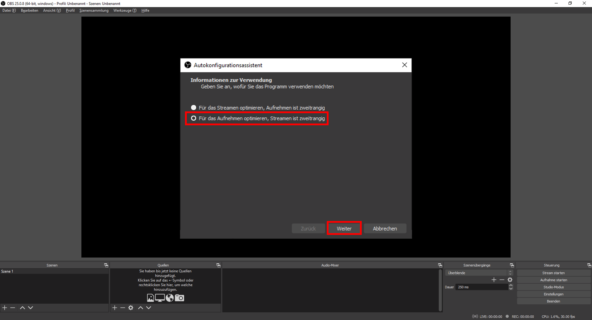
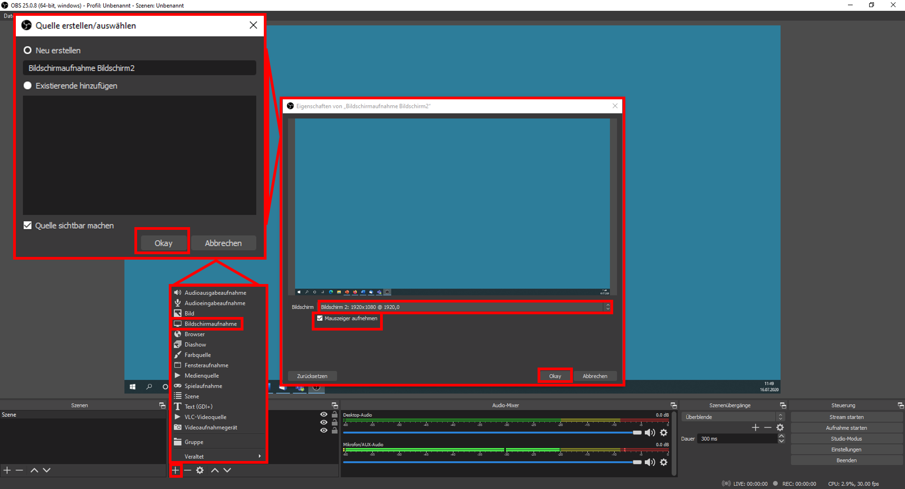
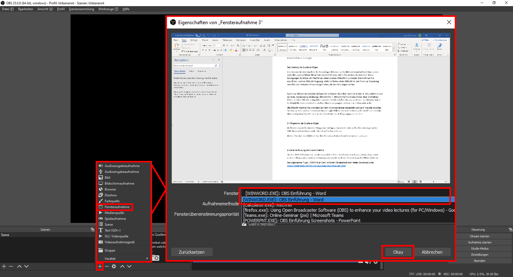
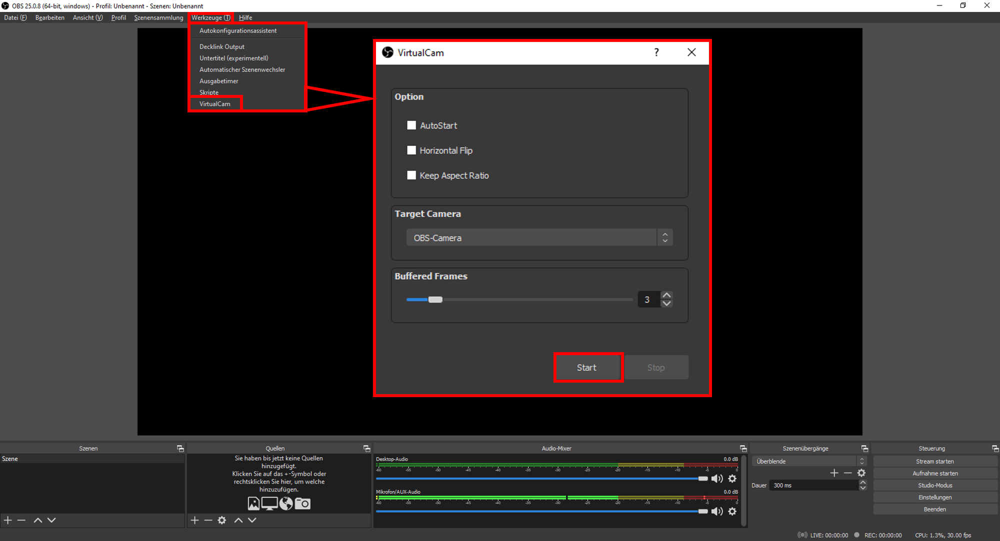
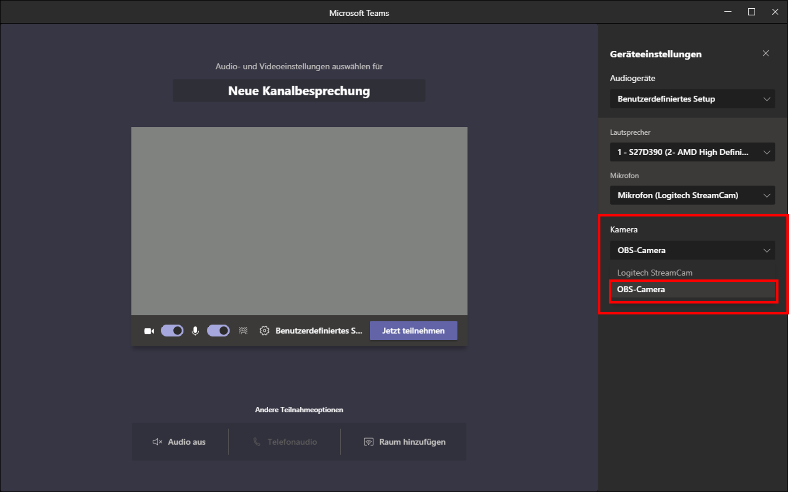

## OBS Einführung

Open Broadcaster Software, kurz OBS, ist ein Programm, mit dem Sie Videos aufzeichnen oder Streamen können, also live online verbreiten. Diese Videos und Streams können unter Anderem aus Bildschirmaufnahmen bestehen. Sie können darin alles integrieren, was Sie auf ihrem Bildschirm nutzen und sehen. Dabei können auch direkt Programme wie PowerPoint oder Browser aufgezeichnet und mit Webcam-Bildern und Audioaufzeichnungen von Ihnen kombiniert werden. Dies funktioniert sowohl live als auch geplant als Aufnahme.
OBS ist eine Open-Source-Software, die frei erhältlich und kostenfrei nutzbar ist.

Sie benötigen dabei als Ausrüstung einen Rechner (bevorzugt Windows), ein Mikrofon und eine externe Kamera. Es lassen lassen sich zwar auch integrierte Webcams und Mikrofone eines Laptops nutzen, um eine verbesserte Audio- und Video-Qualität zu erreichen, empfehlen wir Ihnen jedoch, auf ein externes Mikrofon oder ein Headset sowie eine qualitativ hochwertigere Webcam zurückzugreifen.
Darüber hinaus ist ein zusätzlicher Monitor für einen optimalen Einsatz von OBS klar zu empfehlen.  

## Und los gehts

Das frei erhältliche Programm laden Sie direkt und ohne notwendige Anmeldung auf der Seite https://obsproject.com/de runter. Hier müssen Sie zunächst auswählen, für welches Betriebssystem Sie OBS verwenden wollen.

Nachdem Sie die Installationsdatei heruntergeladen haben, starten Sie den Installationsprozess und folgen den Installationsanweisungen.

Nach erfolgreicher Installation öffnen Sie das Programm OBS. Bei einem ersten Start wird Ihnen angeboten, den Autokonfigurationsassistenten zu nutzen. Nutzen Sie diesen und klicken auf „Ja“.

Geben Sie nun zur Verwendung an, OBS [Für das Aufnehmen optimieren, Streamen ist zweitrangig].

Der Konfigurationsassistent wird ihre Videoeinstellungen analysieren und die für Ihr System optimalen Einstellungen einstellen, Sie können bei den Videoeinstellungen also einfach auf [Weiter] klicken und im Folgenden die [Einstellungen anwenden]. Sollten Sie diese Auswahl dennoch manuell treffen wollen, ist als [Basis-(Leinwand-)Auflösung] [Aktuelle verwenden] und als [FPS] die niedrigste Auswahl [30] ausreichend.

Sofern gewünscht, können Sie den Autokonfigurationsassistenten über den Reiter [Werkzeuge] auch später erneut nutzen und Einstellungen anpassen, oder für Streaming statt einer Aufnahme optimieren.

## Aufbau der Nutzungs-Oberfläche von OBS

Um mit dem Programm OBS leicht zurechtzukommen, reicht eine Übersicht von dessen grundlegenden Funktionen und des optischen Aufbaus.
1.	Vorschaufenster: Hier wird Ihnen angezeigt, was in Ihrer Aufnahme oder Live-Übertragung effektiv dargestellt wird.  Beim ersten Öffnen des Programms wird Ihnen dieser Bereich Schwarz dargestellt, da Sie noch keine Inhalte wie Bilder, Videos, Webcams, Browserdarstellungen, Präsentationen, Bildschirmaufnahmen oder weiteres eingefügt haben. All diese Inhalte, die Sie darstellen und aufzeichnen wollen, werden Quellen genannt.
2.	Quellen: In diesem sehr wichtigen Bereich können Sie Quellen, also Inhalte als einzelne Elemente hinzufügen. Hierüber zugefügte Elemente werden schließlich im großen Vorschaufenster angezeigt. Neben Visuellen Quellen, fügen Sie hier auch Audio-Quellen hinzu.
3.	Szenen: In Diesem Bereich können Sie verschiedene optische Arrangements ihrer eingefügten Quellen speichern und immer wieder darauf zugreifen. Haben Sie zunächst mehrere Quellen eingefügt, können Sie diese in ihrem Vorschaufenster nach Ihren Vorstellungen anordnen – soll etwa eine Präsentation Ihren Hintergrund darstellen, eine Webcam, die Sie zeigt, als kleines Fenster darüber unten links auftauchen – lässt sich diese durch Sie im Vorschaufenster vorgenommene Anordnung als Szene Speichern und immer wieder verwenden. Szenen können als optische Vorlagen betrachtet werden.
4.	Audio Mixer: Hier wird Ihnen angezeigt, ob Audio-Elemente wie Mikrofon-Aufzeichnungen in OBS ankommen. Bewegungen der farblichen Balken geben Ihnen darüber Auskunft und zeigen Ihnen, ob die Audioausgabe zu laut oder zu leise ist. Sofern sie keine ungewollte Audiospuren in OBS integrieren wollen, lassen sich solche hierüber auch stummschalten.
5.	Szenenübergänge: dieser Bereich dient bereits fortgeschrittenerer Anwendung, alle Aufnahmen gelingen auch ohne dessen Funktionen. Mit Szenenübergängen können Sie, sofern Sie mehrere Szenen im Bereich 3 angelegt haben,  bestimmen, wie ein Wechsel  zwischen diesen optisch dargestellt werden soll.
6.	Steuerung: Diesen Bereich benötigen Sie, wenn Sie eine Aufnahme erzeugen wollen. Hier starten und stoppen Sie Ihre Aufnahme.

## Quellen einfügen und anpassen

Quellen fügen Sie über den Bereich Quellen ein, indem Sie auf das kleine [+] klicken. Dann öffnet sich ein Auswahlmenü für alle wählbaren Quellenarten.

Wählen Sie ihre gewünschte Quellenart, etwa ein Bild, müssen Sie ihrer Quelle zunächst einen Namen geben. Lassen Sie dabei die Auswahl auf [Neu erstellen]. Einmal so eingerichtet, wird diese Quelle entsprechend im Bereich Quellen angezeigt und kann später über [Existierende hinzufügen] immer wieder genutzt werden. Benennen Sie Ihre Quellen also ruhig so eindeutig wie möglich.

Über [Durchsuchen] können Sie schließlich ein Bild von Ihrem Computer auswählen. Bestätigen Sie dann die Auswahl mit [Okay], derweil die ausgesuchte Quelle bereits in Ihrem Vorschaufenster dargestellt wird.

Ihre Quelle können Sie im Vorschaufenster mit Ihrer Maus anwählen, diese wird dann mit einem roten Rand und kleinen Quadraten, den Anfassern, markiert. Einmal markiert, können Sie ihre Quelle mit der Maus auf eine gewünschte Größe bringen, indem Sie die an den Anfassern bei gedrückter linker Maustaste ziehen. Das Seitenverhältnis der Quelle bleibt dabei gleich.

Wollen Sie den Bildausschnitt ihrer Quelle verändern, müssen Sie die Alt-Taste auf ihrer Tastatur gedrückt halten, während Sie einen Anfasser der markierten Quelle mit gedrückter linker Maustaste verschieben. Dabei wird die rote Markierung der Seite, von der aus Sie den Ausschnitt verkleinern oder wieder vergrößern wollen, grün dargestellt.

Wollen Sie die Position der Quelle verschieben, können Sie diese im Markierten Zustand verschieben, indem Sie direkt auf die Quelle klicken und diese mit gedrückter linker Maustaste auf dem Vorschaufenster bewegen.

## Den Desktop als Quelle einfügen

Eine der nützlichsten Quellen, die Sie einfügen können, ist die [Bildschirmaufnahme]. Eine solche zeigt alles, was auf ihrem Bildschirm dargestellt wird, sofern Sie wollen inklusive Ihrer Maus-Bewegungen. Es bietet sich hierfür an, einen zweiten Bildschirm zu nutzen. Dann können Sie auswählen, welcher Bildschirm gezeigt wird und haben einen Bildschirm, der Ihnen zur Steuerung von OBS oder weiteren Anwendungen dient, die Sie nicht zeigen wollen.

Auch eine [Bildschirmaufnahme] fügen Sie im Bereich [Quellen] über das kleine [+] ein, wählen es aus der Liste, benennen es eindeutig („Bildschirm1“/ „Bildschirm2“) und bestimmen über die kleinen Pfeile, welcher Bildschirm abgebildet werden soll. Hier haben Sie nun auch über den kleinen Haken die Möglichkeit zu entscheiden, ob Ihre Mausbewegungen sichtbar sein sollen, oder nicht.

Die Bildschirmaufnahme wird dann auf dem Vorschaufenster dargestellt und kann wie alle visuellen Quellen an ihren Anfassern mit der Maus bei gleichbleibendem Verhältnis in der Größe oder mit der Maus und gedrückter Alt-Taste im Ausschnitt der Darstellung angepasst werden.

## Ein Programm als Quelle einfügen

Wollen Sie nur ein bestimmtes Programm darstellen, können Sie dies auch als Quelle einbinden, ohne einen gesamten Bildschirm aufzunehmen.

Öffnen Sie zunächst das gewünschte Programm, etwa PowerPoint, Word oder einen Browser.

Wählen Sie in OBS über das [+] Unter Quellen [Fensteraufnahme] und benennen es adäquat. Unter [Fenster] können Sie nun ihr laufendes Programm aus dem Drop-Down-Menü wählen. Die Auswahl zu [Aufnahmemethode] bleibt auf [Automatisch], [Fensterübereinstimmungspriorität] bleibt ebenso unangetastet.

## Erweiterte Nutzung der Live-Aufnahme

Um Ihre OBS-Aufnahme Live als Webcam-Bild in Video-Konferenzen in Teams, Zoom, Skype oder weiteren Programmen nutzen zu können, müssen Sie noch eine Erweiterung für OBS installieren.

Das sogenannte Plugin „OBS-Virtual-Cam“ erhalten Sie ebenfalls zum freien Download unter  https://obsproject.com/forum/resources/obs-virtualcam.539/

Klicken Sie dort auf [Go to Download], speichern Sie den darauf erscheinenden Downloader und starten die Installation von Virtual-Cam.
(direkter Download ohne Installer und inkl. 32/64-Bit-Auswahl unter https://github.com/CatxFish/obs-virtual-cam/releases)

Nach erforlgreicher Installation finden Sie Ihre VirtualCam in OBS unter [Werkzeuge]. Klicken sie auf Start.

Ab diesem Moment haben Sie in vielen Programmen nun die Möglichkeit, [OBS-Camera] als Kamera auszuwählen. Eine solche Auswahl gelingt meist über die [Geräteeinstellungen] des Programms wie MS Teams, oder Zoom. Statt ihrer normalen Webcam, bildet die ausgewählte [OBS-Camera] alles ab, was Sie in OBS in Ihr Vorschaufenster integriert haben.

