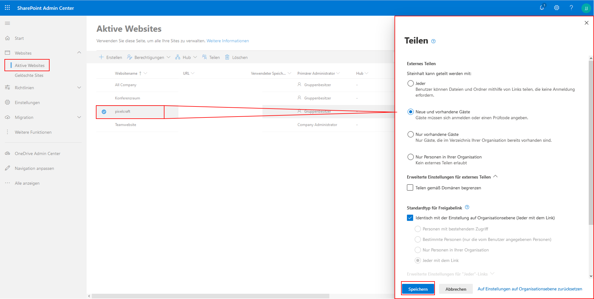

Gastzugang Test
Gast / Rolle

Die voranschreitende Digitalisierung und die durch COVID-19 geprägte Weltlage steigern die Relevanz von Kollaborations-Werkzeugen immer weiter.
Die Lösungen für digitale Zusammenarbeit enden dabei nicht an den Grenzen des eigenen Unternehmens. Auch Kundschaft und extern Mitarbeitende gilt es, in dieses wachsende digitale Arbeitsumfeld zu integrieren.
Microsoft Teams ist eine Lösung, die dieser Herausforderung gewachsen ist. Eine Zusammenarbeit mit Externen ist in Teams möglich, ohne dass Sie sich Gedanken über Lizenzen machen müssen. Ihr eigenes Office-365-Abonnement reicht hierzu aus. Ihr Gast muss lediglich eine private oder geschäftliche E-Mail-Adresse besitzen und kann darüber bereits vollen Zugang zu Meetings, Team-Chats, Dateien und in Teams integrierten Anwendungen erhalten.

Der Gastzugriff in MS Teams ist als eine Rolle zu verstehen. Sie können in Teams einzelne Personen von außerhalb Ihrer Organisation zur Zusammenarbeit einbinden. Als Gast gilt, wer kein Mitglied Ihrer Organisation ist und über kein Geschäftskonto bei Ihrer Organisation verfügt. Jede Person, die nicht Teil Ihrer Organisation ist, kann also als Gast in Teams hinzugefügt werden und vollumfänglich die Kanalfunktionen nutzen. Als Teams-Administrator können Sie dabei den Gast-Zugriff auf Kanäle, deren Chats, Unterhaltungen und Dateiablage verwalten.
Ein Gast muss lediglich über ein E-Mail-Konto verfügen (Outlook, Gmail etc.), um so innerhalb eines MS Teams eingebunden zu werden. Darüber hinaus muss der Gastzugriff, eine organisationweite Einstellung, zunächst durch Sie oder Ihren Administrator aktiviert werden und im gebuchten Office 365 Abonnement enthalten sein. In der Regel können 5 Gäste pro lizensiertem Benutzer eingeladen werden.

Gastrechte
Ein Gast hat standardmäßig folgende Möglichkeiten, Funktionen in Teams zu nutzen:
Kanal erstellen, an privaten Chats teilnehmen, an Kanalunterhaltungen teilnehmen, Nachrichten posten, löschen und bearbeiten, Kanaldateien freigeben. Durch erweiterte Einstellungen kann der Gast auch die Berechtigung erhalten, selbst Gäste einzuladen, Kanäle zu erstellen oder zu löschen.
Auch ohne eigene Office-Lizenz können Ihre Gäste beispielsweise Word-Dokumente erstellen oder an solchen mitarbeiten.
Der Dateiaustausch in privaten Chats ist nicht Teil der Gastfunktionen, über die Kanaldateiablagen auf SharePoint können Gäste aber auf geteilte Dateien zugreifen und dort selbst hochladen.
Teambesitzer und Administratoren können die Gastrechte den erforderlichen Bedürfnissen und Sicherheitsanforderungen anpassen. Sie können Gäste innerhalb von Azure AD verwalten. Ihre Gäste unterliegen dem gleichen Compliance- und Auditing-Schutz wie die gewöhnlichen Office-365-Abonnenten.

Gastzugriff aktivieren
Um Gäste in Teams zu integrieren, müssen Sie zunächst auf Organisationsebene den Gastzugriff allgemein aktivieren. Dies gelingt Ihnen über das Microsoft Teams Admin Center, welches über den Browser im Microsoft 365 Admin Center unter admin.microsoft.com zu erreichen ist. Voraussetzung zum Zugriff auf Admin Center ist ein gültiger Office 365 Business-Plan und dass Sie über Administratorberechtigung verfügen.
Nun melden Sie sich mit Ihrem Administratorkonto im Admin Center an und können dann über das App-Startsymbol oben links die Kachel [Admin] auswählen. Diese Kachel wird nur Personen mit Administratorberechtigung angezeigt.
In der linken Spalte unter [Alle anzeigen] finden Sie das Admin Center [Teams]. Dort können Sie unter [Organisationsweite Einstellungen] im Bereich [Gastzugriff] den Gastzugriff in Teams ermöglichen und Features, die Gastbenutzer verwenden können oder nicht, aktivieren und deaktivieren. Alle Änderungen in diesem Bereich müssen mit [Speichern] bestätigt werden, um wirksam zu sein.

Für den Gastzugriff in Microsoft Teams wird die Azure Active Directory B2B-Plattform (Business-to-Business) genutzt. Die Standardeinstellungen in Azure Active Directory, SharPoint Online und Office 365-Gruppen sind in der Regel bereits für einen Gastzugriff konfiguriert, bedürfen also keiner weiteren Einstellungen, um Gastzugriffe zu ermöglichen.
Hier können Sie aber weitere Einstellungen des Gastzugriffs steuern. Das Azure Active Directory Admin Center finden Sie erneut mit dem Browser im Microsoft 365 Admin Center.
Dort unter [Benutzer], die [Benutzereinstellungen] auswählen und wiederum unter [Externe Benutzer] den Bereich [Externe Einstellungen zur Zusammenarbeit] ansteuern.

Hier können Sie nun bestimmen, ob neben den Administratoren auch Teammitglieder Externe einladen dürfen oder dies sogar Gästen zusteht. Gäste können also selbst Gäste zur Zusammenarbeit mit ihrer Organisation einladen.
Die nächste Instanz zur Verwaltung des Gastzugriffs ist die Office 365-Gruppe. Über das Microsoft 365 Admin Center gelangen sie in der linken Spalte über [Einstellungen] zu [Einstellungen] und dort wird unter Diensten [Office 365-Gruppen] gelistet. Deren Checkboxen sind üblicherweise aktiviert und regeln, dass Gruppenmitglieder von außerhalb ihrer Organisation auf Gruppeninhalte Zugreifen dürfen und Gruppenbesitzer Personen von außerhalb ihrer Organisation zu Gruppen hinzufügen können.

Unter [Sicherheit und Datenschutz], ebenfalls im Office 365 Admin Center unter [Einstellungen], [Einstellungen] zu finden, können Sie unter [Teilen] Benutzern erlauben, neue Gäste zur Organisation hinzuzufügen. Auch diese Einstellung ist üblicherweise bereits aktiviert.

Navigieren sie im Admin Center zum Admin Center [SharePoint]. Dort klicken Sie auf [Websites], [Aktive Websites], wählen Ihr gewünschtes Team an und klicken oberhalb der Liste auf [Teilen]. Mit den Optionen [Jeder] oder [Neue und vorhandene Gäste] können entsprechend Seiteninhalte geteilt werden.
Beachten Sie, dass Änderungen im Admin Center immer mit Speichern bestätigt werden müssen. Im Fall von Änderungen an der Azure Active Directory können bis zu 24 Stunden vergehen, bis die Änderungen aktiv sind und Gäste entsprechend Zugriff haben.

Einen Gast nehmen Sie über die Teams-App auf, indem Sie in der Kanalliste über das Kontextmenü [Weitere Optionen] des gewünschten Kanals [Mitglied hinzufügen] wählen. Dort geben Sie die E-Mail-Adresse des externen Kontakts ein.

Über die Editierfunktion kann der Anzeigename des Gastes bearbeitet werden.

Der Gast erhält per E-Mail eine Einladung und kann, sofern diese E-Mail-Adresse bereits mit einem Microsoft Konto verknüpft wurde, über [Microsoft Teams öffnen] dem Team beitreten.
  
Eine noch nicht verknüpfte E-Mail-Adresse erfordert eine einmalige Registrierung dieser bei Microsoft. Es wird dann automatisch ein Microsoft Konto für die externe Person erstellt, welches dauerhaft mit der angegeben E-Mail-Adresse verknüpft wird.

Teams, deren Mitglieder auch aus Externen bestehen, werden sichtbar gekennzeichnet.
