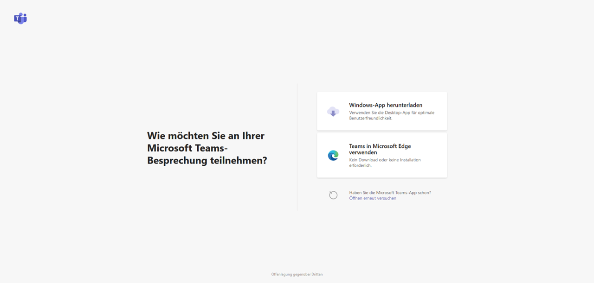
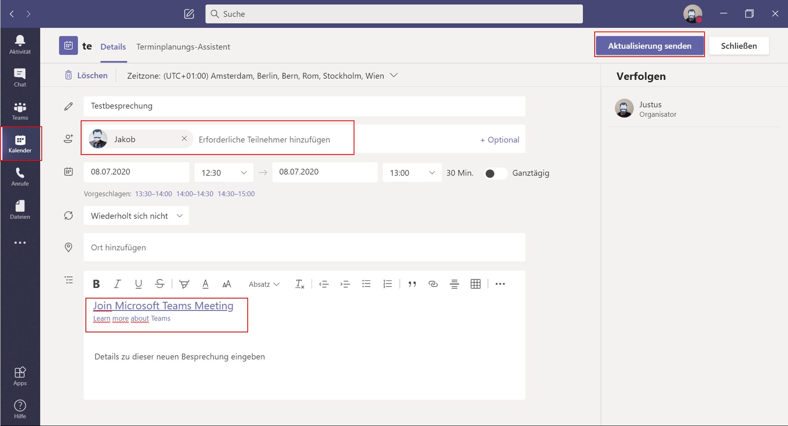

## Gastzugänge in Microsoft Teams

Die voranschreitende Digitalisierung und die durch COVID-19 geprägte Weltlage steigern die Relevanz von Kollaborations-Werkzeugen immer weiter.
Die Lösungen für digitale Zusammenarbeit enden dabei nicht an den Grenzen des eigenen Unternehmens. Auch Kundschaft und extern Mitarbeitende gilt es, in dieses wachsende digitale Arbeitsumfeld zu integrieren.
Microsoft Teams ist eine Lösung, die dieser Herausforderung gewachsen ist.

Eine Zusammenarbeit mit Externen ist in Teams möglich, ohne dass Sie sich Gedanken über Lizenzen machen müssen. Ihr eigenes Office-365-Abonnement (Business Standard, Enterprise oder Education) reicht hierzu aus. Ihr Gast muss lediglich eine E-Mail-Adresse besitzen.

Zunächst muss der Gastzugriff als organisationweite Einstellung durch Ihre Administration aktiviert werden. Danach können fünf Gäste pro lizensiertem Team-Mitglied eingeladen werden. Durch erweiterte Einstellungen können Gäste auch die Berechtigung erhalten, selbst Gäste einzuladen.

Der Gastzugriff in MS Teams ist als eine der Rollen zu verstehen, die die Administration innerhalb der App vergeben kann. {>>Jule: Verlinkung vom Wort "Rollen" auf entsprechenden Absatz im Hauptartikel?<<} Nur in diesem Fall eben an externe Personen. Als Gast gilt, wer kein Mitglied Ihrer Organisation ist und über kein Geschäftskonto bei Ihrer Organisation verfügt.

# Welche Rechte haben Gäste?
Jede Person, die nicht Teil Ihrer Organisation ist, kann als Gast in Teams hinzugefügt werden und damit die [Kanal]-Funktionen prinzipiell vollumfänglich nutzen. Als Administration können Sie die Rechte Ihres Gastzugriffs allerdings nachträglich einschränken und den eigenen Bedürfnissen und Sicherheitsanforderungen anpassen.
Sie können Gäste innerhalb von Azure AD verwalten. Ihre Gäste unterliegen dem gleichen Compliance- und Auditing-Schutz wie alle Personen mit einem Office-365-Abonnement.

Gäste können standardmäßig folgende Funktionen in Teams zu nutzen:
[Kanäle] erstellen, an [privaten Chats] und [Unterhaltungen] teilnehmen sowie Dateien freigeben. {>>Jule: Ich habe hier "Nachrichten posten, löschen und bearbeiten rausgenommen, weil das ja in der Teilnahme an Chats und Unterhaltungen als Vorraussetzung schon enthalten ist"<<} Der Austausch von Dateien in [privaten Chats] ist nicht Teil der Gastfunktionen. Über die [Kanal]-Datei-Ablagen auf SharePoint können Gäste aber auf geteilte Dateien zugreifen und selbst hochladen. Auch ohne eigene Office-Lizenz können Ihre Gäste beispielsweise Word-Dokumente erstellen oder an solchen mitarbeiten.

# Wie steuern wir den Gastzugriff?
Um Gäste in Teams zu integrieren, müssen Sie zunächst auf Organisationsebene den allgemeinen Gastzugriff aktivieren. Dies gelingt Ihnen über das Microsoft Teams Admin Center, welches über den Browser unter admin.microsoft.com zu erreichen ist. Voraussetzungen für den Zugriff auf das Admin Center sind eine gültige Office-365-Business-Lizenz und eine Administrations-Rolle darin.
Melden Sie sich mit Ihrem Administrations-Konto im Admin Center an und wählen Sie über das App-Start-Symbol oben links die Kachel [Admin] aus. Diese Kachel wird nur Personen mit Administrations-Berechtigung angezeigt.
In der linken Spalte unter [Alle anzeigen] finden Sie das Admin Center [Teams]. Dort können Sie unter [Organisationsweite Einstellungen] im Bereich [Gastzugriff] den Gastzugriff in Teams aktivieren und bestimmen, welche Funktionen Gäste nutzen können. Alle Änderungen in diesem Bereich müssen mit [Speichern] bestätigt werden, um wirksam zu sein.

Für den Gastzugriff in Microsoft Teams wird die B2B-Plattform von Azure Active Directory  genutzt. Die Standardeinstellungen in Azure Active Directory, SharePoint Online und Office-365-Gruppen sind in der Regel bereits für einen Gastzugriff konfiguriert und bedürfen damit keiner weiteren manuellen Aktivierung. {>>Jule: Ich bin verwirrt: Muss ich den Gastzugang nun aktivieren oder nicht?<<}
Hier können Sie aber weitere Einstellungen des Gastzugriffs steuern. Auch das Azure Active Directory Admin Center finden Sie über den Browser im Microsoft 365 Admin Center.
Wählen Sie dort unter [Benutzer], die [Benutzereinstellungen] aus und steuern Sie unter [Externe Benutzer] den Bereich [Externe Einstellungen zur Zusammenarbeit] an.

Hier können Sie nun bestimmen, ob neben der Administration auch andere Team-Mitglieder Externe einladen dürfen oder ob dies sogar Gästen zusteht.

Die nächste Instanz zur Verwaltung des Gastzugriffs ist die Office-365-Gruppe. Über das Microsoft 365 Admin Center gelangen Sie in der linken Spalte über [Einstellungen] zu [Einstellungen] und dort wird unter [Dienste] der Menüpunkt [Office 365-Gruppen] gelistet. {>>Jule: Ist das so richtig: "Über [Einstellungen] zu [Einstellungen]"? Im Screenshot sieht es aus wie "Über [Einstellungen] zu [Dienste]"<<} Deren Check-Boxen sind üblicherweise aktiviert und regeln, dass Externe zu Gruppen hinzugefügt werden können und dass Gruppenmitglieder auch von außerhalb Ihrer Organisation auf Gruppeninhalte zugreifen dürfen.

Unter [Sicherheit und Datenschutz], ebenfalls im Office 365 Admin Center unter [Einstellungen], [Einstellungen] zu finden, können Sie Team-Mitgliedern unter [Teilen] erlauben, neue Gäste zur Organisation hinzuzufügen. {>>Jule: Wieder: Ist das richtig? Muss man wirklich zwei Mal auf [Einstellungen] klicken?<<} Auch diese Einstellung ist üblicherweise bereits aktiviert.

Navigieren Sie im Admin Center zum SharePoint Admin Center. Klicken Sie dort auf [Websites], [Aktive Websites], wählen Ihr gewünschtes Team an und klicken oberhalb der Liste auf [Teilen]. Mit den Optionen [Jeder] oder [Neue und vorhandene Gäste] können entsprechende Website-Inhalte geteilt werden.
Beachten Sie, dass Änderungen im Admin Center immer mit [Speichern] bestätigt werden müssen.
Im Fall von Änderungen an der Azure Active Directory können bis zu 24 Stunden vergehen, bis die Änderungen aktiv sind und Gäste entsprechenden Zugriff haben.

Direkt in der Teams-App nehmen Sie Gäste auf, indem Sie den gewünschten [Kanal] in der Liste suchen und über dessen Kontextmenü [...] die Option [Mitglied hinzufügen] wählen. Dort geben Sie die E-Mail-Adresse des externen Kontakts ein.

Über die Editier-Funktion kann der angezeigte Name von Gästen bearbeitet werden.

Gäste erhalten eine Einladung per E-Mail und können, sofern diese E-Mail-Adresse bereits mit einem Microsoft Konto verknüpft wurde, über [Microsoft Teams öffnen] dem Team beitreten.

  

Eine noch nicht verknüpfte E-Mail-Adresse erfordert eine einmalige Registrierung dieser bei Microsoft. Es wird dann automatisch ein Microsoft-Konto für die externe Person erstellt und dauerhaft mit der angegeben E-Mail-Adresse verknüpft.

[Teams], deren Mitglieder auch aus Externen bestehen, werden sichtbar gekennzeichnet.

## Externe in eine Besprechung einladen

MS Teams bietet Ihnen auch die Möglichkeit, Externe an einzelnen Besprechungen teilnehmen zu lassen. Eine Teilnahme ist dabei ganz ohne Anmeldung möglich.

Hierzu müssen Sie der externen Person einen Link bereitstellen, der direkt in die gewünschte Besprechung führt. Wie sie den Link teilen, etwa per Email oder Messenger, bleibt Ihnen überlassen. Die Teilnahme über einen Link ist allen Personen mittels der MS Teams App möglich, welche auch auf Mobilgeräten mit Mac- oder Android-OS verfügbar ist. Darüber hinaus ist es mittels eines Links auch möglich, über einen Browser an einer Besprechung teilzunehmen. Hierzu ist unter Mac-Os ein Chrome-Browser, unter Windows der Microsoft Edge- oder Chrome-Browser eine Voraussetzung. Die eingeladene Person erhält über den Link die Wahl, wie sie an der Besprechung teilnehmen will.

Den Teilnahme- bzw. Einladungs-Link generieren Sie auf zwei Arten:

In der Planung einer Besprechung über den Kalender, oder in einer laufenden Besprechung.

Planen Sie eine Besprechung über den Kalender, können Sie Personen über deren Email-Adresse im Bereich [Erforderliche Teilnehmer hinzufügen]. Wenn Sie die Besprechung inklusive der Angabe über erforderliche Teilnehmer abgeschlossen haben können Sie über [Kalender] erneut auf die geplante Besprechung zugreife. Nun wird im Bereich für [Details zu dieser Besprechung] der Hyperlink dargestellt, der weitere Personen zu dieser Besprechung führen kann. Kopieren Sie diesen oder den Link aus dem Hyperlink und teilen Sie ihn mit weiteren Personen, die Sie nicht direkt eingeladen haben.  

Personen, die Sie direkt über die Besprechungsplanung durch Angabe von deren Email-Adressen eingeladen haben,  erhalten dann eine Email mit einem Teilnahmelink und der Möglichkeit, der geplanten Besprechung zuzusagen, diese abzulehnen und eine Synchronisation des Termins mit persönlichen Kalendern vorzunehmen.

In einer laufenden Besprechung können Sie über die Schaltfläche [Teilnehmer anzeigen] im Eingabefeld [Jemanden einladen] Personen direkt einen Beitrittslink per Email zukommen lassen, indem Sie dort deren Email-Adresse eintragen. Außerdem können Sie über die Schaltfläche [Teilnahmeinfos kopieren] an den Teilnahmelink kommen.

Der Teilnahmelink verbirgt sich in beiden Fällen als Hyperlink hinter dem Text „Join Microsoft Teams Meeting“. Sie können den Hyperlink nutzen, oder den Link aus dem Hyperlink kopieren und so für die direkte Verwendung in einer Adresszeile des Browsers nutzbar machen. Diese Link-URL ist jedoch sehr lang.

Wird dem Link gefolgt, muss sich die Person vor dem Betreten der Besprechung einen Namen geben und ihre Ton- und Videooptionen wählen und dies mit [Jetzt Teilnehmen] bestätigen.

Daraufhin befindet sie sich im Wartebereich und wird Ihnen bzw. dem Organisator der Besprechung als dort befindlich angezeigt. Dies geschieht über eine Pop-Up-Benachrichtigung und ein Symbol in der Steuerleiste Ihrer aktiven Besprechung, welches über [Teilnehmer anzeigen] erscheint. Hier finden Sie auch den Wartebereich, in dem Sie eingeladene Personen über das Hakensymbol nun teilnehmen lassen können.

