**das wird dicker Text**
# Headline erster Ordnung aka Titel

## wichtige Konventionen:

Keine Sachen im Dateinamen groß schreiben, keine Umlaute nutzen (gilt auch für Bilder) !

Keine Sonderzeichen in den datei- und ordnernamen und Bildern! Also keine Unterstriche! Bindestriche ersetzen Leerzeichen!

Datei muss den gleichen Namen wie der übergeordnete Ordner haben, allerdings ohne das vorangestellte "_ "" !
Ordnername hat immer ein vorangestelltes _ "

nach einer Überschrift muss eine leerzeile eingefügt werden

wir arbeiten mit vielen Absätzen - wird mit einer leerzeile dargestellt
Bilder müssen  erst in den Ordner der md-Datei gespeichert werden, dann mit dem Markdown Befehl:

Darf keinen Platzhaltertext beinhalten, besser leer halten. Dieser Text wird Blinden vorgelesen! Die eckigen Klammern und ! muss aber da seine

Zeilenumbruch siehe Zettlr Notizen - werkzeuge

Datei speichern, damit es in der Github-App aktualisiert, dort kommentiert und dann gepusht werden kann.

Die Markdown-Preview aktiviere  ich in Atom mit STRG+SHIFT+M

{>>jakob: hier ein Beispiel für einen Querverweis<<} So werden Kommentare erstellt, sie werden leicht grau dargestellt. der vorangestellte Name kennzeichnet den Autor!

Repositories klonen: Fernarbeit + Unterordner Notizen und draft (darin wird gearbeitet)

# Was ist MS-Teams:

Microsoft Teams ist eine Kollaborationslösung für Teams verschiedener Größe, geeignet für Frimen, Projekte aber durch einen Fokus auf eine effektive Arbeitsumgebung auch eigenständig Tätige. Es bietet plattformübergreifend via App oder Browser einen zentralen Ort der Kommunikation, der Dateiverwaltung und Zusammenarbeit, offen für verschiedene Endgeräte und Betriebssysteme ob mobil oder lokal. Es eignet sich ideal für den Einsatz im Homeoffice oder zur strukturierten gemeinsamen Arbeit innerhalb einer Organisation. Als Cloudbasierter Dienst ermöglicht Teams den Zugriff auf Dateien und Dienste von überall. Der Cloudspeicher garantiert dabei gemeinsames, sicheres Bearbeiten von Dateien. Die Integration der Speicherorte in sogenannte Kanäle sorgt dafür, dass Sie nicht permanent in Dateiordnern arbeiten müssen, sondern bietet ein angenehmes und übersichtliches digitales Arbeitsumfeld. Außerdem lassen sich in Teams neben den Microsoft Office Anwendungen viele der beliebtesten Apps integrieren, das zentrierte und damit effektive Arbeitsumfeld in Microsoft Teams lässt sich entsprechend eigenen Wünschen und Voraussetzungen anpassen und verschiedene Apps miteinander im Arbeitsalltag verbinden, ohne ständig die Programmanwendung wechseln zu müssen.
Microsoft Teams ist zunächst ein Chat-Programm. Gleichzeitig ist es ein Zentrum der Produktivität, ein virtueller Arbeitsraum, der durch einen Fokus auf Kollaboration und geprägt ist, durch die Möglichkeit, das digitale Arbeitsumfeld individuell anpassen zu können aber auch für jede einzelne Person ein Umfeld gesteigerter Effektivität bedeuten kann.

Dabei werden auch die Kommunikation, Zusammenarbeit und geteilte Speicherung von Dateien mit externen Personen durch Teams gefördert, Personen, die also nicht zu Ihrer Organisation gehören wie Kunden oder Partner, über eine gemeinsame Office365-Lizenz verbunden sind oder überhaupt über eine Office365-Lizenz verfügen. Die sogenannten [Teams] umfassen innerhalb der App Sammlungen von Personen, Inhalten und Tools für einzelne Projekte oder ganze Organisationen. Diese Teams lassen sich mit Kanälen noch weiter spezifizieren und aufteilen, um Projekten, Themen, Fachrichtungen oder weiteren für Sie wichtigen Aspekten noch besser gerecht zu werden und die passende Arbeitsumgebung zu bieten.

Dazu werden die Kommunikation einer Firma oder eines Projektes, eine gemeinsame Dateienverwaltung und die Integration diverser digitaler Werkzeuge aus dem Arbeitsalltag zur gemeinsamen Verwendung an einem Ort gebündelt.
Als Teil der Microsoft-Office-Umgebung lassen sich in [Teams] Microsofts weitere Werkzeuge wie Word oder OneNote aber auch viele weitere Programme und Anwendungen aus anderem Hause integrieren, das heißt, zur gemeinsamen Bearbeitung verfügbar und allgemein sichtbar machen. Kommunikation, Dateiverwaltung und Arbeitsumgebung erhalten in Teams eine strukturierte Ordnung, ohne dabei unbedingt auf liebgewonnene Werkzeuge verzichten zu müssen. Die Offenheit auch für externe Anwendungen zeichnet Microsoft Teams aus und lässt es zu einem produktiven digitalen Arbeitsumfeld werden.

## Einsatzfelder Teams und Problemlösungsmöglichkeiten

Als dezentral aus dem Homeoffice arbeitende Firma begegnen wir mit Teams folgenden Problematiken:
Unser Arbeitsalltag litt unter einem zerstreuten Arbeitsumfeld und unstrukturierter Kommunikation:

- Die Absprachen fanden in verschiedenen Apps statt (Trello, WhattsApp)
- Die gemeinsam genutzten, erstellten und geteilten Dateien waren unübersichtlich gespeichert und problematisch in der Synchronisation
- Die laufende Kommunikation war unpersönlich
- Die Wissensdatenbank war durch die Auslagerung in OneNote nicht schnell greifbar
- Die Aufteilung der Kommunikation und Arbeitsschritte auf verschiedene Plattformen und Programme stellte ein Hemmnis dar, führte zu Produktivitätsverlust und Unzufriedenheit

Teams ermöglicht uns, all diese Probleme zentralisiert anzugehen und zu minimieren.
Teams ist für die Zusammenarbeit und Steigerung der Produktivität da.
Im Wesentlichen wird eine Kommunikation über Unterhaltungen, Chats, Telefonie und Videotelefonie geboten, ohne dass sich diese Arten der Kommunikation auf verschieden Apps und Orte verteilen müssen. Ganz gezielt soll Microsoft Teams etwa die interne Email-Kommunikation minimieren, ohne dabei dieses Medium komplett aus dem internen Arbeitsalltag zu verbannen. Der Austausch wird zentral, einheitlich und damit übersichtlich gebündelt. Vorbei die Zeiten, in denen über private Telefonnummern in Whats-App Chats geschäftliches auf dem vermeintlich „kurzen/schnellen“ Weg geklärt wurde, während per Email ein wichtiger interner Hinweis einging und auf Aufmerksamkeit wartete, die Videokonferenz nicht von allen betreten werden konnte, weil die dafür eingesetzte App auf dem Telefon nicht lief.

Die wahrscheinlichsten Business-Szenarien für Teams wären die Zusammenarbeit in Gruppen, Abteilungen oder Projekten.
Eine Abteilung etwa kann ein eigenes [Team] gründen und innerhalb dessen für jedes Thema, welches zusammen bearbeitet wird, einen spezifischen [Kanal] gründen. In den [Kanälen] kann dann Wissen zu diesem Thema geteilt und gesammelt und gemeinsam an Dokumenten gearbeitet werden. Gleiches gilt für die Kommunikation, die über [Teams] und deren zugehörige [Kanäle] gesteuert wird.
Ein unproduktiver Einsatz von verschiedenen Werkzeugen an unterschiedlichen Orten für die Kommunikation und Zusammenarbeit wird durch Teams ausgeschlossen, ohne dabei unflexibel zu sein. Gelang die Kommunikation bisher etwa über Yemma, kann Yemma in Teams integriert werden und tägliches Kommunikationswerkzeug bleiben.
Auch die Zusammenarbeit und Kommunikation mit Kunden kann mit Teams organisiert werden. Es lassen sich spezifische Teams gründen mit Kanälen für Auftrage und Projekte, oder Kunden in bestehende Kanäle einladen. Kunden und externe Personen können als Gäste in die Zusammenarbeit in [Teams] integriert werden und können kontrolliert Zugriff auf alle dort gesammelten Informationen und Inhalte erhalten.

## Was sollte vor dem Start beachtet werden?

Um die volle Funktionalität auszuschöpfen und eine gelungene Integration in den Arbeitsalltag zu erreichen, muss sich jedoch vor der Einführung von Teams als neues Instrument jede Nutzerin und Nutzer über den Einsatzzweck und die Nutzungsmöglichkeiten im Klaren sein.
Ziel sollte sein, die integrierbaren Werkzeuge des täglichen Einsatzes mit all den Teams-Features zu nutzen, die den Arbeitsalltag erleichtern. Alle Mitarbeitenden sollten über die Vorzüge der Integration ihrer Werkzeuge aufgeklärt werden, ein einfaches „Teams Nutzen weil es da ist“ ist kaum erfolgsversprechend.
Als Kollaborationslösung zur verbesserten Kommunikation und dezentralen Zusammenarbeit wirkt Teams nur langfristig, wenn direkt die nötige Akzeptanz für das Programm geschaffen wird.
Eine gute Feedback-Kultur und Fehlertoleranz ist eine Grundlage zum offenen und langfristig erfolgreichen Umgang mit Teams. Hierbei können auch integrierbare Apps einen Beitrag leisten, eine bestehende Feedback-Kultur in das digitale Arbeitsumfeld zu übertragen oder neu aufzustellen. Die Herausforderungen eines neuen Werkzeuges, dürfen nicht unterschätzt werden. Auf Nöte und Wünsche der Anwendenden sollte und kann Dank der Flexibilität der [Teams]-Umgebung reagiert werden.
Es lohnt sich, im Vorhinein Lösungsansätze für bestehende Probleme des Arbeitsalltags innerhalb Teams zu suchen und vor der Verteilung an die Mitarbeitenden in Teams zu implementieren. Es braucht Lösungsansätze, die den Einsatz der neuen Arbeitsumgebung schmackhaft machen. Hier können schon kleinere Problemlösungen einen positiven Effekt haben: ein in Teams integrierter Speiseplan der Kantine oder direktere Teilhabe an internen Informationen etwa wären kleine, unkompliziert zu verwirklichende Anreize, die Mitarbeitenden den Einstieg in Teams als digitales Arbeitsumfeld lohnend erscheinen lassen. Hierzu ist ein Bewusstsein über konkrete Bedürfnisse der Mitarbeitenden nützlich, die dann entsprechend in Microsoft Teams berücksichtigt werden sollten und die Akzeptanz gegenüber der neuen Software steigern können.

Zur gesteigerten Akzeptanz ist auch die Einbindung der Führungsebene entscheidend. Alle Abteilungsebenen und Mitarbeitenden sollten im Arbeitsumfeld von Teams sichtbar und aktiv sein.
Neben der Akzeptanz ist eine richtige Erwartungshaltung an Teams wichtig. Es gilt unter Umständen Gewohnheiten zu überwinden, die eine effektive Arbeit mit Teams untergraben würden. Hierfür muss Verständnis über Möglichkeiten und Grenzen von Teams geschaffen werden.

 - Was soll der Einsatz von Teams verbessern? Warum ist es lohnenswert, die Arbeit in einem neuen digitalen Umfeld zu bewältigen?

Diese Fragen lassen sich mit den firmeninternen Notwendigkeiten beantworten, sollten aber klar kommuniziert werden. Ein Leitfaden für alle Mitarbeitenden kann den Einstieg in Teams reibungsloser gestalten und die Erwartungen moderieren. Klare Absprachen über Arbeitsabläufe, klare Aussagen, wo und wie die Kommunikation in Teams ablaufen soll, wie die Dateiablage gehandhabt wird oder wann welche Lösung genutzt wird, erzeugen Sicherheit im Umgang und somit Akzeptanz und Effektivität des neuen digitalen Umfelds. Wird eine App präferiert, die nicht in Teams integriert wird, sollte auch hier der Grund dafür klar kommuniziert werden, besonders in dem Fall, dass innerhalb von Teams eine App bereit steht, die den gleichen Zweck erfüllen würde.

Ein gelungener Einstieg in Teams gelingt wahrscheinlicher, wenn Mitarbeitende für Microsoft Teams begeistert werden und erkennen, dass sie persönlich von diesem Werkzeug profitieren. Dazu ist es notwendig zu verdeutlichen und zu erklären, wie der digitale Arbeitsplatz funktioniert und zu beachten, welche Apps und Arbeitsweisen den Bedürfnissen der Mitarbeitenden gerecht werden.

# Was kann Teams leisten? / Umgang mit Apps

Teams zeichnet die Offenheit für Apps aus: Die Wahl der kompatiblen Werkzeuge ist groß genug, um Notwendigkeiten aber auch Vorlieben und Gewohnheiten gerecht zu werden. Nicht alles muss für Teams neu gelernt und verändert werden. Viele bereits funktionierende Arbeitsabläufe lassen sich in Teams integrieren oder optimieren.
Unterstützte Apps und Werkzeuge lassen sich in Teams aus einer umfangreichen Liste auswählen und auf verschiedenen Ebenen integrieren, dadurch lässt sich eine zentrierte, effektive Arbeitumgebung schaffen.

Diese Ebenen sind in Microsoft Teams wiefolgt aufgebaut:

Auf der linken Seite von Teams lassen sich Apps mit persönlicher Ansicht oder zum eigenen Gebrauch integrieren. Sie sind so in der linken Seite eingebunden schnell und kanalunabhängig verfügbar.

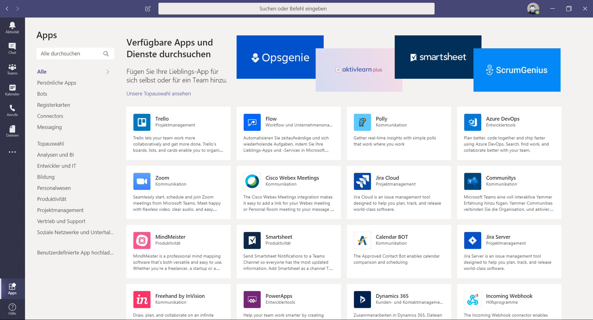

Für die Zusammenarbeit mit unterschiedlichen Personen oder in bestimmten Aufgabenbereichen, lassen sich Apps in den Registrierkarten der Kanäle oder auch Chats einbinden.

Die oben angeordneten Registrierkarten sind in Chats und Kanälen die Orte, an denen Apps platziert und über die Schaltfläche „+“ neu hinzugefügt werden können. Auf diese Weise lassen sich auch Dokumente aus Word oder PowerPoint zur gemeinsamen Bearbeitung hinterlegen.
RegistrierkartenInKanalZufügen

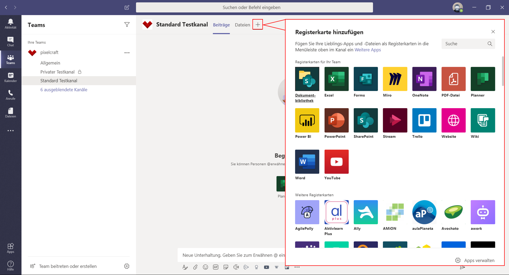

Für jeden Kanal lassen sich auch über [weitere Optionen] App-Benachrichtigungen einbinden. Über sogenannte [Connectors] wird dann im Kanal für alle Mitglieder über Veränderungen, Fortschritte und Weiteres aus der gewünschten App informiert.

Apps können auch in Unterhaltungen integriert werden und deren Inhalte direkt in Nachrichten eingefügt werden: Ein Youtube-Video, ein Wikipedia-Artikel, eine schnelle Umfrage, all das lässt sich zusätzlich zum klassischen Text so mit den Teammitgliedern teilen und durch die in Teams integrierte Suchfunktion schnell erreichen.
Eine Auswahl dieser kompatiblen Apps finden Sie unter dem Feld, in dem Sie die Nachricht eingeben, über die Schaltfläche der drei Punkte [Messaging-Erweiterungen]. Einzelne Apps lassen sich unter dem Nachrichtenfeld auch anheften und ermöglichen so eine schnellere Verfügbarkeit für Nachrichten in Unterhaltungen.

Die Entscheidung darüber, welches Werkzeug zum Einsatz kommt, ist somit unproblematisch. Ist die Wahl einmal getroffen, sollte dieser auch konsequent gefolgt werden und deren durch Teams gebotenen Vorteile der Kollaboration Anwendung finden.

Ein gemeinsam zu bearbeitendes Word-Dokument etwa, kann in Teams für alle optimal erreichbar und sichtbar integriert werden. Ist dies einmal geschehen, sollte dieses Dokument nun auch konsequent über Teams gemeinsam bearbeitet und kommentiert werden. Kommentare bleiben auf diese weise nicht in einem Dokument eingesperrt und warten dort auf Aufmerksamkeit, sie können ohne weiteren Aufwand öffentlich und gezielt in der Kanalkommunikation auftauchen.

Ein Beispiel nicht gelungener Adaption wäre hier, dass jedes Teammitglied weiterhin in einem eigenen Dokument arbeitet, es lokal speichert und innerhalb der Teams-App lediglich in Chats die übrigen Mitarbeitenden über Veränderungen informiert, um später ein Dokument aus unzähligen Dokumenten wieder zusammenzufügen und auch die Kommunikation zum Dokument in verschiedensten Chats verteilt zu haben. So wäre Teams aller kollaborativer Stärken beraubt und würde als Ort einer so stattfindenden suboptimalen Kommunikation wohl eher auf negative Wahrnehmung der Anwendenden treffen.
Optimal wäre Teams eingesetzt, indem das Dokument für alle sichtbar in Teams platziert und dadurch für alle erreichbar auf einem gemeinsamen SharePoint hinterlegt wird. Mit der Kommentarfunktionen im geteilten Dokument, welche gleichzeitig in Teams Kanälen dargestellt wird, gelingt mit allen Mitarbeitenden eine übersichtliche, effektive und nachvollziehbare Kommunikation.

# Wie ist Teams aufgebaut? Struktur

Die Benutzeroberfläche von Teams ist übersichtlich und einfach aufgebaut. Ziel ist es, die wichtigsten Funktionen schnell erreichbar zu machen.
Die linke Spalte ist mit den Schaltflächen der Hauptkategorien versehen.

- Aktivität (ein Feed, der chronologisch über Erwähnungen, Nachrichten, Änderungen und weitere Vorgänge in eigenen Teams informiert)

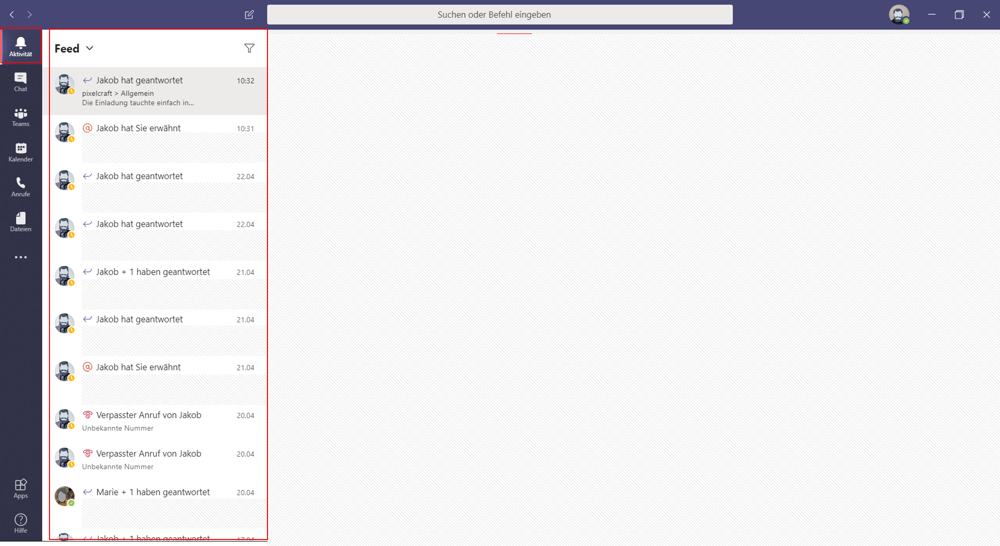

- Chat (ermöglicht den schnellen Austausch mit Teammitgliedern)

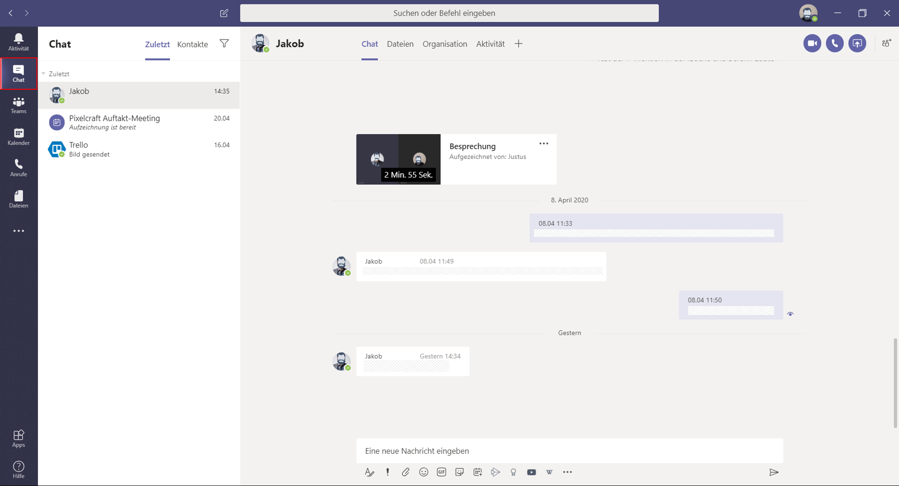

- Teams (listet alle Teams auf, an denen Sie beteiligt sind. In diesen sind wiederum die einzelnen Kanäle zu finden)

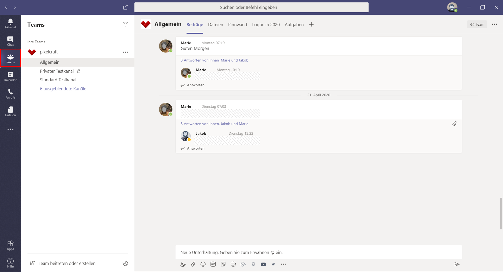

Kalender (hier werden Besprechungen geplant, in einem Kalender aufgeführt und können über diesen betreten werden)

- Anrufe (bietet die Möglichkeit, mit Teammitgliedern per Video- oder Audiocall zu kommunizieren, Kontakte, Verlauf und eine Art Anrufbeantworter sind hier zu finden)

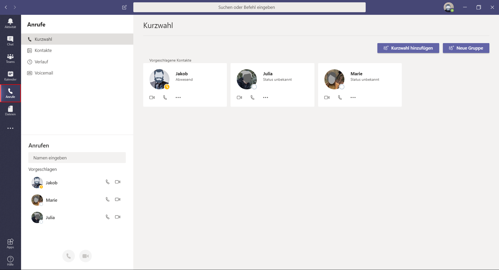

- Dateien (hier finden Sie alle mit Ihnen im Team geteilten Dateien.

In der linken Spalte lassen sich unterhalb der Hauptkategorien außerdem noch weitere Apps zum Schnellzugriff platzieren.

Die Kopfzeile bietet auf der linken Seite eine Navigationshilfe mit Vor- und Zurückfunktion. Diese ist besonders praktisch, um schneller wieder in den Bereich zurückzukommen, aus dem Sie beispielsweise durch einen Chat herausgerissen wurden. Über die Zurückfunktion gelangen Sie dorthin wieder zurück, ohne den Umweg über die Schaltflächen Teams und Kanäle nehmen zu müssen.

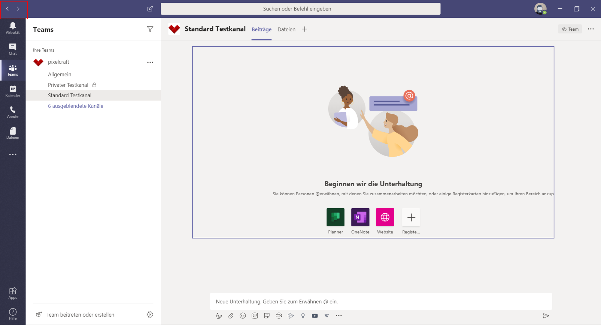

In der Mitte der Kopfzeile kann eine allgemeine Suche darüber hinaus aber auch Befehle ausgeführt werden. Befehle dienen als Kurzbefehle, mit denen allgemeinere Aufgaben in Teams erledigt werden können. Um einen Befehl zu verwenden geben Sie ein / in das Befehlsfeld ein. Eine Liste taucht auf und gibt Ihnen einen Überblick der möglichen Befehle. Auf das / müssen Sie dann noch ohne trennendes Leerzeichen den gewünschten Befehl eingeben und mit Enter bestätigen.

Mit einem vorangestellten @ und darauf folgendem Namen können Sie im Befehlsfeld direkt Nachrichten an Personen und bestehende Gruppenchats senden.

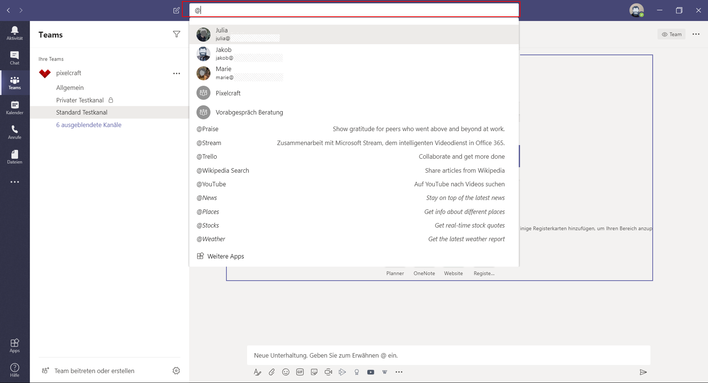

 Im Rechten Bereich der Kopfzeile sind über das runde Profilbild Ihre Grundeinstellungen der Teams-App zu erreichen. Neben den Einstellungen, kann hier auch der den anderen Teammitgliedern angezeigte Status eingestellt werden.

Der Aufbau der einzelnen Hauptkategorien ist in den jeweiligen Passagen beschrieben.

# Kanäle

Teams Einsatzfelder zeichnen sich im Wesentlichen durch drei Pfeiler aus: Kommunikation, Kollaboration und Dateiverwaltung.

Diese Pfeiler stehen auf dem Fundament von Teams, den Kanälen.
Kanäle sind spezielle Abschnitte innerhalb eines Teams. Hiervon stehen jedem Team 200 Standardkanäle und 30 sogenannte private Kanäle zur verfügung.
In Kanälen findet Kommunikation, Kollaboration und Dateiverwaltung statt. Ein Kanal gibt dabei den Personenkreis oder thematischen Rahmen vor. Hier kann aufgeteilt und bestimmt werden, wer Zutritt hat, wer Informationen erhält oder erhalten will, wer Zugriff auf Dateien hat und welche  spezifischen Apps und Tabs verfügbar sind.
Jedes Team startet mit einem Hauptkanal [Allgemein]. Er wird automatisch bei Gründung eines neuen Teams angelegt und kann weder gelöscht noch umbenannt werden.
Für jedes Team lassen sich für bestimmte Projekte oder als Arbeitsumgebung für einen ausgewählten Personenkreis weitere Kanäle hinzufügen, die dann zweckmäßig benannt werden können.
Wird ein Kanal nicht mehr benötigt, lässt er sich löschen. Dabei bleiben die dort geteilten Dateien auf der zum Kanal gehörigen SharePoint Teamseite gespeichert, die Unterhaltungen gehen jedoch verloren.
Ein Kanal besteht aus Tabs bzw. Registrierkarten, die in der Menüleiste oben im Kanal zu finden sind und dort auch erweitert werden können. Jeder Kanal hat dabei zwei Tabs, die dauerhaft bestehen, nicht gelöscht oder umbenannt werden können: [Beiträge] und [Dateien]. Wird ein Kanal betreten, ist automatisch der Tab [Beiträge] geöffnet. In diesem befinden sich alle [Unterhaltungen] des Kanals. Es ist der direkte Ort der Kommunikation und Zusammenarbeit.

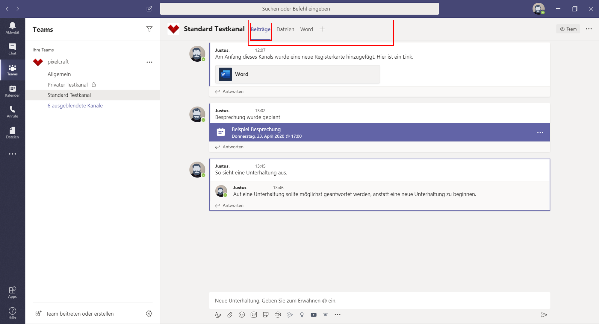

Der Tab [Dateien] bietet einen übersichtlichen Zugriff auf den kanaleigenen Ordner auf SharePoint und somit auf alle Dateien, die über [Unterhaltungen] innerhalb des Kanals geteilt oder direkt bei SharePoint hochgeladen wurden. Geteilt wird die Datei, indem sie über die Schaltfläche [Anfügen] oder Copy-Paste in eine [Antwort] oder neue [Unterhaltung] integriert wird. Der kanaleigene SharePoint-Ordner wird automatisch bei Gründung eines neuen Kanals erstellt und mit dem Dateientab des Kanals verknüpft.

Für jeden Kanal lassen sich mit der als Plus dargestellten Schaltfläche weitere [Registrierkarten hinzufügen]. [Teams] bietet eine große Auswahl an Apps zur Integration an, es lassen sich jedoch auch Websites und einzelne Dokumente mittels eines Tabs in einem Kanal platzieren. So sind wichtige Apps von Microsoft aber auch externen Anbietern, Websites oder gemeinsam bearbeitete Word-Dokumente nur einen Mausklick entfernt, und lassen sich nutzen, ohne die Teams-App verlassen zu müssen. Dabei ist jedoch zu bedenken, dass beispielsweise Word-Dokumente innerhalb der Teams-App in deren Onlineansicht dargestellt werden. Ebenfalls mit einem Klick lässt sich jedoch aus diesem in ein Tab eingefügten Dokument in die vollständige Applikation wechseln.

Die Kanäle lassen sich in der App zur verbesserten Übersicht sortieren: mit der gedrückten Maustaste lassen sie sich verschieben, über das Kontextmenü [Weitere Optionen] auch anheften.
Kanäle stehen zunächst allen Mitgliedern eines Teams offen. Um selektiv Mitgliedern Zugriff zu gewähren, lassen sich private Kanäle gründen. Sie werden in der Kanalübersicht Ihres Teams mit einem Schloss symbolisch gekennzeichnet und auch nur den Mitgliedern angezeigt. Unterhaltungen, Mitgliederlisten und eine separate Websitesammlung auf SharePoint zur Dateiablage sind nur Mitgliedern des privaten Kanals zugänglich. Wer private Kanäle erstellen kann, lässt sich auf Team- und Organisationsebene bestimmen, es steht als Standard aber zunächst allen Teammitgliedern zu, Gäste haben hierzu keine Berechtigung.

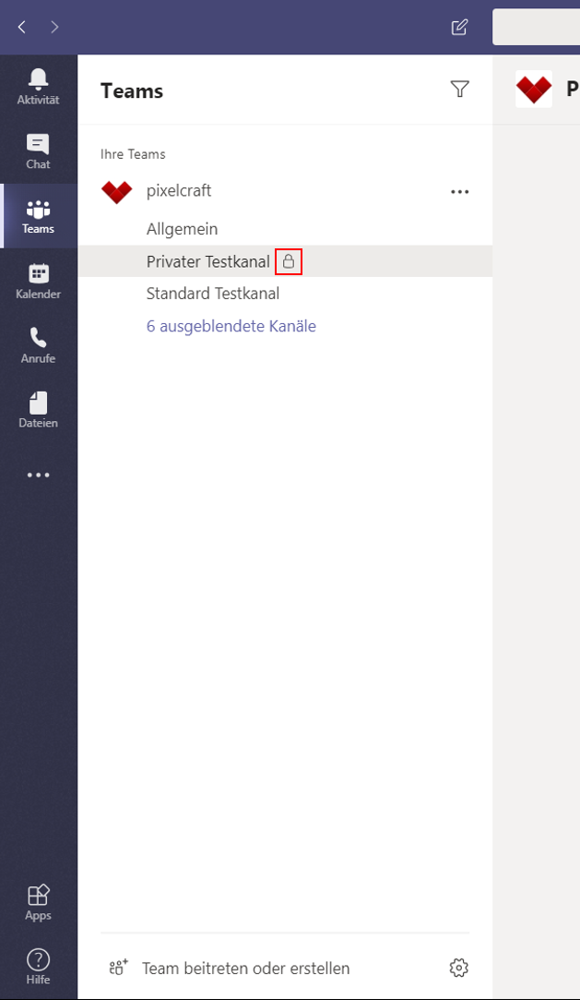

Die Person, die einen privaten Kanal erstellt, kann beliebig Teammitglieder und auch Gäste zum privaten Kanal hinzufügen. Um einen Privaten Kanal zu erstellen, muss im Erstellungsfenster unter [Datenschutz] die Auswahl [Standard - für alle Teammitglieder zugänglich] auf [Privat - nur für bestimmte Personengruppe im Team zugänglich] verändert werden. Anschließend lassen sich erwünschte Personen hinzufügen, oder nachträglich über das Kontextmenü des Kanals [weitere Optionen] ergänzen.

# Unterhaltung

Der größte Teil der Kommunikation innerhalb von [Teams] findet in der sogenannten [Unterhaltung] statt. Unterhaltungen Sind Teil eines jeden Teams [Kanal] und unter der Registrierkarte [Beiträge] zu finden. Wird ein Kanal betreten, so ist dieser Reiter automatisch ausgewählt. Jeder Kanal eines Teams hat seinen eigenen Bereich der [Beiträge].  Wird eine Unterhaltung gestartet, können alle Mitglieder des Teams und Personen mit Zugangsberechtigung auf diese Antworten oder eine eigene Unterhaltung starten. Dabei können Unterhaltungen neben Text auch Dateianhänge, Emojis, Gifs, Sticker, Bilder, Videos und App-Inhalte beinhalten.
Eine [Unterhaltung] dient als Ordnungsinstanz und kann durch eine Formatierungsfunktion, zu erreichen über das große A unterhalb des Texteingabefeldes, optisch Wünschen und Notwendigkeiten angepasst werden.

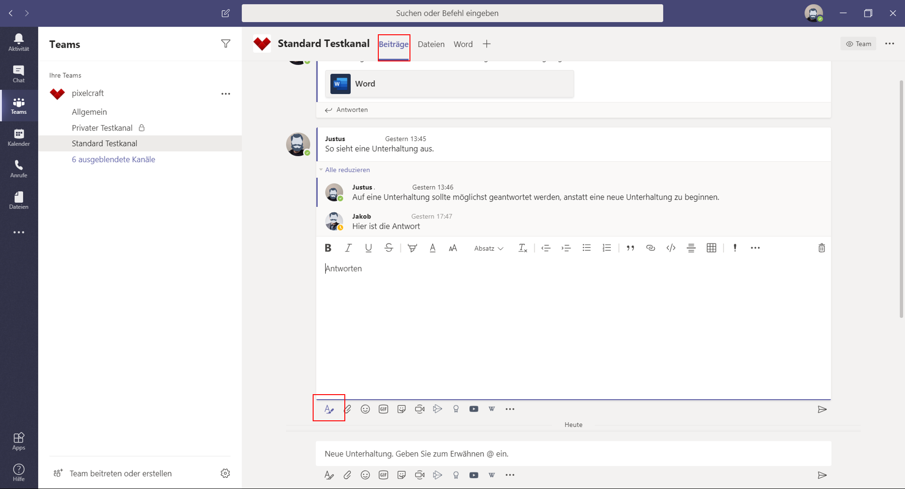

Eine Unterhaltung folgt dem Prinzip eines Threads: Diskussionsbeiträge werden hierarchisch organisiert. Der Anfangsbeitrag einer Unterhaltung gibt das Thema vor, welchem die weiteren Beiträge folgen. Ist ein Thema für Einzelne nicht von Belang oder Interesse, kann so schneller über die Unterhaltung hinweggesehen werden, als es in einer Chatkommunikation mit ihrer durchlaufenden, ungeordneten Gesprächsführung der Fall wäre. Es sollte darauf geachtet werden, die Unterhaltungen und damit den Thread zu einem Thema weiter für dieses Thema zu nutzen und dort für weitere Beiträge auf [Antworten] zurückzugreifen, anstatt eine Antwort oder Fortsetzung des Themas durch eine [Neue Unterhaltung] anzugehen und den Kanal so aufzublasen. Umfangreiche Unterhaltungen mit vielen Antworten werden zur verbesserten Übersicht zusammenklappt und lassen sich bei Bedarf wieder ausklappen.

Auf eine [Unterhaltung] und deren Beiträge lässt sich schnell per Emoji reagieren und so Kenntnisnahme oder Feedback öffentlich kommunizieren, ohne besonderen Einsatz abzuverlangen.  Diese simple Funktion stellt sich als äußerst nützlichen Teil der Kommunikation in Remoteteams dar. Diese kurze Interaktion fördert den Austausch zwischen Teammitgliedern immer dann, wenn aus Zeitmangel oder anderen Gründen eine detailliertere Reaktion nicht möglich ist. Diese Kurzreaktion per Emoji kann den Austausch verstärken und darüber hinaus als Bindeglied zwischen den Teammitgliedern fungieren: Jemand ist da, Jemand nimmt wahr, Jemand weiß zu schätzen.  

Unterhaltungen lassen sich über Lesezeichen für später speichern und per Link oder Email teilen. Besonders die Funktion, Unterhaltungen zu speichern ist eine nützliche Funktion, um wichtige Unterhaltungen schnell wieder verfügbar zu machen oder diese zu fokussieren. Die Funktion ist über  das Kontextmenü [Weitere Optionen] der Unterhaltung zu erreichen, welches auftaucht, sobald Sie den Mauszeiger über der Unterhaltung platzieren. Zu den gespeicherten Nachrichten und Unterhaltungen gelangen Sie über Ihr Profilbild oben rechts unter [Gespeichert]. Über das Kontextmenü lassen sich die Speicherungen wieder aufheben.

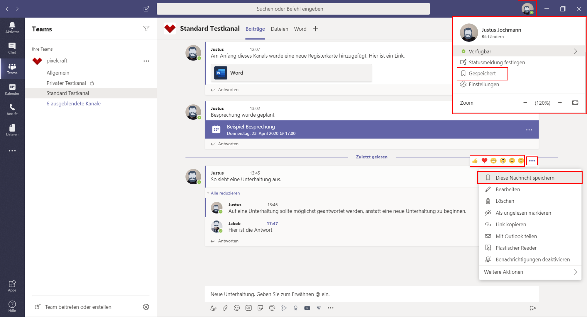

Die Kanalinterne Kommunikation ermöglicht, Information gezielt mit den Richtigen zu teilen, ohne Anderen die Information aufzuzwingen oder überhaupt zugänglich zu machen. Es lässt sich genau bestimmen, wer zu einem Kanal Zutritt hat und dort eine [Unterhaltung] beginnen kann. Jedes einzelne Teammitglied kann darüber hinaus bestimmen, in welcher Art die einzelnen Kanäle sich bemerkbar machen: ist ein Kanal für eine Weile nicht von Belang für eine Person, kann dieser ausgeblendet werden und so keine weitere ungewollte Aufmerksamkeit provozieren.
Auch eine E-Mail lässt sich in eine Unterhaltung umwandeln und so in die Teamsumgebung integrieren. Über das jeweilige Kontextmenü [Weitere Optionen] eines Kanals lässt sich eine [E-Mail-Adresse abrufen]. An diese lassen sich E-Mails inklusive Anhang weiterleiten. Die E-Mails werden dann im Kanal als Unterhaltung dargestellt, auf welche die Kanalmitglieder dort antworten können. Gleichzeitig werden dadurch die Anhänge der E-Mails in SharePoint der Teamseite gespeichert und so für alle verfügbar.

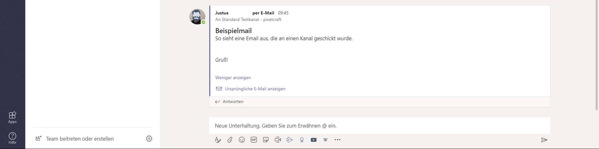

# Chat

Außerhalb der Kanäle findet sich im Bereich [Chat] der Ort, an dem sich Mitglieder in Teams persönlich austauschen können. Er befindet sich in der Seitenleiste der Teams-App.
Chats sind ebenso wie Kanäle in Tabs aufgeteilt und beinhalten immer die Registrierkarten [Chat], also den eigentlichen Chatverlauf, [Dateien] die nur mit den am Chat Teilnehmenden geteilt werden und in Einzelchats den Bereich [Aktivität], der über die Aktivitäten des Chat-Gegenübers in allen mit Ihnen gemeinsam geteilten Kanälen  informiert.
Es lassen sich auch in Chats weitere Registrierkarten einfügen.
Chats können zwischen zwei oder mehr Personen geführt werden, können stumm geschaltet, zur besseren Navigation angeheftet und gezielt durchsucht werden. Für jede neue Personenkonstellation mit Chatinteraktion wird ein neuer Bereich angelegt, den Sie immer wieder erreichen können, um das Gespräch fortzuführen oder auf Informationen erneut zuzugreifen.
Die Nachrichten in Chats laufen durchgängig weiter, eine Ordnung wie in Kanalunterhaltungen ist hier also nicht möglich.
Hier geteilte Dateien sind nur den Chatmitgliedern zugänglich und werden in den persönlichen OneDrive-For-Business-Ordnern gespeichert. Zu diesen Dateien gelangen Sie über den zugehörigen Reiter/Tab [Dateien], der auch über den Absender und damit über den Speicherort Auskunft gibt.
Auch eine Videokonferenz bzw. [Besprechung] oder ein Anruf in der Teams-App beinhaltet einen eigenen Chatbereich, über den zusätzliche Infos oder auch Bilder und andere Dateien geteilt werden können. Auch diese Chatverläufe inklusive ihrer Dateien werden der Speicherlogik von Teams-Chats nach in den privaten One-Drive-For-Business-Ordnern der Teilnehmenden gespeichert.
Besprechungs-Chats verfügen neben den üblichen Registrierkarten [Chat] und [Dateien] noch über die Bereiche [Whiteboard] und [Besprechungsnotizen]. Das Whiteboard ist eine Integration der Whiteboard Web App von Microsoft, um es in einer [Besprechung] zu nutzen, muss eine Person im laufenden Videocall ein Whiteboard freigeben. Dies gelingt über die Schaltfläche [Teilen] im Besprechungsmenü.
[Besprechungsnotizen] können zur Vor- und Nachbereitung genutzt und bearbeitet werden. Sie sind nur für Personen zugänglich, die zuvor zu der zugehörigen [Besprechung] eingeladen worden sind. Vor der Besprechung lassen sich Notizen im Bereich [Kalender] starten und vorbereiten. Während der [Besprechung] können Sie im Besprechungsmenü über [Weitere Aktionen] [Besprechungsnotizen] starten und anzeigen.

Alle diese Chats werden im Bereich [Chat] aufgeführt und lassen sich dort weiternutzen, dies gilt auch für die darin integrierten Whiteboards und Notizen.

# Videotelefonie

Teams hat ein interne Lösung für Videotelefonie und Anrufe. Es steht Lösungen wie Skype for Business in nichts nach und ist laut Microsoft auch als dessen Nachfolgelösung gedacht, soll doch Skype for Business im Sommer 2021 den Dienst einstellen.
Videoanrufe und Anrufe können in Teams über [Anrufe], aus [Chats] heraus, über die Befehlszeile oder über die Profilbilder der zu kontaktierenden Teammitglieder getätigt werden.
Besonders praktisch sind die Videoanrufe allerdings innerhalb der [Besprechung], der Videokonferenz in der Teams-App. So können [Besprechungen] über den [Kalender], in der linken Seitenleiste zu finden, geplant und wahrgenommen werden.

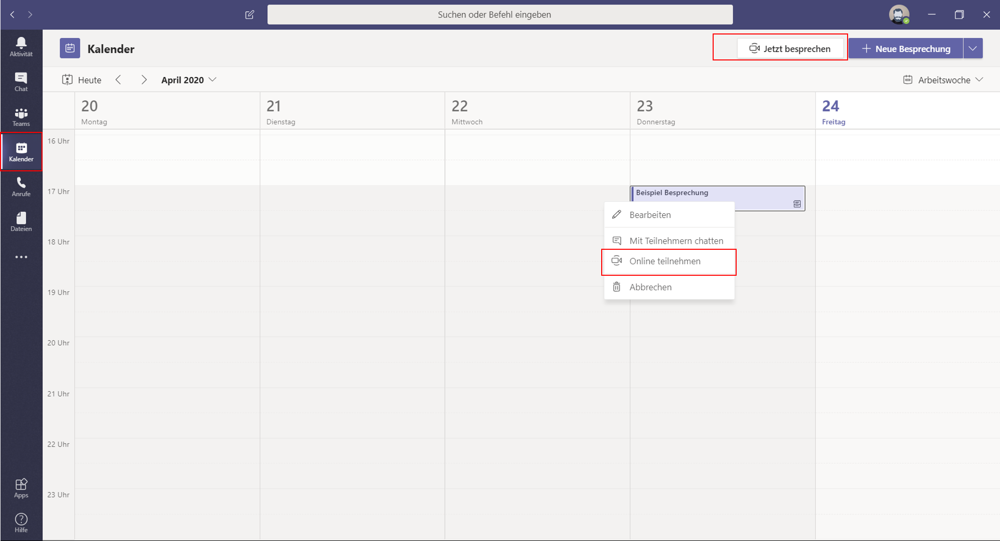

Hinweise mit Teilnahmemöglichkeit auf Besprechungen finden sich auch in den Kanälen wieder.
Die Videoanrufe und Anrufe verfügen über eigene Chats, und eine komfortable Möglichkeit, den eigenen Bildschirm oder einzelne Programmfenster anderer Apps zu teilen.
Videoanrufe lassen sich über den integrierten Dienst [Stream] aufzeichnen und teilen.
Je nach Lizenz bietet Teams auch die Möglichkeit, per Telefon an Besprechungen teilzunehmen und damit auf diesem Weg weitere Gäste und Teammitglieder ohne Internetanbindung in die [Besprechung] zu integrieren.
Mittlerweile verfügt die Videotelefonie in Teams auch die Möglichkeit, künstlich den Hintergrund  des Videos zu bestimmen. Neben der Möglichkeit, Ihren von der Webcam aufgezeichneten Hintergrund unkenntlich zu machen und so den Teilnehmenden unerwünschte Einblicke in Ihre Umgebung zu gewähren, kann nun auch ohne zusätzliche technische Voraussetzungen eine Art Greenscreen-Effekt genutzt werden. Während Sie im Vordergrund sichtbar bleiben, wird Ihr Hintergrund durch eine wählbare Grafik ersetzt. Vor dem Betreten einer Besprechung oder eines Videocalls bietet sich Ihnen die Möglichkeit, genaue Einstellungen ihres Mikrofons und der Kamera vorzunehmen. Hier finden Sie zwischen der Funktion, die Kamera und das Mikrofon an und abzuschalten, die Möglichkeit, die Hintergrundeinstellungen vorzunehmen. Während eines Anrufes erreichen Sie diese Funktion über die darin mit drei Punkten dargestellte Schaltfläche [Weitere Aktionen] und dann unter [Hintergrundeffekte anzeigen].

Teams bietet einige Hintergrundbilder, um einen eigenen Hintergrund in Teams zu integrieren, müssen Sie jedoch einen kleinen Umweg nehmen. Die gewünschte Bilddatei muss in den entsprechenden Teams-Ordner eingefügt werden.
Unter Windows ist der Ordner über den Pfad C:\Users\%USERNAME%\AppData\Roaming\Microsoft\Teams\Backgrounds\Uploads zu erreichen, oder indem Sie im Windows Startsuchfeld %APPDATA%\Microsoft\Teams\Backgrounds suchen. Ihnen wird dann der Ordner Uploads angezeigt, in welchen die gewünschten Bilddateien kopiert werden müssen.
Unter MacOS finden Sie einen versteckten Ordner unter dem Pfad ~/Library/Application Support/Microsoft/Teams/Backgrounds/Uploads.
Bilder werden hier in Teams in 1920x1080 px dargestellt und abweichende Formate auf dieses automatisch zurechtgeschnitten.
Vor jedem Beitritt eines Anrufs wird der Bereich der Audio- und Videoeinstellungen aufgerufen. Nutzen Sie diesen Bereich und stellen Sie über die Geräteeinstellungen sicher, dass die gewünschte Kamera aktiviert ist und Sie gut zu verstehen sind. Diese Einstellungen erreichen Sie über das mit einem Zahnrad gekennzeichnete [PC-Mikrofon und Lautsprechereinstellungen]. Ob alle vorgenommenen Einstellungen wie gewünscht funktionieren, lässt sich hier durch einen kurzen Testanruf überprüfen.
Diese Überprüfung gibt jedoch keine genaue Auskunft über die tatsächliche Qualität Ihrer Video- und Audioqualität. Microsoft bietet im Testanruf eine verminderte Bandbreite. Um die genaue Qualität Ihrer Ton- und Videospur zu ermitteln, welche die übrigen Teilnehmenden effektiv zu sehen und hören bekommen, bietet sich eine kurze Aufzeichnung einer Besprechung an. Diese können Sie auch ohne weitere Teilnehmer immer starten. Eine Aufzeichnung starten Sie, indem Sie in den Besprechungssteuerelementen einer laufenden Besprechung unter [weitere Optionen], dargestellt mit drei Punkten, [Aufzeichnung starten] wählen. An gleicher Stelle beenden Sie die Aufnahme wieder. Die Aufzeichnung wird in Microsoft [Stream] gespeichert und dem [Besprechungschat] hinzugefügt und im Kanal, in dem die Besprechung stattgefunden hat als Aktivität dargestellt. Die Aufzeichnung wird zunächst verarbeitet, es kann eine Weile dauern, bis sie veröffentlicht und Ihnen und den übrigen Teilnehmenden zugänglich ist. Beachten Sie, dass nur Besprechungen und Gruppenanrufe aufgezeichnet werden können.

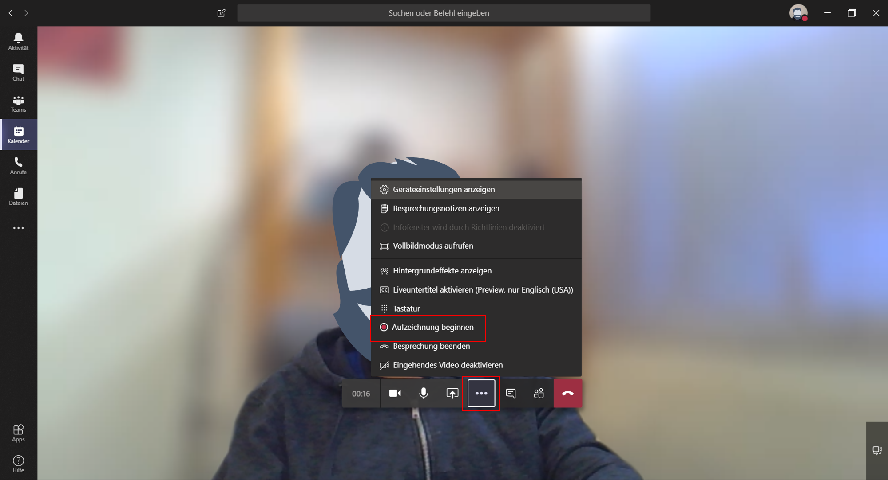

# Benachrichtigung / Erwähnungen

Teams hat den Anspruch, ein digitales Arbeitsumfeld zu schaffen, welches die Produktivität seiner Anwendenden steigert. Um dies zu erreichen, soll die in Teams stattfindende Kommunikation funktional sein, ohne durch die örtliche Nähe der Kommunikationswerkzeuge und der Arbeitswerkzeuge für zu viel Ablenkung zu sorgen. Damit die Kommunikation in Teams dem Spagat gerecht wird, eine notwendige Aufmerksamkeit der gewünschten Person zu erreichen, ohne dabei unangemessen aufdringlich zu sein, arbeitet Teams mit einer eigenen Benachrichtigungslogik, mit der sich steuern lässt, was, wann und wie eine Benachrichtigung durchdringt.
Über das eigene Profilbild oben rechts sind die [Einstellungen] zu erreichen. Dort kann unter [Benachrichtigungen] genau bestimmt werden, wie Erwähnungen, Nachrichten und Sonstiges kommuniziert werden.
Auswählbar sind Benachrichtigungen über Banner, Feed und E-Mail.
Ein Banner ist ein kleines Pop-Up, welches unter Windows im unteren rechten Bereich des Bildschirms und auf einem Mac in der oberen rechten Ecke für eine kurze Weile auftaucht und selbstständig wieder unsichtbar wird.
Per Feed werden im Bereich [Aktivität], zu erreichen über das Glockensymbol oben links, dauerhaft und dank Filterfunktionen übersichtliche Informationen und Erwähnungen gesammelt und angezeigt. Alle geteilten Aktivitäten der Mitarbeitenden und eigene Aktivitäten in Teams, Kanälen, Unterhaltungen, Chats und integrierten Apps werden hier zusammengefasst und können mit einem Mausklick angesteuert werden.

Die Benachrichtigung per E-Mail erfolgt mit zeitlicher Verzögerung. Bleibt eine Erwähnung in Teams länger unbemerkt, wird eine E-Mail versandt, die auf diese Erwähnung hinweist. Diese Benachrichtigungsart lässt sich nicht weiter den eigenen Wünschen anpassen, sondern lediglich deaktivieren. Teams erklärtes Ziel ist es, die E-Mail möglichst aus der hier stattfindenden Kommunikation rauszuhalten und nur als Stütze für das eigene Benachrichtigungsprinzip zu verwenden.

Die größtmögliche Aufmerksamkeit der Mitarbeitenden erregen in Teams Erwähnungen, die @mentions. Mit diesen lassen sich einzelne Personen aber auch ganze Teams oder Kanäle und deren Mitglieder gezielt anschreiben, diese Kontaktaufnahme wird besonders auffällig
gekennzeichnet. Im Chat oder Unterhaltungen muss ein @ vor den gewünschten Namen einer Person oder eines ganzen Kanals geschrieben werden, ohne durch ein Leerzeichen getrennt zu werden. Wird ein @ geschrieben, bietet [Teams] direkt eine Reihe an Vorschlägen, welche Person aufmerksam gemacht werden soll, ein @team und @kanal öffnen entsprechende Vorschläge. Die Benachrichtigung der Person oder des Kanals wird im Aktivitätsfeed angezeigt. Ein roter Punkt auf dem Glockensymbol des Aktivitätsfeeds weist auf solche @Mentions oder eine Antwort hin, die noch nicht bemerkt oder bearbeitet wurde.

Über den Bereich [Suchen oder Befehl eingeben] im oberen Zentrum der Teams-App lassen sich mit den Befehlen /ungelesen und /erwähnungen ungelesene Kanalbenachrichtigungen und eigene @mentions anzeigen.
Die Teilnahme an einem Kanal ist die Grundvoraussetzung, um über dortige Aktivitäten informiert zu werden.
Als Mitglied eines Kanals ist es möglich, einen Kanal komplett auszublenden und so über die darin stattfindende Aktivität nicht weiter informiert zu werden. Jeder Kanal hat ein eigenes Kontextmenü, welches mit drei nebeneinanderliegenden Punkten gekennzeichnet ist. Hier befindet sich die Funktion [Ausblenden]. Ein ausgeblendeter Kanal taucht dann nicht mehr direkt in der Kanalübersicht auf, sondern wird unter [ausgeblendete Kanäle] in der gleichen Übersicht geführt und lässt sich darüber auch wieder sichtbar machen. Eine @mention oder eine als wichtig gekennzeichnete Nachricht wird allerdings dennoch angezeigt.
Neue Aktivitäten in einem Kanal ohne eine @mention werden angezeigt, indem der Name des Kanals in der Kanalliste fett gedruckt erscheint, bis der Kanal aufgesucht wurde.
Im Kontextmenü eines Kanals lässt sich über [Kanalbenachrichtigungen] weiter bestimmen, wie dort die Benachrichtigung stattfinden sollen. Über die Einstellungen [Banner und Feed], [Nur im Feed anzeigen] und [Aus] lässt sich bestimmen, wie Kanalnutzende über neue Beiträge in diesem Kanal oder Kanalerwähnungen informiert werden. Das Banner erscheint als Pop-Up unten rechts auf dem Bildschirm für eine kurze Zeit, die Information im Feed wird im Bereich [Aktivität] dauerhaft und dank Filterfunktionen übersichtlich gesammelt und angezeigt.

Über den Anwesenheitsstatus [Nicht stören] lassen sich alle Benachrichtigungen komplett stummschalten, bis der Anwesenheitsstatus wieder geändert wird.

# Der Dateien-Tab

Der Tab [Dateien] bietet Zugriff auf alle Dateien, die auf der SharePoint Teamsseite gespeichert sind. Die Ordnung der Dateien funktioniert dabei automatisch, jeder Kanal besitzt einen zugehörigen Ordner, der automatisch bei Kanalgründung auf SharePoint erstellt wird. Alle Dateien, die in einem Kanal auftauchen, landen in diesem Ordner. Neben dem Zugriff über die Teams-App und die Teilnahme an einem Kanal, lässt sich mit diesen Dateien natürlich auch über die SharePoint-Seite direkt arbeiten.
Über die Schaltfläche [Dateien] in der linken Spalte der Teams-App lassen sich auch weitere Cloud-Speicher integrieren.

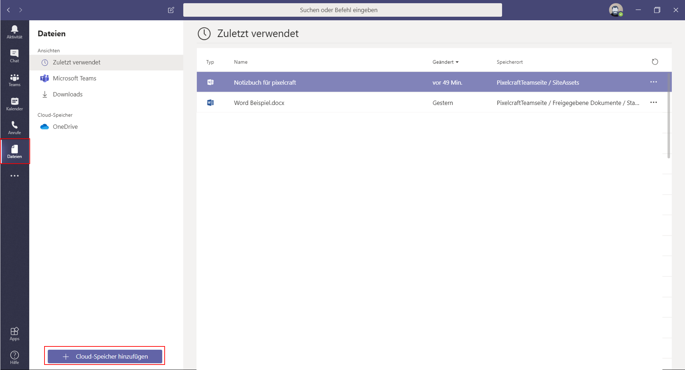

# Aufbau eines Teams/ Vor dem Start

Alle Nutzenden von Office 365 können ein Microsoft [Team] starten bzw. aufbauen. Die einzelnen [Teams] in Microsoft Teams sind auf Office 365 Gruppen aufgebaut, wird ein neues Team gegründet, wird automatisch eine neue Office365 Gruppe gegründet. Es lohnt sich im Vorhinein zu überlegen, ob allen Teammitgliedern die Berechtigung gegeben wird, neue Teams anzulegen, oder dies in der Hand ausgewählter Personen liegen soll, der IT oder Administratoren, um das Teamsumfeld übersichtlicher zu gestalten. Alle diese Berechtigungen innerhalb von Microsoft Teams lassen sich nach den eigenen Bedürfnissen bestimmen, was auch für Entscheidungen gilt, ob Emojis genutzt werden können, welche Apps hinzugefügt werden dürfen, wer Kanäle gründen und verwalten kann und vieles mehr.
Gründen Sie ein neues Team, werden folgende Elemente automatisch erstellt:

- Eine neue Office 365-Gruppe
- Eine SharePoint Online Website und eine SharePoint Online-Dokumentbibliothek (hier werden die Teamdateien gespeichert, jeder Kanal erhält hier seine Dateiablage)
- Ein OneNote Notizbuch für das Team (wird in SharePoint Online gespeichert)
- Ein Exchange Online Postfach
- Ein Exchange Online-Kalender

Ein Team, welches auf Basis einer bestehenden Gruppe gegründet wird, übernimmt Mitgliedschaften, Website, Postfächer und Notizbuch der Gruppe und überführt diese in Microsoft Teams.
Bevor ein neues Team gegründet wird, muss der Name des Teams geprüft werden: Microsoft warnt leider nicht davor, sollte ein Team mit gleichem Namen in Ihrer Organisation bereits bestehen. Das Team lässt sich zwar namensgleich gründen, die zugehörigen SharePoint-Bereiche dürfen jedoch nicht den gleichen Namen aufweisen. Microsoft würde in einem solchen Fall randomisierte Zahlen an den neu geründeten Bereich mit gleichem Namen hängen, die Verwirrung wäre groß.

Ein neues Team „Vertrieb“ bei bereits bestehendem Team „Vertrieb“, würde etwa seine Dateiablage unter https://beispiel.sharepoint.com/sites/Vertrieb314 finden.
In größeren Firmen wären denkbare Fälle, dass es gleiche oder ähnliche Arbeitsbereiche mehrfach gibt. Gibt es eine Sales-Abteilung einmal in Deutschland und eine in den USA und beide entscheiden sich, innerhalb einer Organisation und einer Office365-Lizenz ein Team namens „Sales“ aufzumachen, weist Teams beim zweiten Gründen nicht auf das bereits bestehende namensgleiche Team hin, sondern ergänzt im zweiten Fall die Benennung durch eine randomisierte Zahlenfolge. Die SharePoint-Teamwebsite und Emailadresse des später gegründeten Teams würden entsprechend inklusive der zufälligen Zahlenfolge erscheinen.
(Beispiel: https://Beispielfirma.sharpoint.com/Sites/Salesteam367)

Um herauszufinden, welche Namen die bestehenden Teams bereits haben, kann in der Teams App im Bereich [Teams] unten links über das Zahnradsymbol neben [Team beitreten oder erstellen] eine Übersicht der bestehenden Teams inklusive einer Suchfunktion genutzt werden.

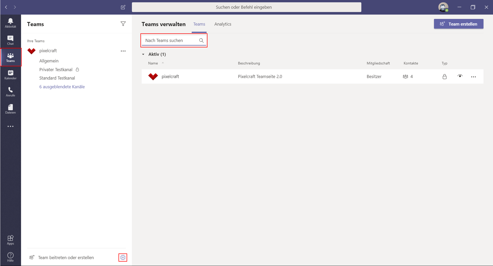

Da auch die von Teams erstellten Outlook Email-Adressen von der ursprünglichen Namenswahl bestimmt sind, gilt es ebenso auf eine allzu sperrige Benennung eines Teams zu verzichten. Wird das Team beim Erstellen „das Team zur Evaluation Betatest“ genannt, so wird die zugehörige Email entsprechen „dasTeamZurEvaluationBetatest@yourdomain.com“.
Vor Gründung eines neuen Teams sollte also eine durchdachte Namenskonvention bestehen und im Organisationsinternen Teamsbereich via Suchfunktion abgeklärt werden, ob ein wie geplant zu benennendes Team bereits besteht.

Mit einem gefundenen Namen im Gepäck bestehen zwei Optionen, auf welcher Grundlage ein neues Team aufgebaut wird: Von Grund auf neu oder auf Grundlage eines bereits existierenden Office 365 Gruppe oder Teams.
Bei einem völlig neu erstelltes Team muss zunächst bestimmt werden, wie neue Mitglieder in das Team gelangen können: Bei der Einstellung [Privat] müssen Mitarbeitende eingeladen werden. [Öffentlich] können alle Mitgliedere einer Organisation dem Team beitreten, [Organisationsweit] werden alle Mitglieder einer Organisation automatisch Teil des Teams.
Mit Gründung auf Basis einer Office 365 Gruppe kann auf bereits bestehende Strukturen und Einstellungen zurückgegriffen werden.

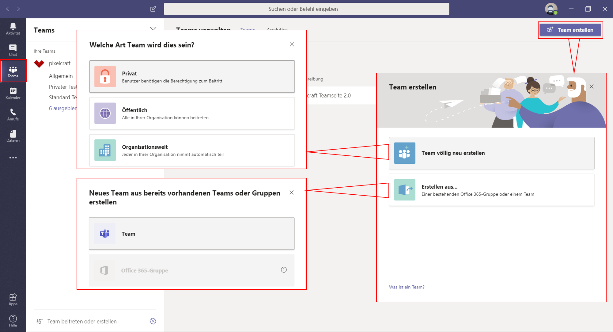

Nun müssen als letzter Schritt dem Team gegebenenfalls Mitglieder und diesen dann Rollen zugewiesen werden. Als Rollen steht die Wahl zwischen [Mitglied] und [Besitzer] an. Es empfiehlt sich als Backup, pro Team mehr als nur einen Besitzer oder Besitzerin zu bestimmen.
Teambesitzer können die teamweiten Einstellungen in Microsoft Teams verwalten.
