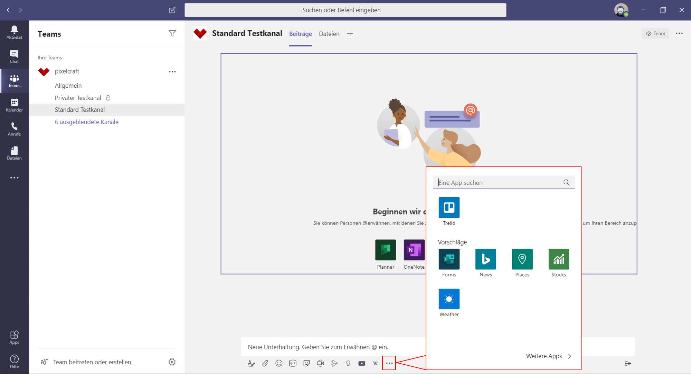
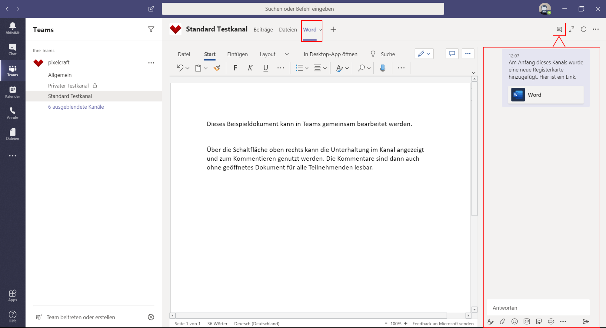
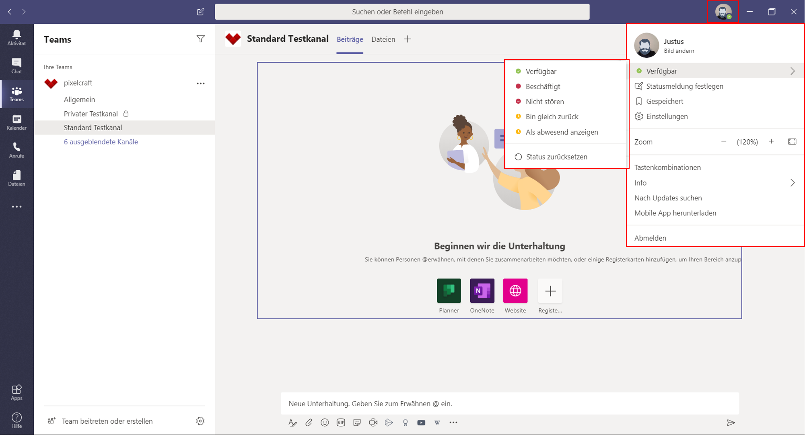

**das wird dicker Text**
# Headline erster Ordnung aka Titel

## wichtige Konventionen:

Keine Sachen im Dateinamen groß schreiben !

Keine Sonderzeichen in den datei- und ordnernamen und Bildern!

Datei muss den gleichen Namen wie der übergeordnete Ordner haben, allerdings ohne das vorangestellte "_ "" !
Ordnername hat immer ein vorangestelltes _ "

nach einer Überschrift muss eine leerzeile eingefügt werden

wir arbeiten mit vielen Absätzen - wird mit einer leerzeile dargestellt
Bilder müssen  erst in den Ordner der md-Datei gespeichert werden, dann mit dem Markdown Befehl:

Datei speichern, damit es in der Github-App aktualisiert, dort kommentiert und dann gepusht werden kann.

Die Markdown-Preview aktiviere  ich in Atom mit STRG+SHIFT+M

{>>@jakob: hier ein Beispiel für einen Querverweis<<} So werden Kommentare erstellt, sie werden leicht grau dargestellt.

# Was ist MS-Teams:

Microsoft Teams ist eine Kollaborationslösung für Teams verschiedener Größe, geeignet für Frimen, Projekte aber durch einen Fokus auf eine effektive Arbeitsumgebung auch eigenständig Tätige. Es bietet plattformübergreifend via App oder Browser einen zentralen Ort der Kommunikation, der Dateiverwaltung und Zusammenarbeit, offen für verschiedene Endgeräte und Betriebssysteme ob mobil oder lokal. Es eignet sich ideal für den Einsatz im Homeoffice oder zur strukturierten gemeinsamen Arbeit innerhalb einer Organisation. Als Cloudbasierter Dienst ermöglicht Teams den Zugriff auf Dateien und Dienste von überall. Der Cloudspeicher garantiert dabei gemeinsames, sicheres Bearbeiten von Dateien. Die Integration der Speicherorte in sogenannte Kanäle sorgt dafür, dass Sie nicht permanent in Dateiordnern arbeiten müssen, sondern bietet ein angenehmes und übersichtliches digitales Arbeitsumfeld. Außerdem lassen sich in Teams neben den Microsoft Office Anwendungen viele der beliebtesten Apps integrieren, das zentrierte und damit effektive Arbeitsumfeld in Microsoft Teams lässt sich entsprechend eigenen Wünschen und Voraussetzungen anpassen und verschiedene Apps miteinander im Arbeitsalltag verbinden, ohne ständig die Programmanwendung wechseln zu müssen.
Microsoft Teams ist zunächst ein Chat-Programm. Gleichzeitig ist es ein Zentrum der Produktivität, ein virtueller Arbeitsraum, der durch einen Fokus auf Kollaboration und geprägt ist, durch die Möglichkeit, das digitale Arbeitsumfeld individuell anpassen zu können aber auch für jede einzelne Person ein Umfeld gesteigerter Effektivität bedeuten kann.

Dabei werden auch die Kommunikation, Zusammenarbeit und geteilte Speicherung von Dateien mit externen Personen durch Teams gefördert, Personen, die also nicht zu Ihrer Organisation gehören wie Kunden oder Partner, über eine gemeinsame Office365-Lizenz verbunden sind oder überhaupt über eine Office365-Lizenz verfügen. Die sogenannten [Teams] umfassen innerhalb der App Sammlungen von Personen, Inhalten und Tools für einzelne Projekte oder ganze Organisationen. Diese Teams lassen sich mit Kanälen noch weiter spezifizieren und aufteilen, um Projekten, Themen, Fachrichtungen oder weiteren für Sie wichtigen Aspekten noch besser gerecht zu werden und die passende Arbeitsumgebung zu bieten.

Dazu werden die Kommunikation einer Firma oder eines Projektes, eine gemeinsame Dateienverwaltung und die Integration diverser digitaler Werkzeuge aus dem Arbeitsalltag zur gemeinsamen Verwendung an einem Ort gebündelt.
Als Teil der Microsoft-Office-Umgebung lassen sich in [Teams] Microsofts weitere Werkzeuge wie Word oder OneNote aber auch viele weitere Programme und Anwendungen aus anderem Hause integrieren, das heißt, zur gemeinsamen Bearbeitung verfügbar und allgemein sichtbar machen. Kommunikation, Dateiverwaltung und Arbeitsumgebung erhalten in Teams eine strukturierte Ordnung, ohne dabei unbedingt auf liebgewonnene Werkzeuge verzichten zu müssen. Die Offenheit auch für externe Anwendungen zeichnet Microsoft Teams aus und lässt es zu einem produktiven digitalen Arbeitsumfeld werden.

## Einsatzfelder Teams und Problemlösungsmöglichkeiten

Als dezentral aus dem Homeoffice arbeitende Firma begegnen wir mit Teams folgenden Problematiken:
Unser Arbeitsalltag litt unter einem zerstreuten Arbeitsumfeld und unstrukturierter Kommunikation:

- Die Absprachen fanden in verschiedenen Apps statt (Trello, WhattsApp)
- Die gemeinsam genutzten, erstellten und geteilten Dateien waren unübersichtlich gespeichert und problematisch in der Synchronisation
- Die laufende Kommunikation war unpersönlich
- Die Wissensdatenbank war durch die Auslagerung in OneNote nicht schnell greifbar
- Die Aufteilung der Kommunikation und Arbeitsschritte auf verschiedene Plattformen und Programme stellte ein Hemmnis dar, führte zu Produktivitätsverlust und Unzufriedenheit

Teams ermöglicht uns, all diese Probleme zentralisiert anzugehen und zu minimieren.
Teams ist für die Zusammenarbeit und Steigerung der Produktivität da.
Im Wesentlichen wird eine Kommunikation über Unterhaltungen, Chats, Telefonie und Videotelefonie geboten, ohne dass sich diese Arten der Kommunikation auf verschieden Apps und Orte verteilen müssen. Ganz gezielt soll Microsoft Teams etwa die interne Email-Kommunikation minimieren, ohne dabei dieses Medium komplett aus dem internen Arbeitsalltag zu verbannen. Der Austausch wird zentral, einheitlich und damit übersichtlich gebündelt. Vorbei die Zeiten, in denen über private Telefonnummern in Whats-App Chats geschäftliches auf dem vermeintlich „kurzen/schnellen“ Weg geklärt wurde, während per Email ein wichtiger interner Hinweis einging und auf Aufmerksamkeit wartete, die Videokonferenz nicht von allen betreten werden konnte, weil die dafür eingesetzte App auf dem Telefon nicht lief.

Die wahrscheinlichsten Business-Szenarien für Teams wären die Zusammenarbeit in Gruppen, Abteilungen oder Projekten.
Eine Abteilung etwa kann ein eigenes [Team] gründen und innerhalb dessen für jedes Thema, welches zusammen bearbeitet wird, einen spezifischen [Kanal] gründen. In den [Kanälen] kann dann Wissen zu diesem Thema geteilt und gesammelt und gemeinsam an Dokumenten gearbeitet werden. Gleiches gilt für die Kommunikation, die über [Teams] und deren zugehörige [Kanäle] gesteuert wird.
Ein unproduktiver Einsatz von verschiedenen Werkzeugen an unterschiedlichen Orten für die Kommunikation und Zusammenarbeit wird durch Teams ausgeschlossen, ohne dabei unflexibel zu sein. Gelang die Kommunikation bisher etwa über Yemma, kann Yemma in Teams integriert werden und tägliches Kommunikationswerkzeug bleiben.
Auch die Zusammenarbeit und Kommunikation mit Kunden kann mit Teams organisiert werden. Es lassen sich spezifische Teams gründen mit Kanälen für Auftrage und Projekte, oder Kunden in bestehende Kanäle einladen. Kunden und externe Personen können als Gäste in die Zusammenarbeit in [Teams] integriert werden und können kontrolliert Zugriff auf alle dort gesammelten Informationen und Inhalte erhalten.

## Was sollte vor dem Start beachtet werden?

Um die volle Funktionalität auszuschöpfen und eine gelungene Integration in den Arbeitsalltag zu erreichen, muss sich jedoch vor der Einführung von Teams als neues Instrument jede Nutzerin und Nutzer über den Einsatzzweck und die Nutzungsmöglichkeiten im Klaren sein.
Ziel sollte sein, die integrierbaren Werkzeuge des täglichen Einsatzes mit all den Teams-Features zu nutzen, die den Arbeitsalltag erleichtern. Alle Mitarbeitenden sollten über die Vorzüge der Integration ihrer Werkzeuge aufgeklärt werden, ein einfaches „Teams Nutzen weil es da ist“ ist kaum erfolgsversprechend.
Als Kollaborationslösung zur verbesserten Kommunikation und dezentralen Zusammenarbeit wirkt Teams nur langfristig, wenn direkt die nötige Akzeptanz für das Programm geschaffen wird.
Eine gute Feedback-Kultur und Fehlertoleranz ist eine Grundlage zum offenen und langfristig erfolgreichen Umgang mit Teams. Hierbei können auch integrierbare Apps einen Beitrag leisten, eine bestehende Feedback-Kultur in das digitale Arbeitsumfeld zu übertragen oder neu aufzustellen. Die Herausforderungen eines neuen Werkzeuges, dürfen nicht unterschätzt werden. Auf Nöte und Wünsche der Anwendenden sollte und kann Dank der Flexibilität der [Teams]-Umgebung reagiert werden.
Es lohnt sich, im Vorhinein Lösungsansätze für bestehende Probleme des Arbeitsalltags innerhalb Teams zu suchen und vor der Verteilung an die Mitarbeitenden in Teams zu implementieren. Es braucht Lösungsansätze, die den Einsatz der neuen Arbeitsumgebung schmackhaft machen. Hier können schon kleinere Problemlösungen einen positiven Effekt haben: ein in Teams integrierter Speiseplan der Kantine oder direktere Teilhabe an internen Informationen etwa wären kleine, unkompliziert zu verwirklichende Anreize, die Mitarbeitenden den Einstieg in Teams als digitales Arbeitsumfeld lohnend erscheinen lassen. Hierzu ist ein Bewusstsein über konkrete Bedürfnisse der Mitarbeitenden nützlich, die dann entsprechend in Microsoft Teams berücksichtigt werden sollten und die Akzeptanz gegenüber der neuen Software steigern können.

Zur gesteigerten Akzeptanz ist auch die Einbindung der Führungsebene entscheidend. Alle Abteilungsebenen und Mitarbeitenden sollten im Arbeitsumfeld von Teams sichtbar und aktiv sein.
Neben der Akzeptanz ist eine richtige Erwartungshaltung an Teams wichtig. Es gilt unter Umständen Gewohnheiten zu überwinden, die eine effektive Arbeit mit Teams untergraben würden. Hierfür muss Verständnis über Möglichkeiten und Grenzen von Teams geschaffen werden.

 - Was soll der Einsatz von Teams verbessern? Warum ist es lohnenswert, die Arbeit in einem neuen digitalen Umfeld zu bewältigen?

Diese Fragen lassen sich mit den firmeninternen Notwendigkeiten beantworten, sollten aber klar kommuniziert werden. Ein Leitfaden für alle Mitarbeitenden kann den Einstieg in Teams reibungsloser gestalten und die Erwartungen moderieren. Klare Absprachen über Arbeitsabläufe, klare Aussagen, wo und wie die Kommunikation in Teams ablaufen soll, wie die Dateiablage gehandhabt wird oder wann welche Lösung genutzt wird, erzeugen Sicherheit im Umgang und somit Akzeptanz und Effektivität des neuen digitalen Umfelds. Wird eine App präferiert, die nicht in Teams integriert wird, sollte auch hier der Grund dafür klar kommuniziert werden, besonders in dem Fall, dass innerhalb von Teams eine App bereit steht, die den gleichen Zweck erfüllen würde.

Ein gelungener Einstieg in Teams gelingt wahrscheinlicher, wenn Mitarbeitende für Microsoft Teams begeistert werden und erkennen, dass sie persönlich von diesem Werkzeug profitieren. Dazu ist es notwendig zu verdeutlichen und zu erklären, wie der digitale Arbeitsplatz funktioniert und zu beachten, welche Apps und Arbeitsweisen den Bedürfnissen der Mitarbeitenden gerecht werden.

# Was kann Teams leisten? / Umgang mit Apps

Teams zeichnet die Offenheit für Apps aus: Die Wahl der kompatiblen Werkzeuge ist groß genug, um Notwendigkeiten aber auch Vorlieben und Gewohnheiten gerecht zu werden. Nicht alles muss für Teams neu gelernt und verändert werden. Viele bereits funktionierende Arbeitsabläufe lassen sich in Teams integrieren oder optimieren.
Unterstützte Apps und Werkzeuge lassen sich in Teams aus einer umfangreichen Liste auswählen und auf verschiedenen Ebenen integrieren, dadurch lässt sich eine zentrierte, effektive Arbeitumgebung schaffen.

Diese Ebenen sind in Microsoft Teams wiefolgt aufgebaut:

Auf der linken Seite von Teams lassen sich Apps mit persönlicher Ansicht oder zum eigenen Gebrauch integrieren. Sie sind so in der linken Seite eingebunden schnell und kanalunabhängig verfügbar.

Für die Zusammenarbeit mit unterschiedlichen Personen oder in bestimmten Aufgabenbereichen, lassen sich Apps in den Registrierkarten der Kanäle oder auch Chats einbinden.

Die oben angeordneten Registrierkarten sind in Chats und Kanälen die Orte, an denen Apps platziert und über die Schaltfläche „+“ neu hinzugefügt werden können. Auf diese Weise lassen sich auch Dokumente aus Word oder PowerPoint zur gemeinsamen Bearbeitung hinterlegen.
RegistrierkartenInKanalZufügen

Für jeden Kanal lassen sich auch über [weitere Optionen] App-Benachrichtigungen einbinden. Über sogenannte [Connectors] wird dann im Kanal für alle Mitglieder über Veränderungen, Fortschritte und Weiteres aus der gewünschten App informiert.

Apps können auch in Unterhaltungen integriert werden und deren Inhalte direkt in Nachrichten eingefügt werden: Ein Youtube-Video, ein Wikipedia-Artikel, eine schnelle Umfrage, all das lässt sich zusätzlich zum klassischen Text so mit den Teammitgliedern teilen und durch die in Teams integrierte Suchfunktion schnell erreichen.
Eine Auswahl dieser kompatiblen Apps finden Sie unter dem Feld, in dem Sie die Nachricht eingeben, über die Schaltfläche der drei Punkte [Messaging-Erweiterungen]. Einzelne Apps lassen sich unter dem Nachrichtenfeld auch anheften und ermöglichen so eine schnellere Verfügbarkeit für Nachrichten in Unterhaltungen.

Die Entscheidung darüber, welches Werkzeug zum Einsatz kommt, ist somit unproblematisch. Ist die Wahl einmal getroffen, sollte dieser auch konsequent gefolgt werden und deren durch Teams gebotenen Vorteile der Kollaboration Anwendung finden.

Ein gemeinsam zu bearbeitendes Word-Dokument etwa, kann in Teams für alle optimal erreichbar und sichtbar integriert werden. Ist dies einmal geschehen, sollte dieses Dokument nun auch konsequent über Teams gemeinsam bearbeitet und kommentiert werden. Kommentare bleiben auf diese weise nicht in einem Dokument eingesperrt und warten dort auf Aufmerksamkeit, sie können ohne weiteren Aufwand öffentlich und gezielt in der Kanalkommunikation auftauchen.

Ein Beispiel nicht gelungener Adaption wäre hier, dass jedes Teammitglied weiterhin in einem eigenen Dokument arbeitet, es lokal speichert und innerhalb der Teams-App lediglich in Chats die übrigen Mitarbeitenden über Veränderungen informiert, um später ein Dokument aus unzähligen Dokumenten wieder zusammenzufügen und auch die Kommunikation zum Dokument in verschiedensten Chats verteilt zu haben. So wäre Teams aller kollaborativer Stärken beraubt und würde als Ort einer so stattfindenden suboptimalen Kommunikation wohl eher auf negative Wahrnehmung der Anwendenden treffen.
Optimal wäre Teams eingesetzt, indem das Dokument für alle sichtbar in Teams platziert und dadurch für alle erreichbar auf einem gemeinsamen SharePoint hinterlegt wird. Mit der Kommentarfunktionen im geteilten Dokument, welche gleichzeitig in Teams Kanälen dargestellt wird, gelingt mit allen Mitarbeitenden eine übersichtliche, effektive und nachvollziehbare Kommunikation.

# Wie ist Teams aufgebaut? Struktur

Die Benutzeroberfläche von Teams ist übersichtlich und einfach aufgebaut. Ziel ist es, die wichtigsten Funktionen schnell erreichbar zu machen.
Die linke Spalte ist mit den Schaltflächen der Hauptkategorien versehen.

- Aktivität (ein Feed, der chronologisch über Erwähnungen, Nachrichten, Änderungen und weitere Vorgänge in eigenen Teams informiert)

- Chat (ermöglicht den schnellen Austausch mit Teammitgliedern)

- Teams (listet alle Teams auf, an denen Sie beteiligt sind. In diesen sind wiederum die einzelnen Kanäle zu finden)

Kalender (hier werden Besprechungen geplant, in einem Kalender aufgeführt und können über diesen betreten werden)

- Anrufe (bietet die Möglichkeit, mit Teammitgliedern per Video- oder Audiocall zu kommunizieren, Kontakte, Verlauf und eine Art Anrufbeantworter sind hier zu finden)

- Dateien (hier finden Sie alle mit Ihnen im Team geteilten Dateien.

In der linken Spalte lassen sich unterhalb der Hauptkategorien außerdem noch weitere Apps zum Schnellzugriff platzieren.

Die Kopfzeile bietet auf der linken Seite eine Navigationshilfe mit Vor- und Zurückfunktion. Diese ist besonders praktisch, um schneller wieder in den Bereich zurückzukommen, aus dem Sie beispielsweise durch einen Chat herausgerissen wurden. Über die Zurückfunktion gelangen Sie dorthin wieder zurück, ohne den Umweg über die Schaltflächen Teams und Kanäle nehmen zu müssen.

In der Mitte der Kopfzeile kann eine allgemeine Suche darüber hinaus aber auch Befehle ausgeführt werden. Befehle dienen als Kurzbefehle, mit denen allgemeinere Aufgaben in Teams erledigt werden können. Um einen Befehl zu verwenden geben Sie ein / in das Befehlsfeld ein. Eine Liste taucht auf und gibt Ihnen einen Überblick der möglichen Befehle. Auf das / müssen Sie dann noch ohne trennendes Leerzeichen den gewünschten Befehl eingeben und mit Enter bestätigen.

Mit einem vorangestellten @ und darauf folgendem Namen können Sie im Befehlsfeld direkt Nachrichten an Personen und bestehende Gruppenchats senden.

 Im Rechten Bereich der Kopfzeile sind über das runde Profilbild Ihre Grundeinstellungen der Teams-App zu erreichen. Neben den Einstellungen, kann hier auch der den anderen Teammitgliedern angezeigte Status eingestellt werden.

Der Aufbau der einzelnen Hauptkategorien ist in den jeweiligen Passagen beschrieben.

# Kanäle

Teams Einsatzfelder zeichnen sich im Wesentlichen durch drei Pfeiler aus: Kommunikation, Kollaboration und Dateiverwaltung.

Diese Pfeiler stehen auf dem Fundament von Teams, den Kanälen.
Kanäle sind spezielle Abschnitte innerhalb eines Teams. Hiervon stehen jedem Team 200 Standardkanäle und 30 sogenannte private Kanäle zur verfügung.
In Kanälen findet Kommunikation, Kollaboration und Dateiverwaltung statt. Ein Kanal gibt dabei den Personenkreis oder thematischen Rahmen vor. Hier kann aufgeteilt und bestimmt werden, wer Zutritt hat, wer Informationen erhält oder erhalten will, wer Zugriff auf Dateien hat und welche  spezifischen Apps und Tabs verfügbar sind.
Jedes Team startet mit einem Hauptkanal [Allgemein]. Er wird automatisch bei Gründung eines neuen Teams angelegt und kann weder gelöscht noch umbenannt werden.
Für jedes Team lassen sich für bestimmte Projekte oder als Arbeitsumgebung für einen ausgewählten Personenkreis weitere Kanäle hinzufügen, die dann zweckmäßig benannt werden können.
Wird ein Kanal nicht mehr benötigt, lässt er sich löschen. Dabei bleiben die dort geteilten Dateien auf der zum Kanal gehörigen SharePoint Teamseite gespeichert, die Unterhaltungen gehen jedoch verloren.
Ein Kanal besteht aus Tabs bzw. Registrierkarten, die in der Menüleiste oben im Kanal zu finden sind und dort auch erweitert werden können. Jeder Kanal hat dabei zwei Tabs, die dauerhaft bestehen, nicht gelöscht oder umbenannt werden können: [Beiträge] und [Dateien]. Wird ein Kanal betreten, ist automatisch der Tab [Beiträge] geöffnet. In diesem befinden sich alle [Unterhaltungen] des Kanals. Es ist der direkte Ort der Kommunikation und Zusammenarbeit.

Der Tab [Dateien] bietet einen übersichtlichen Zugriff auf den kanaleigenen Ordner auf SharePoint und somit auf alle Dateien, die über [Unterhaltungen] innerhalb des Kanals geteilt oder direkt bei SharePoint hochgeladen wurden. Geteilt wird die Datei, indem sie über die Schaltfläche [Anfügen] oder Copy-Paste in eine [Antwort] oder neue [Unterhaltung] integriert wird. Der kanaleigene SharePoint-Ordner wird automatisch bei Gründung eines neuen Kanals erstellt und mit dem Dateientab des Kanals verknüpft.

Für jeden Kanal lassen sich mit der als Plus dargestellten Schaltfläche weitere [Registrierkarten hinzufügen]. [Teams] bietet eine große Auswahl an Apps zur Integration an, es lassen sich jedoch auch Websites und einzelne Dokumente mittels eines Tabs in einem Kanal platzieren. So sind wichtige Apps von Microsoft aber auch externen Anbietern, Websites oder gemeinsam bearbeitete Word-Dokumente nur einen Mausklick entfernt, und lassen sich nutzen, ohne die Teams-App verlassen zu müssen. Dabei ist jedoch zu bedenken, dass beispielsweise Word-Dokumente innerhalb der Teams-App in deren Onlineansicht dargestellt werden. Ebenfalls mit einem Klick lässt sich jedoch aus diesem in ein Tab eingefügten Dokument in die vollständige Applikation wechseln.

Die Kanäle lassen sich in der App zur verbesserten Übersicht sortieren: mit der gedrückten Maustaste lassen sie sich verschieben, über das Kontextmenü [Weitere Optionen] auch anheften.
Kanäle stehen zunächst allen Mitgliedern eines Teams offen. Um selektiv Mitgliedern Zugriff zu gewähren, lassen sich private Kanäle gründen. Sie werden in der Kanalübersicht Ihres Teams mit einem Schloss symbolisch gekennzeichnet und auch nur den Mitgliedern angezeigt. Unterhaltungen, Mitgliederlisten und eine separate Websitesammlung auf SharePoint zur Dateiablage sind nur Mitgliedern des privaten Kanals zugänglich. Wer private Kanäle erstellen kann, lässt sich auf Team- und Organisationsebene bestimmen, es steht als Standard aber zunächst allen Teammitgliedern zu, Gäste haben hierzu keine Berechtigung.

Die Person, die einen privaten Kanal erstellt, kann beliebig Teammitglieder und auch Gäste zum privaten Kanal hinzufügen. Um einen Privaten Kanal zu erstellen, muss im Erstellungsfenster unter [Datenschutz] die Auswahl [Standard - für alle Teammitglieder zugänglich] auf [Privat - nur für bestimmte Personengruppe im Team zugänglich] verändert werden. Anschließend lassen sich erwünschte Personen hinzufügen, oder nachträglich über das Kontextmenü des Kanals [weitere Optionen] ergänzen.

# Unterhaltung

Der größte Teil der Kommunikation innerhalb von [Teams] findet in der sogenannten [Unterhaltung] statt. Unterhaltungen Sind Teil eines jeden Teams [Kanal] und unter der Registrierkarte [Beiträge] zu finden. Wird ein Kanal betreten, so ist dieser Reiter automatisch ausgewählt. Jeder Kanal eines Teams hat seinen eigenen Bereich der [Beiträge].  Wird eine Unterhaltung gestartet, können alle Mitglieder des Teams und Personen mit Zugangsberechtigung auf diese Antworten oder eine eigene Unterhaltung starten. Dabei können Unterhaltungen neben Text auch Dateianhänge, Emojis, Gifs, Sticker, Bilder, Videos und App-Inhalte beinhalten.
Eine [Unterhaltung] dient als Ordnungsinstanz und kann durch eine Formatierungsfunktion, zu erreichen über das große A unterhalb des Texteingabefeldes, optisch Wünschen und Notwendigkeiten angepasst werden.

Eine Unterhaltung folgt dem Prinzip eines Threads: Diskussionsbeiträge werden hierarchisch organisiert. Der Anfangsbeitrag einer Unterhaltung gibt das Thema vor, welchem die weiteren Beiträge folgen. Ist ein Thema für Einzelne nicht von Belang oder Interesse, kann so schneller über die Unterhaltung hinweggesehen werden, als es in einer Chatkommunikation mit ihrer durchlaufenden, ungeordneten Gesprächsführung der Fall wäre. Es sollte darauf geachtet werden, die Unterhaltungen und damit den Thread zu einem Thema weiter für dieses Thema zu nutzen und dort für weitere Beiträge auf [Antworten] zurückzugreifen, anstatt eine Antwort oder Fortsetzung des Themas durch eine [Neue Unterhaltung] anzugehen und den Kanal so aufzublasen. Umfangreiche Unterhaltungen mit vielen Antworten werden zur verbesserten Übersicht zusammenklappt und lassen sich bei Bedarf wieder ausklappen.

Auf eine [Unterhaltung] und deren Beiträge lässt sich schnell per Emoji reagieren und so Kenntnisnahme oder Feedback öffentlich kommunizieren, ohne besonderen Einsatz abzuverlangen.  Diese simple Funktion stellt sich als äußerst nützlichen Teil der Kommunikation in Remoteteams dar. Diese kurze Interaktion fördert den Austausch zwischen Teammitgliedern immer dann, wenn aus Zeitmangel oder anderen Gründen eine detailliertere Reaktion nicht möglich ist. Diese Kurzreaktion per Emoji kann den Austausch verstärken und darüber hinaus als Bindeglied zwischen den Teammitgliedern fungieren: Jemand ist da, Jemand nimmt wahr, Jemand weiß zu schätzen.  

Unterhaltungen lassen sich über Lesezeichen für später speichern und per Link oder Email teilen. Besonders die Funktion, Unterhaltungen zu speichern ist eine nützliche Funktion, um wichtige Unterhaltungen schnell wieder verfügbar zu machen oder diese zu fokussieren. Die Funktion ist über  das Kontextmenü [Weitere Optionen] der Unterhaltung zu erreichen, welches auftaucht, sobald Sie den Mauszeiger über der Unterhaltung platzieren. Zu den gespeicherten Nachrichten und Unterhaltungen gelangen Sie über Ihr Profilbild oben rechts unter [Gespeichert]. Über das Kontextmenü lassen sich die Speicherungen wieder aufheben.

Die Kanalinterne Kommunikation ermöglicht, Information gezielt mit den Richtigen zu teilen, ohne Anderen die Information aufzuzwingen oder überhaupt zugänglich zu machen. Es lässt sich genau bestimmen, wer zu einem Kanal Zutritt hat und dort eine [Unterhaltung] beginnen kann. Jedes einzelne Teammitglied kann darüber hinaus bestimmen, in welcher Art die einzelnen Kanäle sich bemerkbar machen: ist ein Kanal für eine Weile nicht von Belang für eine Person, kann dieser ausgeblendet werden und so keine weitere ungewollte Aufmerksamkeit provozieren.
Auch eine E-Mail lässt sich in eine Unterhaltung umwandeln und so in die Teamsumgebung integrieren. Über das jeweilige Kontextmenü [Weitere Optionen] eines Kanals lässt sich eine [E-Mail-Adresse abrufen]. An diese lassen sich E-Mails inklusive Anhang weiterleiten. Die E-Mails werden dann im Kanal als Unterhaltung dargestellt, auf welche die Kanalmitglieder dort antworten können. Gleichzeitig werden dadurch die Anhänge der E-Mails in SharePoint der Teamseite gespeichert und so für alle verfügbar.

