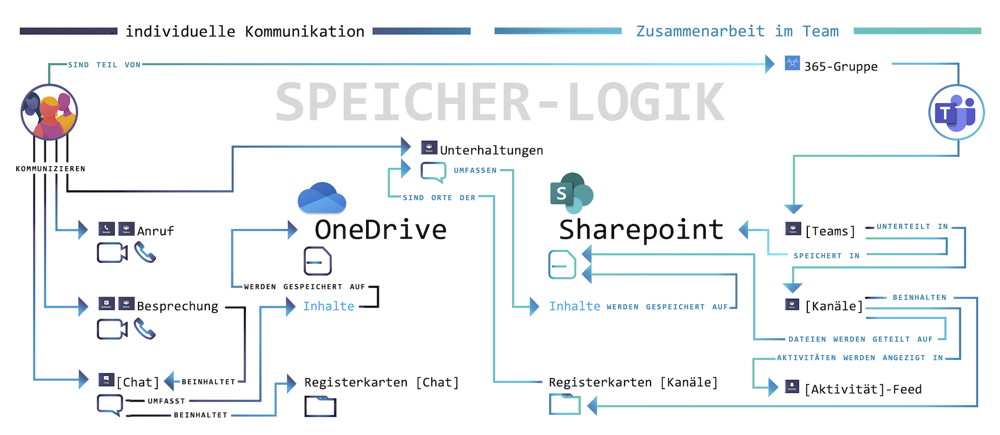

# MS Teams [intro]

Microsoft Teams ist Software, mit der Sie Dokumente und Kommunikation in gemeinsamer Arbeit verwalten können. Von kleinen Projekten bis zur Konzern-Struktur, mit allen möglichen Endgeräten und Betriebssystemen über die entsprechenden Apps.

Microsoft Teams bietet dafür einen zentralen Ort der Kommunikation, der Dateiverwaltung und Zusammenarbeit. Dieser Ort liegt als vernetzte Datenbank in der *Cloud*. Auf die dort vorgehaltenen Inhalte können Sie anderen Menschen Zugriff ermöglichen.
<label for="aside--microsoft-teams-bietet" class="aside-toggle" role="button" aria-pressed="false" aria-label="Randbemerkung anzeigen" onkeypress="toggleButtonKeyPress()" onclick="toggleButtonClick()" tabindex="0">⨭ …</label>

<input id="aside--microsoft-teams-bietet" type="checkbox" class="aside-toggle"/>

**Notiz**: Die *Cloud* ist eigentlich nur ein Computer, den jemand als Dienstleistung für Sie verwaltet. Extra für eine besondere Anwendung eingerichtet, so dass Sie über das Internet darauf zugreifen können.

<label for="aside--dieser-leitfaden-bietet" class="aside-toggle" role="button" aria-pressed="false" aria-label="Randbemerkung anzeigen" onkeypress="toggleButtonKeyPress()" onclick="toggleButtonClick()" tabindex="0">⨭ …</label>

<input id="aside--dieser-leitfaden-bietet" type="checkbox" class="aside-toggle"/>

**Download**: Die Architektur von Teams als Poster. <a href="teams-architektur.pdf">PDF, Din A1 </a>

Ein so mächtiges Werkzeug zur Verwaltung von Zugriffsrechten und Kommunikation braucht ein wenig Eingewöhnung — aber wer einmal die Logik dahinter verstanden hat, kann schnell und intuitiv damit arbeiten.

Dieser Leitfaden bietet dazu die Einführung.

Microsoft Teams ermöglicht mit der Struktur von Inhalten und Dateien anhand von **[Teams]** und deren **[Unterhaltungen]** einen reibungslosen Wechsel zwischen dem Büro zu Hause und in der Firma. Auch Menschen außerhalb einer Organisation können für einzelne Projekte mit entsprechendem Zugriff eingebunden werden.
<label for="aside--microsoft-teams-ermoeglicht" class="aside-toggle" role="button" aria-pressed="false" aria-label="Randbemerkung anzeigen" onkeypress="toggleButtonKeyPress()" onclick="toggleButtonClick()" tabindex="0">⨭ …</label>

<input id="aside--microsoft-teams-ermoeglicht" type="checkbox" class="aside-toggle"/>

**Notiz:** In diesem Leitfaden schreiben wir Begriffe, die auf einen gleich lautenden Menüeintrag in MS-Teams verweisen, in eckigen Klammern. In der App versammeln die sogenannten **[Teams]** Personengruppen, Inhalte und Werkzeuge für einzelne Projekte oder ganze Organisationen. Diese **[Teams]** lassen sich mit **[Kanälen]** noch weiter spezifizieren und aufteilen, um Projekten, Themen, Fachrichtungen oder weiteren für Sie wichtigen Aspekten noch besser gerecht zu werden.

Die Integration der Speicherorte in sogenannte **[Kanäle]** bietet ein übersichtliches digitales Arbeitsumfeld: Absprachen und Datei-Verlinkungen werden hier zu einzelnen Themen und Projekten gebündelt, so dass Sie nicht permanent zwischen Chat-Fenstern und Datei-Ordnern hin und her suchen müssen.

Microsoft Teams kann außerdem weitere Apps und Informations-Quellen in seine Oberfläche integrieren. So können Sie Arbeit und die daran anknüpfenden Informationen zentral sichtbar machen.

Microsoft Teams ermöglicht Zusammenarbeit, indem es die Absprachen zur Arbeit an Dokumenten und Inhalten in den Fokus stellt. Deswegen sieht die wichtigste Oberfläche wie ein Chat-Programm aus und eine Videokonferenz ist immer nur einen Klick entfernt. Dazu lassen sich die jeweils relevanten Arbeits-Inhalte ganz individuell einrichten.

Auch die Kommunikation und Zusammenarbeit und mit externen Personen ist möglich: Personen, die nicht zu Ihrer Organisation gehören, können auch ohne Office365-Lizenz von Ihnen in Arbeitsgruppen eingeladen werden.

[Wozu und wie mit MS Teams starten](#wozu-20200907)    
[Einführung in die Oberfläche](#anleitung-20200907)  
