### Der Einstieg in Microsoft Teams
Wie Sie mit Microsoft Teams Kommunikationswege bündeln und mit Ihrer Belegschaft einen erfolgreichen Start planen.  
▿ *ca 10min*

- [**Wozu**](#wozu-20200907)
    - [Vorteile](#wozu-vorteile-20200907)
    - [Einführung](#wozu-einfuehrung-20200907)
    - [Verwaltung](#wozu-verwaltung-20200907)

### Der Umgang mit der Oberfläche
Wie Sie mit der Software umgehen und Produktivitäts-Gewinne erschließen.  
▿ *ca 20min*

- [**Anleitung**](#anleitung-20200907)
    - [Apps](#anleitung-apps-20200907)
    - [Kanäle](#anleitung-kanaele-20200907)
    - [Unterhaltungen](#anleitung-unterhaltungen-20200907)
    - [Chat](#anleitung-chat-20200907)
    - [Video](#anleitung-video-20200907)
    - [Benachrichtigungen](#anleitung-benachrichtigungen-20200907)
    - [Dateien](#anleitung-Dateien-20200907)

### Gastzugänge für externen Zugriff einrichten
Wie Sie Gäste von außerhalb ihrer Organisation und ohne eigenes Office-365-Konto einladen und zur Mitarbeit befähigen.
▿ *ca 10min*

- [**Gastzugang**](#gastzugang-20200907)
    - [Rechte](#gastzugang-rechte-20200907)
    - [Zugang Einrichten](#gastzugang-einrichten-20200907)
    - [Besprechungen](#gastzugang-besprechungen-20200907)

### GitHub in Teams integrieren
Installationsanleitung: Wie sie GitHub in die Teams-App integrieren .
▿ *ca 2min*

- [**GitHub**](#github-inegrieren-20200924)

### [zurück zur Übersicht](/)

# MS Teams [intro]

Microsoft Teams ist Software, mit der Sie Dokumente und Kommunikation in gemeinsamer Arbeit verwalten können. Von kleinen Projekten bis zur Konzern-Struktur, mit allen möglichen Endgeräten und Betriebssystemen über die entsprechenden Apps.

Microsoft Teams bietet dafür einen zentralen Ort der Kommunikation, der Dateiverwaltung und Zusammenarbeit. Dieser Ort liegt als vernetzte Datenbank in der *Cloud*. Auf die dort vorgehaltenen Inhalte können Sie anderen Menschen Zugriff ermöglichen.
<label for="aside--microsoft-teams-bietet" class="aside-toggle" role="button" aria-pressed="false" aria-label="Randbemerkung anzeigen" onkeypress="toggleButtonKeyPress()" onclick="toggleButtonClick()" tabindex="0">⨭ …</label>

<input id="aside--microsoft-teams-bietet" type="checkbox" class="aside-toggle"/>

**Notiz**: Die *Cloud* ist eigentlich nur ein Computer, den jemand als Dienstleistung für Sie verwaltet. Extra für eine besondere Anwendung eingerichtet, so dass Sie über das Internet darauf zugreifen können.

<label for="aside--dieser-leitfaden-bietet" class="aside-toggle" role="button" aria-pressed="false" aria-label="Randbemerkung anzeigen" onkeypress="toggleButtonKeyPress()" onclick="toggleButtonClick()" tabindex="0">⨭ …</label>

<input id="aside--dieser-leitfaden-bietet" type="checkbox" class="aside-toggle"/>

**Download**: Die Architektur von Teams als Poster. <a href="teams-architektur.pdf">PDF, Din A1 </a>

Ein so mächtiges Werkzeug zur Verwaltung von Zugriffsrechten und Kommunikation braucht ein wenig Eingewöhnung — aber wer einmal die Logik dahinter verstanden hat, kann schnell und intuitiv damit arbeiten.

Dieser Leitfaden bietet dazu die Einführung.

Microsoft Teams ermöglicht mit der Struktur von Inhalten und Dateien anhand von **[Teams]** und deren **[Unterhaltungen]** einen reibungslosen Wechsel zwischen dem Büro zu Hause und in der Firma. Auch Menschen außerhalb einer Organisation können für einzelne Projekte mit entsprechendem Zugriff eingebunden werden.
<label for="aside--microsoft-teams-ermoeglicht" class="aside-toggle" role="button" aria-pressed="false" aria-label="Randbemerkung anzeigen" onkeypress="toggleButtonKeyPress()" onclick="toggleButtonClick()" tabindex="0">⨭ …</label>

<input id="aside--microsoft-teams-ermoeglicht" type="checkbox" class="aside-toggle"/>

**Notiz:** In diesem Leitfaden schreiben wir Begriffe, die auf einen gleich lautenden Menüeintrag in MS-Teams verweisen, in eckigen Klammern. In der App versammeln die sogenannten **[Teams]** Personengruppen, Inhalte und Werkzeuge für einzelne Projekte oder ganze Organisationen. Diese **[Teams]** lassen sich mit **[Kanälen]** noch weiter spezifizieren und aufteilen, um Projekten, Themen, Fachrichtungen oder weiteren für Sie wichtigen Aspekten noch besser gerecht zu werden.

Die Integration der Speicherorte in sogenannte **[Kanäle]** bietet ein übersichtliches digitales Arbeitsumfeld: Absprachen und Datei-Verlinkungen werden hier zu einzelnen Themen und Projekten gebündelt, so dass Sie nicht permanent zwischen Chat-Fenstern und Datei-Ordnern hin und her suchen müssen.

Microsoft Teams kann außerdem weitere Apps und Informations-Quellen in seine Oberfläche integrieren. So können Sie Arbeit und die daran anknüpfenden Informationen zentral sichtbar machen.

Microsoft Teams ermöglicht Zusammenarbeit, indem es die Absprachen zur Arbeit an Dokumenten und Inhalten in den Fokus stellt. Deswegen sieht die wichtigste Oberfläche wie ein Chat-Programm aus und eine Videokonferenz ist immer nur einen Klick entfernt. Dazu lassen sich die jeweils relevanten Arbeits-Inhalte ganz individuell einrichten.

Auch die Kommunikation und Zusammenarbeit und mit externen Personen ist möglich: Personen, die nicht zu Ihrer Organisation gehören, können auch ohne Office365-Lizenz von Ihnen in Arbeitsgruppen eingeladen werden.

[Wozu und wie mit MS Teams starten](#wozu-20200907)    
[Einführung in die Oberfläche](#anleitung-20200907)

## Wie ist Teams aufgebaut? [anleitung-20200907]

Alle wichtigen Funktionen können Sie über die Schaltflächen in der linken Spalte erreichen. Wie Sie die jeweils nutzen, erklären wir in den folgenden Abschnitten noch genau. Aber hier ist ein erster Überblick.

**[Aktivität]** - Ein Feed, der Sie chronologisch über Erwähnungen, Nachrichten, Änderungen und weitere Vorgänge in Ihren [Teams] informiert.

**[Chat]** - Ermöglicht Ihnen den schnellen Austausch mit anderen Mitgliedern.

**[Teams]** - Listet alle [Teams] auf, an denen Sie beteiligt sind. Hierüber erreichen Sie auch deren zugehörige [Kanäle].

**[Kalender]** - Hier planen und betreten Sie Besprechungen.

**[Anrufe]** - Bietet die Möglichkeit, mit anderen per Video- oder Audio-Anruf zu kommunizieren. Auch Kontakte, Verläufe und eine Art Anrufbeantworter finden Sie hier.

**[Dateien]** - Hier finden Sie alle mit Ihnen geteilten Dateien.

In der linken Spalte, unterhalb der Hauptfunktionen, können Sie noch weitere Apps für den Schnellzugriff platzieren.

Die Kopfzeile bietet auf der linken Seite eine Navigationshilfe mit Vor- und Zurückfunktion. Diese ist besonders praktisch, um schnell wieder in den Bereich zurückzukommen, aus dem Sie, beispielsweise durch einen [Chat], herausgeraten sind. Mit einem Klick auf [<] gelangen Sie wieder dorthin zurück, ohne den Umweg über die Schaltflächen [Teams] und [Kanäle] nehmen zu müssen.

In der Mitte der Kopfzeile können Sie sowohl eine allgemeine Suche als auch Befehle ausführen.

Kurzbefehle dienen dazu, allgemeine Aufgaben in Teams zu erledigen. Um diese zu verwenden, geben Sie [/] in das Befehlsfeld ein. Daraufhin öffnet sich eine Liste mit einem Überblick über mögliche Befehle und deren Wortlaut.

Mit einem vorangestellten [@] vor einem Namen können Sie im Befehlsfeld Nachrichten direkt an einzelne Personen oder geteilte [Chats] senden.

Im rechten Bereich der Kopfzeile befindet sich ein rundes Profilbild. Hier können Sie all Ihre grundsätzlichen Einstellungen anpassen. Zum Beispiel können Sie den Status Ihrer aktuellen Erreichbarkeit ändern, der anderen Mitgliedern angezeigt wird.

[jetzt lesen](#anleitung-apps-20200907)

## Wie können wir Apps in MS Teams einbinden? [anleitung-apps-20200907]

Teams zeichnet die Offenheit für externe Apps aus: Die Wahl der kompatiblen Werkzeuge ist groß genug, um sowohl Notwendigkeiten als auch Vorlieben und Gewohnheiten gerecht zu werden. Nicht alles muss für Teams neu gelernt und verändert werden. Viele bereits funktionierende Arbeitsabläufe können Sie in Teams integrieren oder optimieren. Und so eine zentrierte, effektive Arbeitsumgebung schaffen.

Sie können unterstützte Apps und Werkzeuge in Teams aus einer umfangreichen Liste auswählen und auf verschiedenen Ebenen integrieren. Diese Ebenen sind in Microsoft Teams wie folgt aufgebaut:

Auf der linken Seite der Benutzer-Oberfläche von Teams können Sie Apps, die Ihnen besonders wichtig sind, zum eigenen Gebrauch integrieren. So in der linken Seite eingebunden, sind Apps für Sie schnell und auch außerhalb einzelner Kanäle verfügbar.

Für einzelne Arbeitsgruppen oder Aufgabenbereiche können Sie Apps auch in den Registerkarten der jeweiligen [Kanäle] und [Chats] einbinden.

Die oben angeordneten Registerkarten sind die Orte in [Chats] und [Kanälen], an denen Sie Apps platzieren und über die Schaltfläche **[+]** neu hinzufügen können. Auf diese Weise können Sie auch Dokumente aus Word oder PowerPoint zur gemeinsamen Bearbeitung hinterlegen.

Für jeden Kanal können Sie über [weitere Optionen] App-Benachrichtigungen einbinden. Über sogenannte [Connectors] werden dann im [Kanal] alle Mitglieder über Veränderungen, Fortschritte und Weiteres aus der gewünschten App informiert.

Sie können Apps auch in Unterhaltungen integrieren. Deren Inhalte können Sie direkt in Nachrichten eingefügen: Ein Youtube-Video, ein Wikipedia-Artikel, eine schnelle Umfrage, all das lässt sich zusätzlich zum klassischen Text mit Team-Mitgliedern teilen.

Eine Auswahl dieser kompatiblen Apps finden Sie unter dem Feld, in dem Sie die Nachricht eingeben: Hinter der Schaltfläche [...] liegen alle sogenannten [Messaging-Erweiterungen]. Sie können auch einzelne Apps direkt unter dem Nachrichtenfeld anheften, um in Unterhaltungen noch schneller darauf zuzugreifen.

Ist die Wahl für ein integriertes Werkzeug einmal getroffen, sollten Sie dieser auch konsequent folgen.
Ein gemeinsam zu bearbeitendes Word-Dokument etwa, kann in Teams für alle optimal erreichbar und sichtbar integriert werden. Infolgedessen sollten Sie dieses Dokument nun auch konsequent über Teams gemeinsam bearbeiten und kommentieren. Kommentare bleiben auf diese Weise nicht in einem Dokument eingesperrt und warten dort auf Aufmerksamkeit. Sie können jetzt ohne weiteren Aufwand gezielt in die öffentlichen Kommunikation des [Kanals] eingebunden werden.

Ein Beispiel nicht gelungener Adaption wäre hier, dass jedes Team-Mitglied weiterhin in einem eigenen Word-Dokument arbeitet, dieses lokal speichert und die Teams-App dann lediglich dafür nutzt, alle anderen in einem [Chat] über die Veränderungen zu informieren. In dem Fall müssten Sie später mühevoll Unterhaltungen durchsuchen und das Dokument aus vielen Versionen wieder zusammenzufügen. So wäre Teams aller kollaborativer Stärken beraubt und würde als suboptimales Kommunikations-Werkzeug wohl eher negative Reaktionen hervorrufen.

Optimal wäre Teams eingesetzt, wenn das Dokument für alle sichtbar in Teams platziert und dadurch für alle erreichbar auf einem gemeinsamen SharePoint hinterlegt wird. Mit der Kommentarfunktion im geteilten Dokument, welche gleichzeitig in Teams [Kanälen] dargestellt wird, gelingt mit allen Mitarbeitenden eine übersichtliche, effektive und nachvollziehbare Kommunikation.

[weiter lesen: Kanäle](#anleitung-kanaele-20200907)

## Kanäle [anleitung-kanaele-20200907]

MS Teams Einsatzfelder zeichnen sich im Wesentlichen durch drei Pfeiler aus: Kommunikation, Kollaboration und Dateiverwaltung. Diese Pfeiler stehen auf dem Fundament von Teams, den [Kanälen].

[Kanäle] sind spezielle Bereiche innerhalb eines [Teams]. Hiervon stehen jedem Team 200 [Standardkanäle] und 30 sogenannte [private Kanäle] zur Vµerfügung.

Ein [Kanal] gibt dabei den Personenkreis oder thematischen Rahmen vor. Hier können Sie aufteilen und bestimmen, wer Zutritt hat, wer Informationen erhält, wer Zugriff auf Dateien hat und welche  spezifischen Apps und Tabs verfügbar sind.

Jedes [Team] startet mit einem Hauptkanal [Allgemein]. Dieser wird automatisch bei Gründung eines neuen [Teams] angelegt und kann weder gelöscht noch umbenannt werden.
Für jedes [Team] können Sie weitere [Kanäle] hinzufügen und zweckmäßig benennen. Etwa für bestimmte Projekte oder als Arbeitsumgebung für einen ausgewählten Personenkreis.

Sie können die [Kanäle] in der App zur verbesserten Übersicht sortieren: Mit gehaltener Maustaste lassen sie sich verschieben, über das Kontextmenü [Weitere Optionen] auch anheften.
Benötigen Sie einen [Kanal] nicht mehr, können Sie diesen löschen. Dabei bleiben die dort geteilten Dateien auf der zum [Kanal] gehörigen SharePoint-Team-Seite gespeichert, die darin geführten Unterhaltungen gehen jedoch verloren.

Ein [Kanal] besteht aus Tabs beziehungsweise Registrierkarten, die Sie in der Menüleiste oben im [Kanal] finden und dort auch erweitern können. Jeder [Kanal] hat dabei zwei Registerkarten, die dauerhaft bestehen, also auch nicht gelöscht oder umbenannt werden können: [Beiträge] und [Dateien]. Betreten Sie einen [Kanal], ist automatisch die Registerkarte [Beiträge] geöffnet. In dieser befinden sich alle [Unterhaltungen] des [Kanals]. Es ist der direkte Ort der Kommunikation und Zusammenarbeit.

Die Registerkarte [Dateien] bietet einen übersichtlichen Zugriff auf den kanaleigenen Ordner auf dem SharePoint und somit auf alle Dateien, die von [Kanal]-Mitgliedern über [Unterhaltungen] innerhalb des [Kanals] geteilt oder direkt auf den SharePoint hochgeladen wurden.

Sie teilen eine Datei, indem diese über die Schaltfläche [Anfügen] oder über Copy-Paste in eine [Antwort] oder neue [Unterhaltung] integrieren. Der kanaleigene SharePoint-Ordner wird automatisch bei Gründung eines neuen [Kanals] erstellt und mit der [Dateien]- Registerkarte des [Kanals] verknüpft.

Für jeden [Kanal] können Sie über die Schaltfläche [+] weitere [Registrierkarten hinzufügen].

Teams bietet eine große Auswahl an Apps zur Integration an, es lassen sich jedoch auch Internetseiten und einzelne Dokumente als Registerkarte in einem [Kanal] platzieren. So sind wichtige Apps von Microsoft aber auch externen Anbietern, Internetseiten oder gemeinsam bearbeitete Word-Dokumente nur einen Mausklick entfernt und direkt in der Teams-App zu benutzen. Dabei ist jedoch zu bedenken, dass beispielsweise Word-Dokumente innerhalb der Teams-App zunächst in der Online-Ansicht dargestellt werden. Aber auch hier müssen Sie nur ein Mal auf [In Desktop-App öffnen] klicken, um in die vollständige Applikation zu wechseln.

{>>Jule: Schreib doch hier bitte "Beispiel-Dokument" oder einfach nur "Dokument" und erhöhe den Schriftgrad.<<}

[Kanäle] stehen zunächst allen Mitgliedern eines [Teams] offen. Um selektiv Mitgliedern Zugriff zu gewähren, können Sie [private Kanäle] gründen. Diese werden in der [Kanal]-Übersicht Ihres [Teams] mit einem Schloss-Symbol gekennzeichnet und nur eingeladenen Personen angezeigt. Unterhaltungen, Mitgliedslisten und eine separate Website-Sammlung auf SharePoint zur Dateiablage sind nur Mitgliedern des [privaten Kanals] zugänglich. Wer [private Kanäle] erstellen kann, lässt sich auf Team- und Organisationsebene bestimmen, es steht als Standard aber zunächst allen [Team]-Mitgliedern zu. Gäste haben hierzu keine Berechtigung.

Die Person, die einen [privaten Kanal] erstellt, kann [Team]-Mitglieder und auch Gäste nach ihrem Belieben hinzufügen. Um einen [privaten Kanal] zu erstellen, müssen Sie im Erstellungsfenster unter [Datenschutz] die Auswahl [Standard - für alle Teammitglieder zugänglich] auf [Privat - nur für bestimmte Personengruppe im Team zugänglich] ändern. {>>Jule: Was ist das "Erstellungsfenster"? Hier braucht es glaube ich eine bessere Schaltflächen-Beschreibung.<<} Anschließend können Sie erwünschte Personen hinzufügen, oder nachträglich über die [Kanal]-Schaltfläche [...] ergänzen.

[weiter lesen: Unterhaltungen](#anleitung-unterhaltungen-20200907)

## Unterhaltungen [anleitung-unterhaltungen-20200907]

Der größte Teil der Kommunikation innerhalb von [Teams] findet in der sogenannten [Unterhaltung] statt.

[Unterhaltungen] Sind Teil eines jeden [Kanals] und unter der Registrierkarte [Beiträge] zu finden. Betreten Sie einen [Kanal], so ist dieser Reiter automatisch ausgewählt.

Wird eine [Unterhaltung] gestartet, können alle [Team]-Mitglieder und Zugangsberechtigte auf diese antworten oder eine eigene [Unterhaltung] starten. Dabei können sie neben Text auch Emojis, Gifs, Sticker, Bilder, Videos, Datei-Anhänge und App-Inhalte veröffentlichen.
Außerdem lassen sich Inhalte zur besseren Übersicht formatieren. Alle Optionen hierzu finden Sie über die Schaltfläche [A] unterhalb der Texteingabe.

Eine [Unterhaltung] folgt dem Prinzip eines Threads: Beiträge werden hierarchisch organisiert.

Der erste Beitrag einer [Unterhaltung] gibt das Thema vor, welchem die weiteren Beiträge folgen. Ist ein Thema für Einzelne nicht von Belang oder Interesse, kann so schneller über die Unterhaltung hinweggesehen werden, als es in einer Chat-Kommunikation mit durchlaufender, ungeordneter Gesprächsführung der Fall wäre.
Sie sollten darauf achten, die [Unterhaltungen] zu einem bestimmten Thema auch weiter für dieses zu nutzen. Greifen Sie für weitere Beiträge auf [Antworten] zurück, anstatt eine Antwort oder Fortsetzung des Themas durch eine [Neue Unterhaltung] anzugehen und den [Kanal] so unnötig aufzublasen.

Umfangreiche [Unterhaltungen] mit vielen Antworten werden zur verbesserten Übersicht zusammenklappt. Bei Bedarf können Sie diese wieder ausklappen.

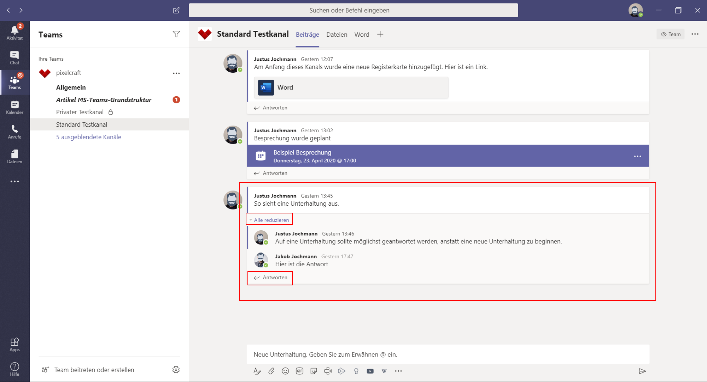

Wenn Sie mit der Maus über einzelne Beiträge einer [Unterhaltung] fahren, öffnet sich rechts oben ein Emoji-Menü. Hier können Sie schnell mit einer symbolischen Emotion reagieren und so besonders unkompliziert Kenntnisnahme oder Feedback kommunizieren. Diese simple Funktion stellt sich als äußerst nützlichen Teil der Kommunikation dezentraler Arbeitsgruppen dar. Vor allem dann, wenn aus Zeitmangel oder anderen Gründen eine detailliertere Antwort nicht möglich ist. Die kurze Reaktion per Emoji kann den Austausch verstärken und darüber hinaus als Bindeglied im Kollegium fungieren: Jemand ist da, jemand nimmt wahr, jemand weiß zu schätzen.  

Im Menü [...] rechts neben den Emojis können Sie Nachrichten als Lesezeichen für später speichern oder per Link mit anderen Zugriffsberechtigten teilen.
Besonders die Funktion, Nachrichten zu speichern, ist nützlich, wenn Sie wichtige Unterhaltungen schnell wieder verfügbar machen oder fokussieren wollen. Zu den gespeicherten Nachrichten gelangen Sie über Ihr Profilbild oben rechts unter [Gespeichert]. Mit einem Klick auf das rote Lesezeichen-Symbol neben den einzelnen Nachrichten können Sie die Speicherungen wieder aufheben.

Die Kommunikation innerhalb eines [Kanals] ermöglicht es Ihnen, Information gezielt mit dem richtigen Personenkreis zu teilen, ohne anderen die Information aufzuzwingen oder überhaupt zugänglich zu machen. Sie können genau bestimmen, wer zu einem [Kanal] Zutritt hat und dort eine [Unterhaltung] beginnen kann.
Jedes Mitglied kann darüber hinaus bestimmen, wie die einzelnen [Kanäle] abgebildet werden: Ist ein [Kanal] für eine Weile nicht von Belang für eine Person, kann er ausgeblendet werden und so keine ungewollte Aufmerksamkeit provozieren.
Sie können auch eine E-Mail in eine Unterhaltung umwandeln und so in die Teams-Umgebung integrieren. Über die Schaltfläche [...] eines jeden [Kanals] können Sie dessen individuelle [E-Mail-Adresse abrufen]. Schicken Sie E-Mails an diese Adresse, werden diese inklusive Anhang im [Kanal] als [Unterhaltung] dargestellt. So können alle Mitglieder direkt im [Kanal] darauf antworten. Gleichzeitig werden die Anhänge der E-Mails im SharePoint gespeichert und bleiben so für alle verfügbar.

[weiter lesen: Chat](#anleitung-chat-20200907)

## Chat [anleitung-chat-20200907]

Außerhalb der [Kanäle] finden Sie im Bereich [Chat] den Ort, an dem Sie sich persönlich mit Teams-Mitgliedern austauschen können. Er befindet sich in der linken Seitenleiste der Benutzeroberfläche.

[Chats] sind ebenso wie [Kanäle] in Registerkarten aufgeteilt und beinhalten immer einen [Chat], also den eigentlichen Chat-Verlauf und [Dateien], die mit Personen aus dem Chat geteilt werden.

In Chats zwischen zwei Personen gibt es außerdem den Bereich [Aktivität], der über die Aktivitäten des [Chat]-Gegenübers in allen mit Ihnen gemeinsam geteilten [Kanälen] informiert.
{>>Jule: Was ist mit der Registerkarte [Organisation] ? Die würde die Position des Gegenübers in einem Firmen-Organigramm anzeigen, wenn man eines hinterlegt hätte. Aber wie hinterlegt man das? <<}
Darüberhinaus können Sie weitere, eigene Registerkarten hinzufügen.

Sie können [Chats] mit zwei oder mehr Personen führen. Für jede neue Personen-Konstellation wird durch MS Teams ein eigener Bereich angelegt, den Sie immer wieder erreichen können, um das Gespräch fortzuführen, oder auf Informationen erneut zuzugreifen.

Die Nachrichten in [Chats] laufen durchgängig weiter, eine Ordnung wie in [Unterhaltungen] innerhalb eines [Kanals] ist hier also nicht möglich.

In einem [Chat] geteilte Dateien sind nur den [Chat]-Mitgliedern zugänglich und werden in den persönlichen OneDrive-For-Business-Ordnern gespeichert.

Sie erreichen sie über die Registerkarte [Dateien], die auch darüber Auskunft gibt, von wem die Datei abgesendet wurde und wo sie folglich gespeichert ist.

Auch [Anrufe] und [Besprechungen] innerhalb der Teams-App haben einen eigenen [Chat]-Bereich, über den Sie zusätzliche Informationen, Bilder und andere Dateien teilen können.

Auch diese [Chat]-Verläufe werden inklusive Anhang in den privaten One-Drive-For-Business-Ordnern der Teilnehmenden gespeichert.

Besprechungs-[Chats] verfügen neben den üblichen Registerkarten [Chat] und [Dateien] noch über die Bereiche [Whiteboard] und [Besprechungsnotizen].

Das [Whiteboard] ist eine Integration der Whiteboard Web App von Microsoft. Um es in einer [Besprechung] zu nutzen, muss eine Person im laufenden Video-Anruf ein [Whiteboard] freigeben. Dies gelingt Ihnen über die Schaltfläche [Teilen] im [Besprechungs]-Menü.

Sie können [Besprechungsnotizen] zur Vor- und Nachbereitung nutzen und bearbeiten. Diese sind nur Personen zugänglich, die zuvor zu der zugehörigen [Besprechung] eingeladen worden sind. Vor der [Besprechung] können Sie Notizen im Bereich [Kalender] auf der linken Seitenleiste der Teams-Oberfläche starten und vorbereiten. Während der [Besprechung] können Sie [Besprechungsnotizen] über [Weitere Aktionen] im [Besprechungs]-Menü starten und anzeigen.

Auch die [Chats] aus [Anrufen] und [Besprechungen] werden im Bereich [Chat] aufgeführt, wo Sie sie weiter nutzen können. Dies gilt auch für die darin integrierten [Whiteboards] und [Besprechungsnotizen].

Sie können einzelne [Chats] stumm schalten, zur besseren Navigation anheften und gezielt durchsuchen.

Außerdem haben Sie die Möglichkeit, einzelne [Chats] aus der Programmoberfläche von Teams zu lösen und individuellen Fenstern zu nutzen. So können sie mehrere [Chats] gleichzeitig im Blick behalten oder einen [Chat] nutzen, während Sie in MS Teams außerhalb des [Chat]-Bereichs arbeiten.

Klicken Sie hierfür auf die Schaltfläche [...] neben dem gewünschten [Chat] und wählen Sie [Pop-out-Chat]. Noch einfacher und überall aus der App heraus erreichbar starten Sie einen [Pop-out-Chat] per Doppelklick auf das Profilbild der Team-Mitglieder.

Die Schaltfläche [!] unterhalb des Eingabefelds für [Chat]-Nachrichten bietet Ihnen [Zustellungsoptionen], mit der Sie eine Nachricht als [wichtig] oder [dringend] markieren können.
Eine als [wichtig] markierte Nachricht wird optisch auffällig dargestellt. Neben einer roten Fassung werden solche Nachrichten mit einem roten Ausrufezeichen versehen.

Eine [dringende] Nachricht erscheint ebenfalls in rot eingefasst. Markiert wird diese Nachricht mit einer roten Glocke. Zusätzlich werden Ihre Gesprächspartner über einen Zeitraum von 20 Minuten alle zwei Minuten über ein akustisches Signal und ein Pop-Up-Fenster, welches unten rechts auf dem Desktop erscheint, auf Ihre dringende Nachricht aufmerksam gemacht. Wird Ihre Nachricht gelesen, werden keine weiteren akustischen und optischen Hinweise gegeben.

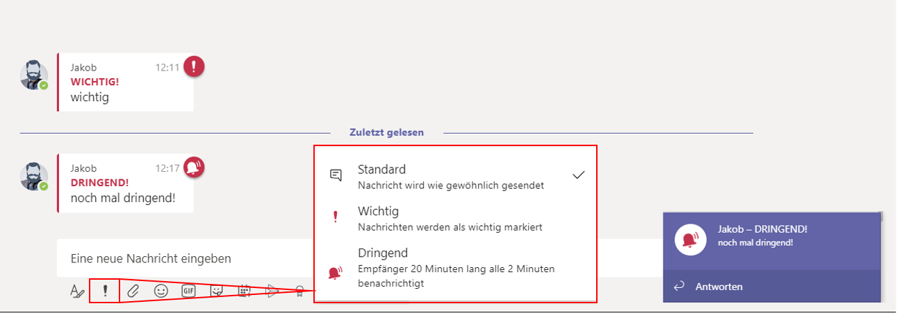

[weiter lesen: Video-Telefonate](#anleitung-video-20200907)

## Video-Telefonie [anleitung-video-20200907]

Teams hat ein interne Lösung für Telefonie mit und ohne Video. Diese steht vergleichbaren Anwendungen wie Skype for Business in nichts nach und ist laut Microsoft auch als dessen Nachfolge geplant, wenn Skype for Business im Sommer 2021 den Dienst einstellt.

In MS Teams können Sie [Anrufe] über die gleichnamige Schaltfläche in der linken Menü-Spalte starten. Aber auch aus [Chats] heraus oder über die Profilbilder Ihrer Kontaktperson.

Besonders praktisch sind [Anrufe] allerdings innerhalb einer [Besprechung], der Video-Konferenz der Teams-App. Sie können [Besprechungen] über den [Kalender], in der linken Menü-Leiste planen, finden und wahrnehmen.

Hinweise auf geplante [Besprechungen] und der Möglichkeit einer Teilnahme finden sich auch in den [Kanälen] wieder.

Jeder [Anruf] verfügt über einen eigenen [Chat].

Zudem haben Sie die Möglichkeit, den eigenen Bildschirm oder einzelne Programmfenster anderer Apps zu teilen.

Sie können [Anrufe] über den integrierten Dienst [Stream] aufzeichnen und teilen. Dies ist im Kontextmenü unter [weitere Aktionen] integriert und kann durch [Aufzeichnung beginnen] von Ihnen gestartet werden. Alle Teilnehmenden werden über die Aufzeichnung informiert. Im [Chat]-Bereich der [Besprechung] wird ebenfalls über die fertige Aufzeichnung informiert. Hier können Sie sich die Aufzeichnung auch außerhalb der Stream-App oder Stream-Web-Plattform ansehen.

Je nach Lizenz bietet Teams auch die Möglichkeit, per Telefon an [Besprechungen] teilzunehmen. Auf diesem Weg können Sie weitere Gäste und Team-Mitglieder ohne Internetanbindung in Ihr Gespräch integrieren.

Mittlerweile haben Sie in der Video-Telefonie in Teams auch die Möglichkeit, den Hintergrund Ihres Videos zu bestimmen. Im laufenden Gespräch erreichen Sie diese Funktion über die Schaltfläche [...] mit [Hintergrundeffekte anzeigen].

Neben einem Unschärfe-Effekt, mit dem Sie Ihren Hintergrund unkenntlich machen und so unerwünschte Einblicke in Ihre Umgebung verhindern, können Sie nun auch ohne zusätzliche technische Voraussetzungen eine Art Green-Screen-Effekt nutzen: Während Sie im Vordergrund sichtbar bleiben, wird Ihr Hintergrund durch eine Grafik ersetzt.

Teams bietet eine Auswahl vorgefertigter Hintergründe, um eine eigene Grafik in Teams zu integrieren, müssen Sie jedoch einen kleinen Umweg nehmen. Sie müssen die gewünschte Bilddatei in den entsprechenden lokalen Teams-Ordner einfügen.

In Windows erreichen Sie diesen Ordner über den Pfad [C:\Users\%USERNAME%\AppData\Roaming\Microsoft\Teams\Backgrounds\Uploads] oder indem Sie [%APPDATA%\Microsoft\Teams\Backgrounds] in das Startsuchfeld von Windows eingeben. Damit wird Ihnen der Ordner [Uploads] angezeigt, in welchen Sie die gewünschten Bilddateien kopieren müssen.

Unter MacOS finden Sie einen versteckten Ordner unter dem Pfad [~/Library/Application Support/Microsoft/Teams/Backgrounds/Uploads].
Bilder werden in Teams in 1920x1080 px dargestellt. Abweichende Formate werden automatisch zurechtgeschnitten.

Sie können diese und andere Einstellungen bereits vornehmen, bevor Sie einer [Besprechung] beitreten, denn bei jeder Teilnahme wird zunächst der Bereich der Audio- und Video-Einstellungen aufgerufen.

Nutzen Sie diesen Bereich und stellen Sie über die [Geräteeinstellungen] sicher, dass die gewünschte Kamera aktiviert ist und Sie gut zu verstehen sind. Dies erreichen Sie über das mit einem Zahnrad gekennzeichnete [PC-Mikrofon und Lautsprechereinstellungen].

Um zu überprüfen, ob alle vorgenommenen Einstellungen wie gewünscht funktionieren, können Sie einen kurzen [Testanruf führen].

Diese Überprüfung gibt jedoch keine genaue Auskunft über die tatsächliche Qualität Ihrer Video- und Audio-Signale, denn Microsoft bietet im Testanruf eine verminderte Bandbreite. Um die genaue Qualität Ihrer Ton- und Video-Spur zu ermitteln, welche die übrigen Teilnehmenden effektiv zu sehen und hören bekommen, bietet sich eine kurze Aufzeichnung einer [Besprechung] an.

Diese können Sie auch ohne weitere Teilnehmende immer starten, müssen beim Anlegen einer Besprechung über den [Kalender] allerdings mindestens eine weitere Person zur Besprechung einladen. Eine Aufzeichnung starten Sie, indem Sie in der laufenden [Besprechung] auf die Schaltfläche [...] klicken und dann [Aufzeichnung starten] wählen. An gleicher Stelle beenden Sie die Aufnahme wieder.

Die Aufzeichnung wird in Microsoft [Stream] gespeichert, dem [Besprechungschat] hinzugefügt und im [Kanal], in dem die Besprechung stattgefunden hat, als Aktivität dargestellt. Die Aufzeichnung wird zunächst verarbeitet. Es kann also eine Weile dauern, bis sie veröffentlicht und Ihnen und den übrigen Teilnehmenden zugänglich ist.

[weiter lesen: Benachrichtigungen](#anleitung-benachrichtigung-20200907)

## Benachrichtigungen [anleitung-benachrichtigung-20200907]

Teams hat den Anspruch, ein digitales Arbeitsumfeld zu schaffen, welches die Produktivität seiner Anwendenden steigert. Um dies zu erreichen, soll die Kommunikation funktional sein, ohne neben den anderen Arbeits-Werkzeugen für zu viel Ablenkung zu sorgen.

Damit die Kommunikation in Teams dem Spagat gerecht wird, die notwendige Aufmerksamkeit einer Person zu erreichen, ohne dabei zu aufdringlich zu sein, arbeitet Teams mit einer eigenen Benachrichtigungs-Logik. Mit dieser können Sie steuern was, wann und wie eine Benachrichtigung zu Ihnen durchdringt.

Über das eigene Profilbild oben rechts in der Benutzer-Oberfläche erreichen sie die [Einstellungen]. Dort können Sie unter [Benachrichtigungen] genau bestimmen, wie Erwähnungen, Nachrichten und Sonstiges kommuniziert werden.

Auswählbar sind Benachrichtigungen über Banner, Feed und E-Mail.
Ein Banner ist ein kleines Pop-Up, welches unter Windows im unteren rechten Bereich des Bildschirms und auf einem Mac in der oberen rechten Ecke kurzzeitig auftaucht und selbstständig wieder verschwindet.

Per Feed werden im Bereich [Aktivität], zu erreichen über das Glocken-Symbol oben links, dauerhaft Erwähnungen gesammelt und angezeigt. Alle geteilten Aktivitäten der Mitarbeitenden und eigene Aktivitäten in [Teams], [Kanälen], [Unterhaltungen], [Chats] und integrierten Apps werden hier  zusammengefasst. Dank Filterfunktionen können Sie schnell durchsucht und mit einem Mausklick angesteuert werden.

Die Benachrichtigung per E-Mail erfolgt mit zeitlicher Verzögerung. Bleibt eine Erwähnung in Teams länger unbemerkt, wird eine E-Mail versandt, die auf diese Erwähnung hinweist. Diese Form der Benachrichtigung lässt sich nicht weiter den eigenen Wünschen anpassen, sondern lediglich deaktivieren. Teams erklärtes Ziel ist es, die E-Mail möglichst aus der Kommunikation herauszuhalten und nur als Stütze für das eigene Benachrichtigungs-Prinzip zu verwenden.

Die größtmögliche Aufmerksamkeit erzeugen Erwähnungen, die [@mentions]. Mit diesen können Sie einzelne Personen aber auch ganze [Teams] oder [Kanäle] gezielt anschreiben. Diese Kontaktaufnahme wird besonders auffällig gekennzeichnet.

Hierfür müssen Sie im [Chat] oder in der [Unterhaltungen] ein [@] vor den gewünschten Namen schreiben, ohne diese Kombination durch ein Leerzeichen zu trennen. Schreiben Sie ein [@], bietet Ihnen Teams direkt eine Reihe an Vorschlägen, welche Person aufmerksam gemacht werden soll. Ein [@team] und [@kanal] öffnen entsprechende Vorschläge.

Die Benachrichtigung einer Person oder eines [Kanals] wird entsprechend unter [Aktivität] angezeigt. Ein roter Punkt auf dem Glocken-Symbol weist auf solche [@mentions] oder eine Antwort hin, die Sie noch nicht gelesen haben.

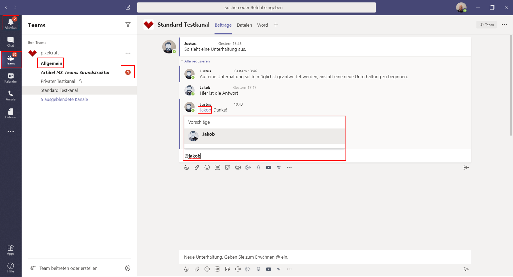

Über den Bereich [Suchen oder Befehl eingeben] im oberen Zentrum der Teams-App können Sie mit den Befehlen [/ungelesen] und [/erwähnungen] ungelesene [Kanal]-Benachrichtigungen und eigene [@mentions] anzeigen.

Die Teilnahme an einem [Kanal] ist die Grundvoraussetzung, um über dortige Aktivitäten informiert zu werden.

Es ist aber auch möglich, einen [Kanal] komplett auszublenden und so über dessen Aktivität nicht weiter informiert zu werden. Jeder [Kanal] hat eine eigene [...]-Schaltfläche, hinter der sich die Funktion [Ausblenden] befindet. Ein ausgeblendeter [Kanal] taucht dann nicht mehr direkt in Ihrer Übersicht auf, sondern wird unter [ausgeblendete Kanäle] geführt und lässt sich darüber auch wieder sichtbar machen. Eine [@mention] oder eine als wichtig gekennzeichnete Nachricht an Sie wird Ihnen allerdings dennoch angezeigt.

Neue Aktivitäten in einem [Kanal] ohne eine [@mention] werden Ihnen angezeigt, indem der Name des [Kanals] in Ihrer Übersicht fett gedruckt erscheint, bis Sie hineinschauen.

Im Kontextmenü [...] eines jeden [Kanals] können Sie über [Kanalbenachrichtigungen] weiter bestimmen, wie die Benachrichtigungen speziell für diesen [Kanal] stattfinden sollen. In [Benutzerdefiniert] können Sie über die Einstellungen [Banner und Feed], [Nur im Feed anzeigen] und [Aus] bestimmen, wie Sie über neue Beiträge in diesem Kanal oder Erwähnungen informiert werden.

Über den Anwesenheits-Status [Nicht stören] können Sie alle Benachrichtigungen komplett stummschalten, bis Sie Ihren Anwesenheits-Status wieder ändern.

# Video-Telefonie [anleitung-video-20200907]

Teams hat ein interne Lösung für Telefonie mit und ohne Video. Diese steht vergleichbaren Anwendungen wie Skype for Business in nichts nach und ist laut Microsoft auch als dessen Nachfolge geplant, wenn Skype for Business im Sommer 2021 den Dienst einstellt.

In MS Teams können Sie [Anrufe] über die gleichnamige Schaltfläche in der linken Menü-Spalte starten. Aber auch aus [Chats] heraus oder über die Profilbilder Ihrer Kontaktperson.

Besonders praktisch sind [Anrufe] allerdings innerhalb einer [Besprechung], der Video-Konferenz der Teams-App. Sie können [Besprechungen] über den [Kalender], in der linken Menü-Leiste planen, finden und wahrnehmen.

Hinweise auf geplante [Besprechungen] und der Möglichkeit einer Teilnahme finden sich auch in den [Kanälen] wieder.

Jeder [Anruf] verfügt über einen eigenen [Chat].

Zudem haben Sie die Möglichkeit, den eigenen Bildschirm oder einzelne Programmfenster anderer Apps zu teilen.

Sie können [Anrufe] über den integrierten Dienst [Stream] aufzeichnen und teilen. Dies ist im Kontextmenü unter [weitere Aktionen] integriert und kann durch [Aufzeichnung beginnen] von Ihnen gestartet werden. Alle Teilnehmenden werden über die Aufzeichnung informiert. Im [Chat]-Bereich der [Besprechung] wird ebenfalls über die fertige Aufzeichnung informiert. Hier können Sie sich die Aufzeichnung auch außerhalb der Stream-App oder Stream-Web-Plattform ansehen.

Je nach Lizenz bietet Teams auch die Möglichkeit, per Telefon an [Besprechungen] teilzunehmen. Auf diesem Weg können Sie weitere Gäste und Team-Mitglieder ohne Internetanbindung in Ihr Gespräch integrieren.

Mittlerweile haben Sie in der Video-Telefonie in Teams auch die Möglichkeit, den Hintergrund Ihres Videos zu bestimmen. Im laufenden Gespräch erreichen Sie diese Funktion über die Schaltfläche [...] mit [Hintergrundeffekte anzeigen].

Neben einem Unschärfe-Effekt, mit dem Sie Ihren Hintergrund unkenntlich machen und so unerwünschte Einblicke in Ihre Umgebung verhindern, können Sie nun auch ohne zusätzliche technische Voraussetzungen eine Art Green-Screen-Effekt nutzen: Während Sie im Vordergrund sichtbar bleiben, wird Ihr Hintergrund durch eine Grafik ersetzt.

Teams bietet eine Auswahl vorgefertigter Hintergründe, um eine eigene Grafik in Teams zu integrieren, müssen Sie jedoch einen kleinen Umweg nehmen. Sie müssen die gewünschte Bilddatei in den entsprechenden lokalen Teams-Ordner einfügen.

In Windows erreichen Sie diesen Ordner über den Pfad [C:\Users\%USERNAME%\AppData\Roaming\Microsoft\Teams\Backgrounds\Uploads] oder indem Sie [%APPDATA%\Microsoft\Teams\Backgrounds] in das Startsuchfeld von Windows eingeben. Damit wird Ihnen der Ordner [Uploads] angezeigt, in welchen Sie die gewünschten Bilddateien kopieren müssen.

Unter MacOS finden Sie einen versteckten Ordner unter dem Pfad [~/Library/Application Support/Microsoft/Teams/Backgrounds/Uploads].
Bilder werden in Teams in 1920x1080 px dargestellt. Abweichende Formate werden automatisch zurechtgeschnitten.

Sie können diese und andere Einstellungen bereits vornehmen, bevor Sie einer [Besprechung] beitreten, denn bei jeder Teilnahme wird zunächst der Bereich der Audio- und Video-Einstellungen aufgerufen.

Nutzen Sie diesen Bereich und stellen Sie über die [Geräteeinstellungen] sicher, dass die gewünschte Kamera aktiviert ist und Sie gut zu verstehen sind. Dies erreichen Sie über das mit einem Zahnrad gekennzeichnete [PC-Mikrofon und Lautsprechereinstellungen].

Um zu überprüfen, ob alle vorgenommenen Einstellungen wie gewünscht funktionieren, können Sie einen kurzen [Testanruf führen].

Diese Überprüfung gibt jedoch keine genaue Auskunft über die tatsächliche Qualität Ihrer Video- und Audio-Signale, denn Microsoft bietet im Testanruf eine verminderte Bandbreite. Um die genaue Qualität Ihrer Ton- und Video-Spur zu ermitteln, welche die übrigen Teilnehmenden effektiv zu sehen und hören bekommen, bietet sich eine kurze Aufzeichnung einer [Besprechung] an.

Diese können Sie auch ohne weitere Teilnehmende immer starten, müssen beim Anlegen einer Besprechung über den [Kalender] allerdings mindestens eine weitere Person zur Besprechung einladen. Eine Aufzeichnung starten Sie, indem Sie in der laufenden [Besprechung] auf die Schaltfläche [...] klicken und dann [Aufzeichnung starten] wählen. An gleicher Stelle beenden Sie die Aufnahme wieder.

Die Aufzeichnung wird in Microsoft [Stream] gespeichert, dem [Besprechungschat] hinzugefügt und im [Kanal], in dem die Besprechung stattgefunden hat, als Aktivität dargestellt. Die Aufzeichnung wird zunächst verarbeitet. Es kann also eine Weile dauern, bis sie veröffentlicht und Ihnen und den übrigen Teilnehmenden zugänglich ist.

[weiter lesen: Dateien](#anleitung-dateien-20200907)

## Dateien [anleitung-dateien-20200907]

Die Registerkarte [Dateien] bietet Ihnen Zugriff auf alle Dateien, die auf dem SharePoint gespeichert sind.

Die Ordnung der Dateien regelt MS Teams von selbst:
Jeder [Kanal] besitzt einen zugehörigen Ordner, der bei [Kanal]-Gründung automatisch auf SharePoint erstellt wird. Alle Dateien, die in einem [Kanal] auftauchen, landen in diesem Ordner.

Neben dem Zugriff über die Teams-App und die Teilnahme an einem [Kanal], können Sie mit diesen Dateien natürlich auch direkt über die SharePoint-Seite arbeiten.

Über die Schaltfläche [Dateien] in der linken Spalte der Teams-App können Sie auch weitere Cloud-Speicher integrieren.

---

[nächstes Kapitel: Gastzugang für Microsoft Teams](#gastzugang-20200907)

## Gastzugänge in Microsoft Teams [gastzugang-20200907]

Die Lösungen für digitale Zusammenarbeit enden bei Microsoft Teams nicht an den Grenzen des eigenen Unternehmens. Sie können auch Kundschaft und extern Mitarbeitende in Ihr digitales Arbeitsumfeld integrieren.

Ihr eigenes Office-365-Abonnement (Business Standard, Enterprise oder Education) reicht als Lizenz aus. Ihr Gast muss lediglich eine E-Mail-Adresse besitzen.

Zunächst muss der Gastzugriff als organisationsweite Einstellung durch Ihre Administration aktiviert werden. Danach können fünf Gäste pro lizensiertem Team-Mitglied eingeladen werden. Durch erweiterte Einstellungen können Gäste auch die Berechtigung erhalten, selbst Gäste einzuladen.

Der Gastzugriff in MS Teams ist als eine der Rollen zu verstehen, die die Administration innerhalb der App vergeben kann. {>>Jule: Verlinkung vom Wort "Rollen" auf entsprechenden Absatz im Hauptartikel?<<} Nur in diesem Fall eben an externe Personen. Als Gast gilt, wer kein Mitglied Ihrer Organisation ist und über kein Geschäftskonto bei Ihrer Organisation verfügt.

[jetzt lesen](#gastzugang-rechte-20200907)

## Welche Rechte haben Gäste? [gastzugang-rechte-20200907]

Jede Person, die nicht Teil Ihrer Organisation ist, kann als Gast in Teams hinzugefügt werden und damit die [Kanal]-Funktionen prinzipiell vollumfänglich nutzen. Als Administration können Sie die Rechte Ihres Gastzugriffs allerdings nachträglich einschränken und den eigenen Bedürfnissen und Sicherheitsanforderungen anpassen.

Sie können Gäste innerhalb von Azure AD verwalten. Ihre Gäste unterliegen dem gleichen Compliance- und Auditing-Schutz wie alle Personen mit einem Office-365-Abonnement.

Gäste können standardmäßig folgende Funktionen in Teams zu nutzen:
[Kanäle] erstellen, an [privaten Chats] und [Unterhaltungen] teilnehmen sowie Dateien freigeben. {>>Jule: Ich habe hier "Nachrichten posten, löschen und bearbeiten rausgenommen, weil das ja in der Teilnahme an Chats und Unterhaltungen als Vorraussetzung schon enthalten ist"<<} Der Austausch von Dateien in [privaten Chats] ist nicht Teil der Gastfunktionen. Über die [Kanal]-Datei-Ablagen auf SharePoint können Gäste aber auf geteilte Dateien zugreifen und selbst hochladen. Auch ohne eigene Office-Lizenz können Ihre Gäste beispielsweise Word-Dokumente erstellen oder an solchen mitarbeiten.

[weiter lesen: Gastzugriff einrichten](#gastzugang-einrichten-20200907)

## Wie steuern wir den Gastzugriff? [gastzugang-einrichten-20200907]

Um Gäste in Teams zu integrieren, müssen Sie zunächst auf Organisationsebene den allgemeinen Gastzugriff aktivieren. Dies gelingt Ihnen über das Microsoft Teams Admin Center, welches über den Browser unter admin.microsoft.com zu erreichen ist. Voraussetzungen für den Zugriff auf das Admin Center sind eine gültige Office-365-Business-Lizenz und eine Administrations-Rolle darin.

Melden Sie sich mit Ihrem Administrations-Konto im Admin Center an und wählen Sie über das App-Start-Symbol oben links die Kachel [Admin] aus. Diese Kachel wird nur Personen mit Administrations-Berechtigung angezeigt.
In der linken Spalte unter [Alle anzeigen] finden Sie das Admin Center [Teams]. Dort können Sie unter [Organisationsweite Einstellungen] im Bereich [Gastzugriff] den Gastzugriff in Teams aktivieren und bestimmen, welche Funktionen Gäste nutzen können. Alle Änderungen in diesem Bereich müssen mit [Speichern] bestätigt werden, um wirksam zu sein.

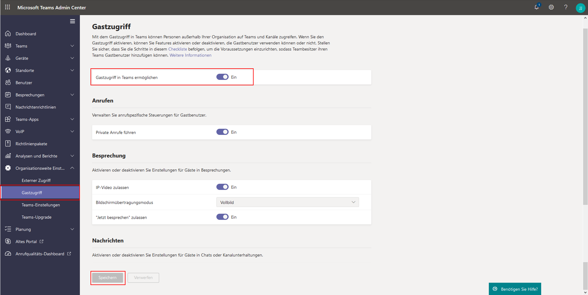

Für den Gastzugriff in Microsoft Teams wird die B2B-Plattform von Azure Active Directory  genutzt. Die Standardeinstellungen in Azure Active Directory, SharePoint Online und Office-365-Gruppen sind in der Regel bereits für einen Gastzugriff konfiguriert und bedürfen damit keiner weiteren manuellen Aktivierung. {>>Jule: Ich bin verwirrt: Muss ich den Gastzugang nun aktivieren oder nicht?<<}
Hier können Sie aber weitere Einstellungen des Gastzugriffs steuern. Auch das Azure Active Directory Admin Center finden Sie über den Browser im Microsoft 365 Admin Center.
Wählen Sie dort unter [Benutzer], die [Benutzereinstellungen] aus und steuern Sie unter [Externe Benutzer] den Bereich [Externe Einstellungen zur Zusammenarbeit] an.

Hier können Sie nun bestimmen, ob neben der Administration auch andere Team-Mitglieder Externe einladen dürfen oder ob dies sogar Gästen zusteht.

Die nächste Instanz zur Verwaltung des Gastzugriffs ist die Office-365-Gruppe. Über das Microsoft 365 Admin Center gelangen Sie in der linken Spalte über [Einstellungen] zu [Einstellungen] und dort wird unter [Dienste] der Menüpunkt [Office 365-Gruppen] gelistet. {>>Jule: Ist das so richtig: "Über [Einstellungen] zu [Einstellungen]"? Im Screenshot sieht es aus wie "Über [Einstellungen] zu [Dienste]"<<} Deren Check-Boxen sind üblicherweise aktiviert und regeln, dass Externe zu Gruppen hinzugefügt werden können und dass Gruppenmitglieder auch von außerhalb Ihrer Organisation auf Gruppeninhalte zugreifen dürfen.

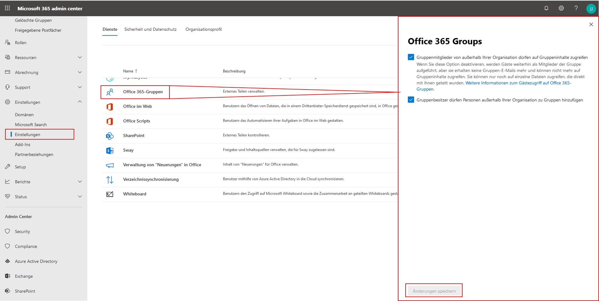

Unter [Sicherheit und Datenschutz], ebenfalls im Office 365 Admin Center unter [Einstellungen], [Einstellungen] zu finden, können Sie Team-Mitgliedern unter [Teilen] erlauben, neue Gäste zur Organisation hinzuzufügen. {>>Jule: Wieder: Ist das richtig? Muss man wirklich zwei Mal auf [Einstellungen] klicken?<<} Auch diese Einstellung ist üblicherweise bereits aktiviert.

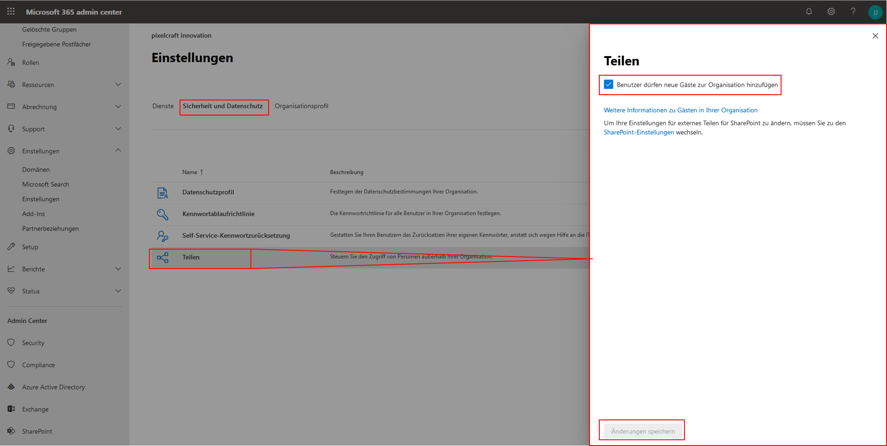

Navigieren Sie im Admin Center zum SharePoint Admin Center. Klicken Sie dort auf [Websites], [Aktive Websites], wählen Ihr gewünschtes Team an und klicken oberhalb der Liste auf [Teilen]. Mit den Optionen [Jeder] oder [Neue und vorhandene Gäste] können entsprechende Website-Inhalte geteilt werden.
Beachten Sie, dass Änderungen im Admin Center immer mit [Speichern] bestätigt werden müssen.
Im Fall von Änderungen an der Azure Active Directory können bis zu 24 Stunden vergehen, bis die Änderungen aktiv sind und Gäste entsprechenden Zugriff haben.

Direkt in der Teams-App nehmen Sie Gäste auf, indem Sie den gewünschten [Kanal] in der Liste suchen und über dessen Kontextmenü [...] die Option [Mitglied hinzufügen] wählen. Dort geben Sie die E-Mail-Adresse des externen Kontakts ein.

Über die Editier-Funktion kann der angezeigte Name von Gästen bearbeitet werden.

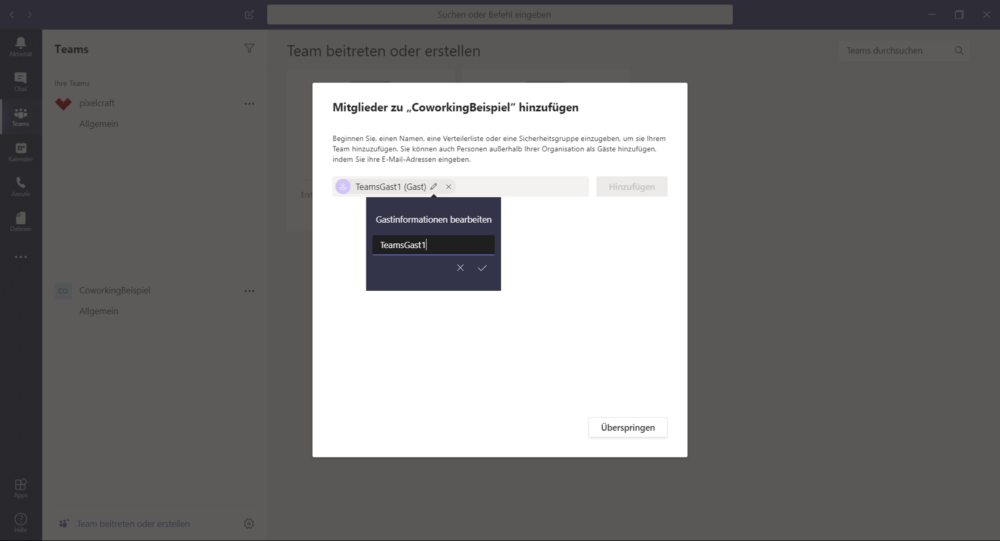

Gäste erhalten eine Einladung per E-Mail und können, sofern diese E-Mail-Adresse bereits mit einem Microsoft Konto verknüpft wurde, über [Microsoft Teams öffnen] dem Team beitreten.

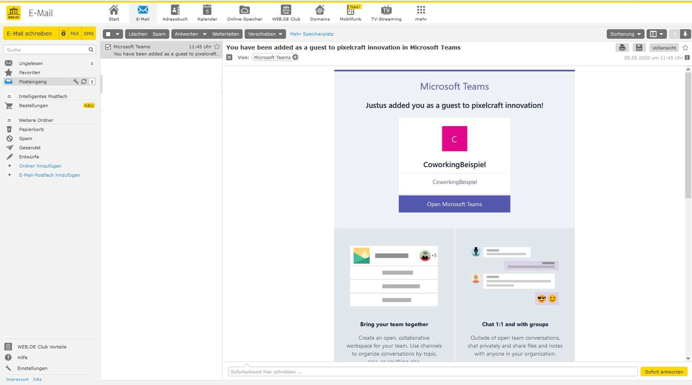  

Eine noch nicht verknüpfte E-Mail-Adresse erfordert eine einmalige Registrierung dieser bei Microsoft. Es wird dann automatisch ein Microsoft-Konto für die externe Person erstellt und dauerhaft mit der angegeben E-Mail-Adresse verknüpft.

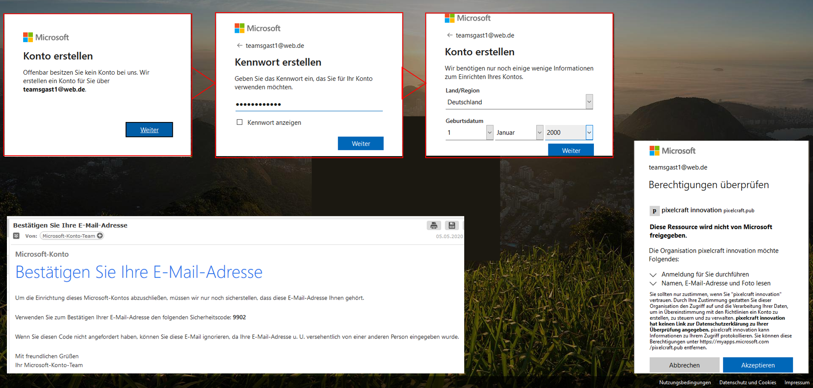

[Teams], deren Mitglieder auch aus Externen bestehen, werden sichtbar gekennzeichnet.

[weiter lesen: Besprechungen](#gastzugang-besprechungen-20200907)

## Gäste in eine Besprechung einladen [gastzugang-besprechungen-20200907]

MS Teams bietet Ihnen die Möglichkeit, Externe an einzelnen Besprechungen teilnehmen zu lassen. Eine Teilnahme ist dabei ganz ohne Anmeldung möglich.

Hierzu müssen Sie der externen Person einen Link bereitstellen, der direkt in die gewünschte Besprechung führt. Wie Sie den Link teilen, etwa per E-Mail oder Messenger, bleibt Ihnen überlassen. Die Teilnahme über einen Link ist allen Personen mittels der Teams-App möglich, welche auch auf mobilen Geräten mit Mac- oder Android-OS verfügbar ist. Aber auch über einen Browser lässt sich die Besprechung öffnen. Unter Mac-OS eignet sich hierfür der Chrome-Browser, unter Windows Microsoft Edge oder Chrome. Die eingeladene Person erhält über den Link die Wahl, wie sie an der Besprechung teilnehmen will.

Den Link für die Einladung generieren Sie auf zwei Arten:
In der Planung einer Besprechung über den Teams-Kalender, oder in einer laufenden Besprechung.

Planen Sie eine [+ Neue Besprechung] über den [Kalender], können Sie Personen über deren E-Mail-Adresse im Bereich [Erforderliche Teilnehmer hinzufügen]. Wenn Sie die Planung inklusive der Angabe aller Beteiligten abgeschlossen haben, können Sie über [Kalender] erneut auf die geplante Besprechung zugreifen. Nun wird im Bereich für [Details zu dieser Besprechung] der Hyperlink dargestellt, der weitere Personen zu dieser Besprechung führen kann. Kopieren Sie diesen und teilen Sie ihn mit weiteren Personen, die Sie nicht direkt eingeladen haben.

Personen, die Sie direkt über die Besprechungs-Planung durch Angabe der E-Mail-Adressen eingeladen haben, erhalten eine E-Mail mit einem Teilnahme-Link und der Möglichkeit, der geplanten Besprechung zuzusagen, diese abzulehnen und eine Synchronisation des Termins mit persönlichen Kalendern vorzunehmen.

In einer laufenden Besprechung können Sie über die Schaltfläche [Teilnehmer anzeigen] im Eingabefeld [Jemanden einladen] Personen direkt einen Beitritts-Link per E-Mail zukommen lassen, indem Sie dort deren E-Mail-Adresse eintragen. Außerdem können Sie den Teilnahme-Link generieren, indem Sie auf [Teilnahmeinfos kopieren] klicken.

Der Teilnahme-Link verbirgt sich in beiden Fällen als Hyperlink hinter dem Text [Join Microsoft Teams Meeting]. Sie können den Hyperlink nutzen oder den Link aus dem Hyperlink kopieren und so für die direkte Verwendung in der Adresszeile des Browsers nutzbar machen. Diese Link-URL ist jedoch sehr lang.

Wird dem Link gefolgt, muss sich die Person vor dem Betreten der Besprechung einen Namen geben, ihre Ton- und Video-Optionen wählen und dies mit [Jetzt teilnehmen] bestätigen.

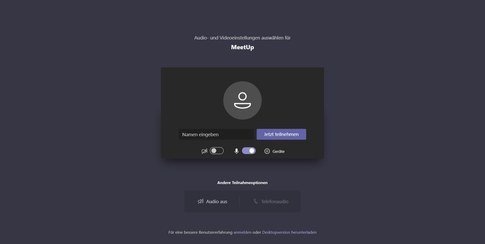

Daraufhin befindet sie sich im Wartebereich, was der Person angezeigt wird, die die Besprechung geplant hat. Dies geschieht über eine Pop-Up-Benachrichtigung und ein Symbol in der Steuerleiste Ihrer aktiven Besprechung, welches über [Teilnehmer anzeigen] erscheint. Hier finden Sie auch den Wartebereich, in dem Sie Eingeladene über das Häkchen-Symbol aktiv teilnehmen lassen können.

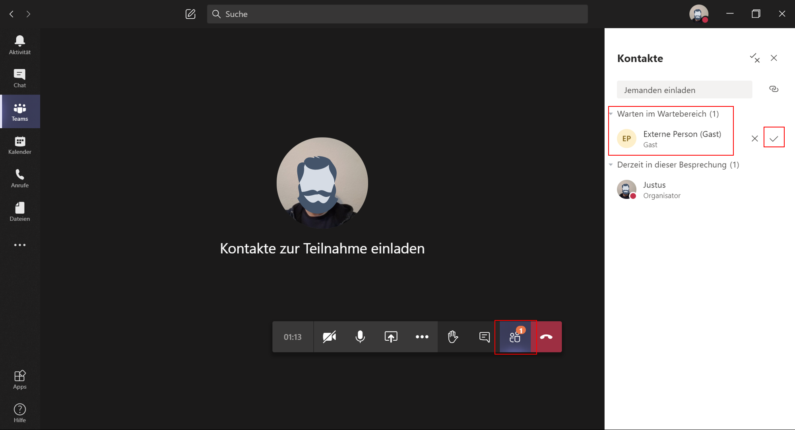

## GitHub in Teams integrieren [github-integrieren-20200924]

Auch der netzbasierte Dienst zur Versionsverwaltung für Software-Entwicklung GitHub lässt sich zur verbesserten Kollaboration in Microsoft Teams integrieren. Dadurch können Sie issues aufmachen und schließen, issues und pull-requests direkt in Teams kommentieren und allgemein über Vorgänge in Ihren geteilten Repositories informiert werden.

 Hierzu müssen Sie in der Teams-App im App-Store GitHub (Preview) installieren. Navigieren Sie über die die drei Punkte in der linken Seitenleiste in die App-Suchfunktion, suchen GitHub und wählen GitHub (Preview) aus.

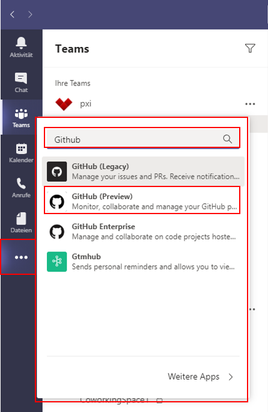

Nach erfolgreicher Installation begrüßt sie GitHub (Preview) in ihrer Teams-App. Antworten Sie hier mit dem Befehl @github (Preview) signin, um Ihren Github-Account mit dem Teams-Account zu verknüpfen.  

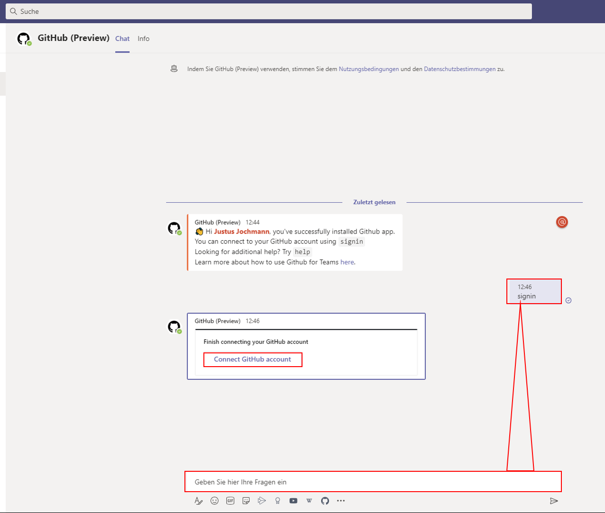

Um in einem Teams-Kanal Benachrichtigungen über Veränderungen wie innerhalb eines Repository zu erhalten - wie pull-requests und issues -, müssen Sie in Teams dem gewünschten Repository in dem gewünschten Kanal, in welchem die Benachrichtigungen stattfinden sollen, subscriben. dies gelingt indem Sie das Kommando @github (Preview) subscribe Organisationsname/Repository-Name als Nachricht eingeben.

Damit dies erfolgreich sein kann, weist Sie GitHub nun darauf hin, dass in ihrem GitHub-Repository die Teams Github-App installiert werden muss. Klicken Sie in diesem Hinweis auf [install app].

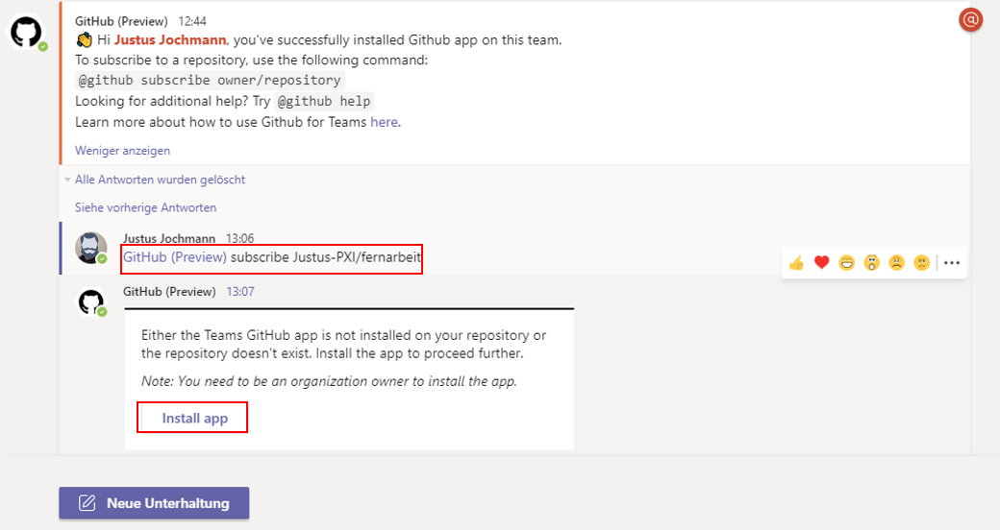

Nun werden sie im Browser auf Github.com geleitet, wo sie die App für Ihre Organisation installieren können.

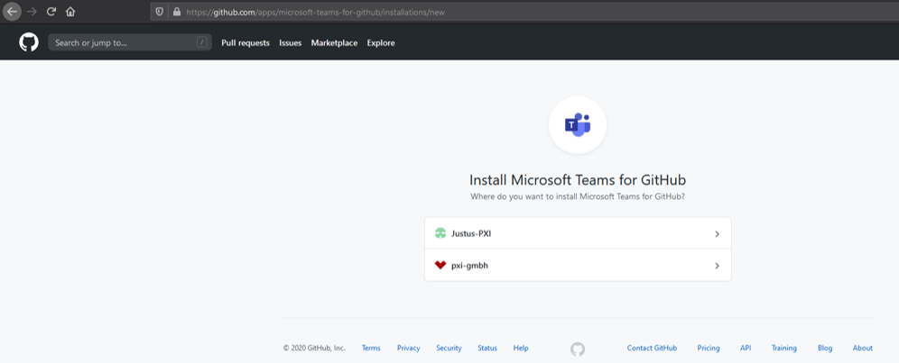

Nun können Sie noch bestimmen, ob über die App Zugriff auf bestimmte oder alle Repositories genehmigt werden soll. Genehmigen sie auf alle Repositories Zugriff, werden auch künftige neue private Repositories in Microsoft Teams über den Befehl @github (Preview) subscribe Organisationsname/Repository-Name abonniert. Andernfalls müssen Sie diesen Vorgang entsprechend erneut durchführen.

Die App kann nur durch die Person installiert werden, die den Account/Organisation besitzt. Jede Person kann aber die Installation einleiten, diese wird beantragt und wartet dann auf Freischaltung durch die berechtigte Person, welche in den Organisations-Einstellungen vorgenommen wird.

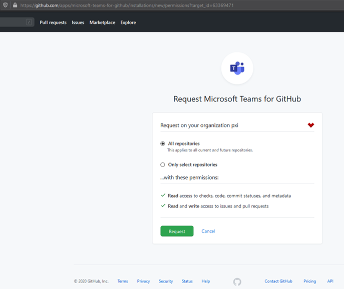
Der Befehl @github (Preview) subscribe Organisationsname/Repository-Name abonniert alle zur verfügung stehenden Benachrichtigungen aus dem Repository, @github (Preview) unsubscribe Organisationsname/Repository-Name deabonniert diese wieder.
Den Umfang der Benachrichtigungen können Sie nach Ihren Bedürfnissen anpassen. Zur Auswahl stehen dabei die features: issues, pulls, commits und comments. Mit dem Befehl @github (Preview) subscribe Organisationsname/Repository-Name feature können Sie einzelne Benachrichtigungen abonieren oder mit dem Befehl @github (Preview) unsubscribe Organisationsname/Repository-Name/feature einzelne Bnachrichtigungen abwählen.

Mit der Eingabe @github (Preview) erhalten Sie als Antwort eine Übersicht der möglichen Befehle/Interaktionen.

---

[zurück zur Übersicht](/)
