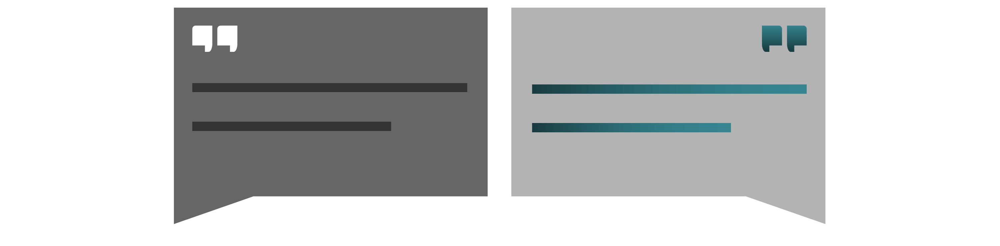

<nav class="nav--article"><!-- leave this alone -->

<!-- leave this alone -->
<h2><a href="#close" id="nav--close">Inhalts-Verzeichnis</a></h2><!-- leave this alone -->
<small>ca 25 Minuten Lesezeit | aktualisiert: 2020-05-27</small>

- [**Prinzipien zum Loslegen**][]
    - [Absprachen sind wichtiger als Werkzeuge!][]
    - [Schreiben ist die Kulturtechnik des Vertrauens!][]
    - [Information wird zentralisiert!][]
    - [Wohlwollen und Wertschätzung werden Bringschuld!][]

- [**Konzepte zur Strukturierung von Arbeit**][]
    - [Gleichzeitigkeit und Nachzeitigkeit][]
    - [Konzentration und Geschäftigkeit][]
    - [Autonomie][]
    - [Rhythmus][]
    - [Transparenz][]
    - [Präsenz-Kennzeichnung][]
    - [Fehlerkultur][]

- [**Werkzeug-Praxis**][]
    - [Text][]
    - [Video-Konferenz (für Besprechungen)][]
    - [Video-Konferenz (für Workshops)][]
    - [Dateiverwaltung][]
    - [Aufgabenverwaltung][]
    - [E-Mail][]
    - [Chat][]
    - [Briefpost][]

- [**Arbeitsplatz zu Hause**][]
    - [Arbeitsumgebung][]
    - [Ausstattung][]

- [**Unternehmenskultur**][]
    - [Führungsaufgaben][]

- [**Gesundheit und Selbstmotivation**][]
    - [Trennung von Arbeit und Privatleben][]
    - [Aufmerksamkeit verteilen][]
    - [Dranbleiben][]
    - [Gemeinschaftsgefühl stärken][]
    - [Unruhiges Arbeitsumfeld][]

- [**Vereinbarkeit von Beruf und Familie**][]
    - [Kinderbetreuung gerecht verteilen][]

- [**Schnellstart**][]

- &nbsp;
    - **Weiterführendes Material**
        - [Übersicht Online-Werkzeuge](/werkzeugsammlung) (ca 15min)
        - [Tagesplan Arbeit und Betreuung](/familie-beruf) (ca 6min)
        - [Leitfaden Text-Produktion](/schreiben) (ca 15min)

<!-- leave this alone -->
<h2><a href="#open">Inhalts-Verzeichnis</a></h2><!-- leave this alone -->
</nav><!-- leave this alone -->

# Fernarbeit

Wir sind eine kleine [Strategie-Agentur](https://agentur.pxi.gmbh) und mussten lernen, mit bescheidenen Mitteln zu arbeiten. Quer über die Welt verteilt. Hier unsere Erfahrungen als *Lebendiger Leitfaden*.

> *Wenn Sie die Prinzipien und Erläuterungen lieber später lesen und jetzt schnell die wichtigsten Grundlagen zur Umstellung schaffen wollen, springen Sie ans Ende des Dokuments*  
> <a href="#schnellstart">→ die ersten Schritte</a>

Dieser Text hat *Randnotizen*.	Auf dem Handy können Sie diese Inhalte mit einem Klick auf das ⨭… Symbol ausklappen.
<label for="hier-finden-sie" class="aside-toggle" role="button" aria-pressed="false" aria-label="Randbemerkung anzeigen" onkeypress="toggleButtonKeyPress()" onclick="toggleButtonClick()" tabindex="0">⨭ …</label>

<input id="hier-finden-sie" type="checkbox" class="aside-toggle"/>

Hier finden Sie Begriffsklärungen, Quellenangaben, weiterführende Links, sowie persönliche Kommentare und Erfahrungen aus unserem Team. Wenn Sie es eilig haben, können Sie sich das Lesen einfach sparen.

## Einleitung

Ein Hoffnungsschimmer für stressige Zeiten: Was jetzt als Notbehelf eingeführt wird, kann langfristig neue Freiheiten und Kompetenzen für eine bessere Arbeitswelt schaffen.

Auch für uns stellen sich angesichts der Pandemie ganz neue Herausforderungen, trotz unserer Erfahrung. Eigentlich wollten wir uns im April für ein paar Tage zusammensetzen, um über die Neuausrichtung unserer Firma zu sprechen. Denn auch für unsere Kultur und unser Vertrauen untereinander ist es wichtig, dass wir zumindest ab und an tatsächlich zusammen sind. Da wir alle woanders wohnen, konzentrieren wir diese Zeit in gelegentlichen gemeinsamen Ausflügen.

Diesmal bleiben wir zuhause und arbeiten weiter getrennt. Aber trotzdem anders als vorher: Auch unser Rhythmus ist durch den Ausfall von Kinderbetreuung durcheinander gebracht worden. Auch unsere Kundschaft braucht virtuelle und virtualisierte Unterstützung, für die wir erst die Infrastruktur schaffen müssen. Aber genau zu diesen schwierigen Details wollen wir Inspiration anbieten.

Keine Panik. Wir schaffen das. In Krisenzeiten sind Menschen erstaunlich anpassungsfähig und als Gemeinschaft widerstandsfähig.

## Prinzipien zum Loslegen

Prinzipien leiten uns dabei, die richtigen Regeln zu finden und eventuell auch zu verändern. Hier also die für uns hilfreichsten Erkenntnisse, damit Sie sofort selbstwirksam loslegen können.

### Absprachen sind wichtiger als Werkzeuge!

Lassen Sie sich von Empathie und Mitgefühl leiten. Fragen Sie sich nicht: Welche Technologie macht uns sofort dezentral vernetzt? Fragen Sie lieber: Welche Strukturen und Informationen kann ich der Belegschaft, Freunden und Familie bieten, damit wir uns aneinander aufrichten können?

Suchen Sie Halt in vertrauten Strukturen: Vergeuden Sie keine Zeit mit der Suche nach dem perfekten neuen Werkzeug, sondern passen Sie bestehende Werkzeuge an neue Arbeitsformen an. Die Lernkurve der Anpassung wird steil genug, da müssen Sie Ihre Belegschaft nicht noch zusätzlich mit Lernaufwand für neue Software belasten.

Aber wenn ein Werkzeug schnell Erfolg verspricht: zugreifen, machen. Sie können später schauen, ob es passendere Optionen gibt.

Wenn die dezentrale Situation neu für einige oder alle Teammitglieder ist, sollten sie eine Kultur der Überkommunikation etablieren: Alle Beteiligten tauschen sich täglich darüber aus, wie sie mit der Umstellung zurechtkommen und welche Maßnahmen ihnen bei der Umgewöhnung helfen.

### Schreiben ist die Kulturtechnik des Vertrauens!

Stellen Sie sich darauf ein, dass Sie viel mehr „ausdrücklich“ absprechen und aufschreiben müssen, als innerhalb eines gemeinsamen Büros. Es fehlen die unbewussten Signale und Rückmeldungen, mit denen Menschen sich abstimmen. Arbeit, die Ihre Arbeit erst möglich macht, war bislang unsichtbar oder flüchtig, versteckt in Köpfen und Unterhaltungen auf dem Flur. Oder analog auf Klebezetteln an Bildschirmen. Dieser Arbeit müssen Sie jetzt Raum und Gestalt geben.

Das wird Sie einiges an Aufwand kosten, aber dafür gewinnen Sie an anderer Stelle Freiheiten, die nur ohne räumliche Anwesenheit möglich sind.

Wenn Sie es schaffen, eine Organisation zu gestalten, die trotz der räumlichen Distanz Menschen zusammenbringt, knüpfen Sie Verbindungen, die belastbarer sind als die der flüchtigen Alltagsbegegnung.

Die neue Perspektive auf gemeinschaftliche Arbeit wird auch auf Ihre Unternehmensstruktur und Prozesse zurückwirken. Dabei werden alle Kräfte Ihrer Belegschaft neue Kompetenzen erwerben, die künftige Arbeit bereichern.

Gemeinsam Gemeintes wird klarer ausgesprochen und für Rückverweise aufgeschrieben. Vertrauen wird neu verhandelt und festgehalten. Es wird durch gemeinsame, verbindliche Absprachen und Strukturen nach und nach verinnerlicht. Der dafür nötige redaktionelle Aufwand wird mit der Zeit geringer, weil bald ein belastbares Fundament entsteht.

### Information wird zentralisiert!

Vertrauen braucht eine gemeinsame Quelle der Wahrheit, auf die sich alle berufen können. Halten Sie Informationen bei verteilter Fernarbeit deshalb immer zentral und eindeutig fest. Vermeiden Sie abweichende Kopien und Varianten. Verdoppelung und Abweichungen sind Auslöser für Missverständnisse, und Missverständnisse sind teuer.

Bedenken Sie dabei: Information ohne Struktur ist unverständliches Rauschen. Sie brauchen eine gemeingültige Ordnung. Die Struktur, auf die sich alle einigen können, wird sich allerdings erst nach und nach finden. Probieren Sie sich aus, bis sich eine organische, gemeinsame Verbindlichkeit entwickelt.

Richten Sie sich aber darauf ein, dass keine übergeordnete Struktur allen Bedürfnissen gerecht werden kann. Vor allem am Anfang nicht. Jede Person wird sie für sich interpretieren und Ihre eigene Ordnung hineinbauen. Erstmal ist das nicht so schlimm. Seien Sie nachsichtig und bitten Sie um Wohlwollen und Geduld.  

Aber ignorieren Sie das Thema nicht auf lange Sicht. Arbeiten Sie lieber in Ruhe alle gemeinsam daran, die Struktur nach und nach an die Bedürfnisse Einzelner anzupassen. Denn wenn Sie diesen Prozess nicht zusammen gestalten, gestaltet er sich im Hintergrund. Und das führt womöglich zu Lagerbildungen und parallelen Strukturen, die untereinander inkompatibel sind.
<label for="aside--spaetestens-in-grossen" class="aside-toggle" role="button" aria-pressed="false" aria-label="Randbemerkung anzeigen" onkeypress="toggleButtonKeyPress()" onclick="toggleButtonClick()" tabindex="0">⨭ …</label>

<input id="aside--spaetestens-in-grossen" type="checkbox" class="aside-toggle"/>

**Notiz**: Spätestens in großen Organisationen gibt es geradezu geheime Strukturen, wenn nicht alle in die Gestaltung von Prozessen eingebunden werden. Fragen Sie Ihre Systemadministration nach Shadow-IT.

Falls Sie noch kein gemeinsames Manifest und keine verbindliche Quelle für die Regeln und Prinzipien der Zusammenarbeit erstellt haben oder Ihnen eine zentrale Dateiverwaltung fehlt, beginnen Sie mit nur einem Dokument, das (möglichst online) für alle Beteiligten verfügbar und veränderbar ist.

### Wohlwollen und Wertschätzung werden Bringschuld!

Auch für uns läuft Fernarbeit nicht perfekt. Menschliche Bedürfnisse und Umstände ändern sich ständig, also gilt: Permanent dazulernen, nachsichtig mit sich selbst sein und wohlwollend mit anderen kommunizieren.

Wohlwollen ist eine Form des Vertrauens, die Missverständnissen vorbeugt. Wohlwollen unterstellt den anderen, in bester Absicht für den gemeinsamen Erfolg zu handeln und zu kommunizieren. Interpretieren Sie deren Aussagen also positiv gestimmt.  Formulieren Sie Ihre eigenen Aussagen dafür mit viel Bedacht, um den Interpretations-Aufwand Ihres Gegenüber zu minimieren.

Wertschätzung ist die Brücke für räumliche Distanz, mehr als alle Werkzeuge. Ohne Wertschätzung in der gegenseitigen Kommunikation und Zusammenarbeit verlieren Sie den nötigen Zusammenhalt. Menschen klinken sich aus dem Informationsaustausch aus, wenn Ihnen keine Signale der Wertschätzung ausdrücklich entgegengebracht werden.
<label for="aside--wertschaetzung-ist-die" class="aside-toggle" role="button" aria-pressed="false" aria-label="Randbemerkung anzeigen" onkeypress="toggleButtonKeyPress()" onclick="toggleButtonClick()" tabindex="0">⨭ …</label>

<input id="aside--wertschaetzung-ist-die" type="checkbox" class="aside-toggle"/>

**Jakob**: *Empfänger-orientierte Kommunikation ist effizient für Unternehmen: Wenn ich mir beim Formulieren mehr Zeit nehme, um Missverständnisse im Vorfeld schon zu reduzieren, spare ich der Organisation dramatisch viel Zeit für Nachfragen und Klärung, insbesondere wenn mehrere Menschen meine Aussage verstehen müssen.*

Sie müssen versuchen, eine Unternehmenskultur zu schaffen, in der die Belegschaft sich gegenseitig Wertschätzung schenkt und zeigt. Regelmäßiger, geplanter Austausch konstruktiver Kritik, Lob und Dankbarkeit in einer Arbeitsgruppe sind ein Weg, diese Denkweise zu verankern. Führen Sie dafür extra ein Format ein, wenn es so etwas noch nicht gibt.
<label for="aside--sie-muessen-versuchen" class="aside-toggle" role="button" aria-pressed="false" aria-label="Randbemerkung anzeigen" onkeypress="toggleButtonKeyPress()" onclick="toggleButtonClick()" tabindex="0">⨭ …</label>

<input id="aside--sie-muessen-versuchen" type="checkbox" class="aside-toggle"/>

**Justus**: *Wir feiern und loben uns jeden Freitag in einer gemeinsamen Video-Konferenz für die Fortschritte der Woche. Nur eine halbe Stunde voll positivem Zuspruch macht viel aus, um mit einem guten Gefühl ins Wochenende zu gehen.*

## Konzepte zur Strukturierung von Arbeit

### Gleichzeitigkeit und Nachzeitigkeit

Kommunikation braucht Aufmerksamkeit. Und Aufmerksamkeit ist eine kostbare Ressource - vor allem bei verteilten Arbeitsplätzen. Verlangen Sie von anderen also nur dann Aufmerksamkeit, wenn es für den gemeinsamen Erfolg wichtig ist. Respektieren Sie, wenn jemand seine Aufmerksamkeit gerade für Fokus-Arbeit benötigt und keine Zeit für Absprachen hat.

Wir trennen unsere Arbeit dafür strikt in gleichzeitige (synchrone) Kommunikation und versetzte (asynchrone) Kommunikation.

Absprachen sind besonders produktiv, wenn sie in gleichzeitig kommuniziert werden: Kontext und Hintergrundwissen werden bei allen Beteiligten gleichzeitig erzeugt. Alle wissen zu dieser gemeinsamen Zeit, wer zum aktuellen „wir“ gehört und wann das „jetzt“ ist, von dem aus über „morgen“ oder „gestern“ gesprochen wird. In einer asynchronen Absprache müssten diese Rahmenbedingungen erst aufwändig erklärt werden. Und das jedes Mal.
<label for="aside--absprachen-sind-besonders" class="aside-toggle" role="button" aria-pressed="false" aria-label="Randbemerkung anzeigen" onkeypress="toggleButtonKeyPress()" onclick="toggleButtonClick()" tabindex="0">⨭ …</label>

<input id="aside--absprachen-sind-besonders" type="checkbox" class="aside-toggle"/>

**Notiz**: In der Linguistik gibt es dafür den Begriff der *Kontextualisierung* und damit eine Ehrenrettung für Meetings: Meetings sind dann sinnvoll, wenn das Hintergrundwissen, mit dem alle weiterarbeiten können, zunächst gemeinsam erzeugt werden muss.

Die besten Voraussetzungen für einen synchronen Austausch bietet die räumliche Anwesenheit. Versuchen Sie deshalb, so viel räumliche Anwesenheit wie möglich mit technischer Unterstützung zu vermitteln. Schaffen Sie wenigstens eine Möglichkeit zur Video-Konferenz. Wenn die unmöglich ist, bevorzugen Sie das Telefon. Wenn das ausfällt, greifen Sie auf Chats zurück.

In asynchroner Kommunikation ist Fokus-Arbeit besonders produktiv. Hier ist das Hintergrundwissen nicht von den Beiträgen anderer Beteiligter abhängig. Vielmehr sind es Sinn-Zusammenhänge, die Sie im Kopf jonglieren müssen, um den Überblick für eine Aufgabenstellung zu behalten. Diese Zusammenhänge können Sie durchdenken und dann strukturiert aufschreiben, damit sie auch von anderen nachvollzogen werden können.

Wann andere Ihren Faden aufgreifen, um damit das große Gewebe weiter zu spinnen, ist flexibel. Alle können erst einmal ihre eigenen Aufgabenstellungen zu Ende denken, bevor sie sich extra Zeit nehmen, die Anfragen der anderen zur Abstimmung zu bearbeiten. Fördern Sie dieses zeitversetzte Anknüpfen, in dem Sie die Erwartungshaltung nach sofortiger Reaktion aktiv steuern:

Vermeiden Sie die Todeszone der Benachrichtigungen. Halb-gleichzeitige Arbeit und das Verlangen nach sofortiger Antwort erzeugt eine Atmosphäre des ständigen Wartens auf Unterbrechung. Hier müssen Sie die Technologie aktiv beschränken und Regelungen finden, wie Chat-Systeme nicht zur Aufmerksamkeits-Falle werden. Schalten Sie Benachrichtigungen als Standard aus und richten Sie statt dessen einen Kanal oder spezielle Benachrichtigungen ein, die wirklich benötigte sofortige Aufmerksamkeit garantieren.

Es gibt Arbeitsphasen, in die gleichzeitiges Hintergrundrauschen und ein wenig ablenkende oder zerstreuende Kommunikation passen. Schaffen Sie extra dafür Freiräume. So schützen Sie die Arbeit, die ungestörte Konzentration verlangt.

### Konzentration und Geschäftigkeit

Es gibt Arbeit, die lässt sich ohne viel Konzentration „nebenher“ erledigen und Arbeit, die unsere ungeteilte Aufmerksamkeit beansprucht. Fernarbeit kann Produktivität gegenüber der Arbeit im Büro befördern, weil Phasen der ungebrochenen Konzentration hier nicht unbeabsichtigt vom Kollegium gestört werden. Zumindest, wenn Sie die Regeln und die Technologie der Fernarbeit auf diesen Vorteil ausrichten.
<label for="aside--es-gibt-arbeit" class="aside-toggle" role="button" aria-pressed="false" aria-label="Randbemerkung anzeigen" onkeypress="toggleButtonKeyPress()" onclick="toggleButtonClick()" tabindex="0">⨭ …</label>

<input id="aside--es-gibt-arbeit" type="checkbox" class="aside-toggle"/>

**Lesematerial**: Forschungsergebnisse bestätigen Produktivitätsgewinn der Arbeit von zu Hause, siehe [Bloom et al, 2017](https://nbloom.people.stanford.edu/sites/g/files/sbiybj4746/f/wfh.pdf)

Wir unterscheiden zwischen Konzentrations-Arbeit und Geschäftigkeit.

Konzentrations-Arbeit braucht ungebrochene Aufmerksamkeit. Fokus. Das Kurzzeitgedächtnis wird mit Kontextwissen für die aktuelle Aufgabenstellung „aufgeladen“ und es reicht ein Impuls, der Aufmerksamkeit verlangt, um diese Phase der Konzentration zu zerstören. Ein Fokus-Wechsel kostet viel Zeit. Danach muss der Kontext erst wieder mühsam neu hergestellt werden. Programmieren, Diagramme gestalten, Texte schreiben, all das braucht Ruhe und Fokus.
Geschäftigkeit besteht aus Aufgabenschritten, die unabhängig voneinander ohne großes Eindenken in den Zusammenhang erledigt werden können. Auch bei Denkarbeit gibt es Aufgaben, die fast mechanisch erledigt werden können. Trotzdem sind diese Aufgaben wichtig, damit die Konzentrations-Arbeit ihre Wirkung entfalten kann. Ohne Ablage von Rechnungen kann die Buchhaltung nicht funktionieren. Ohne Buchhaltung kann das Unternehmen seinen Zahlungsverpflichtungen nicht nachkommen.

Geschäftige Arbeit passt außerdem gut zu indirekter Arbeit an Produktivität: Sie können Inspiration und soziale Bindung mit den anderen Mitgliedern der Belegschaft fördern, wenn Sie gemeinsam (parallel) geschäftiger Arbeit nachgehen und sich währenddessen über allgemeine Themen austauschen. Hier sind Fokus-Wechsel gut möglich und sogar förderlich.
Wertschätzen Sie notwendige Geschäftigkeit, die den Raum für Konzentrations-Arbeit bereitet. Schützen Sie Konzentrations-Arbeit, in dem Sie Unterbrechungen durch Kommunikation reglementieren.
<label for="aside--geschaeftige-arbeit-passt" class="aside-toggle" role="button" aria-pressed="false" aria-label="Randbemerkung anzeigen" onkeypress="toggleButtonKeyPress()" onclick="toggleButtonClick()" tabindex="0">⨭ …</label>

<input id="aside--geschaeftige-arbeit-passt" type="checkbox" class="aside-toggle"/>

**Jakob**: *Ich schätze Geschäftigkeit auch dafür, dass ich trotzdem produktiv sein kann, wenn ich eben keinen Schutz vor Ablenkung habe. Etwa wenn ich mit einem Auge auf die spielenden Kinder achten muss, damit ein Streit nicht eskaliert.*

Schaffen Sie eine Unternehmenskultur, in der Aufmerksamkeit als wertvolles Gut wahrgenommen wird, das gezielt auf gemeinsame Arbeit verteilt wird.
<label for="aside--schaffen-sie-eine" class="aside-toggle" role="button" aria-pressed="false" aria-label="Randbemerkung anzeigen" onkeypress="toggleButtonKeyPress()" onclick="toggleButtonClick()" tabindex="0">⨭ …</label>

<input id="aside--schaffen-sie-eine" type="checkbox" class="aside-toggle"/>

**Lesematerial**: Weiterführende Überlegungen dazu, wie Sie eine Firma um versetzte Kommunikation als Standard strukturieren, finden Sie auf Englisch: [asynchronous communication](https://doist.com/blog/asynchronous-communication/)

### Autonomie

Wenn Ihre Belegschaft eigenständig Entscheidungen treffen kann, verwendet sie weniger Zeit mit der Abstimmung von Zuständigkeiten und Vorbereitung, und mehr Zeit mit der Arbeit an Aufgaben. Dazu müssen Sie Zuständigkeit transparent machen und Kompetenz als gemeinsamen Wissensschatz verfügbar machen. Schaffen Sie einen Ort, wo neue Erfahrungen und Erkenntnisse für alle dokumentiert werden, damit jeder sich weiter bilden kann.  Sie können langfristig Rollen und Aufgabenbereiche für gemeinsames Arbeiten definieren und Ihre Belegschaft mit Mentorenprogrammen und Fortbildung zu Selbstverantwortung und Kompetenz ermächtigen.

Geben Sie allen in der Belegschaft für den Anfang klar umgrenzte persönliche Projekte vor. Die können jederzeit bearbeitet werden, wenn jemand für ein gemeinschaftliches Projekt erst noch auf Zuarbeit einer anderen Person wartet. Schon haben Sie Leerlauf in produktive Zeit umgewandelt, in der die Belegschaft Fortschritt erzielen und erleben kann. Wählen Sie dazu Projekte, die der persönlichen Entwicklung genauso dienen wie der Entwicklung von Unternehmenszielen.

### Rhythmus

Der Takt der Anwesenheit im Büro fehlt der Arbeit zu Hause. Die verteilt arbeitende Belegschaft findet für sich und ihre Bedürfnisse individuellere Taktung der Arbeit. Dennoch sind Arbeitsphasen auch bei verteilter Arbeit wichtig für Übergaben und Abstimmungen. Da hilft ein Metronom, an dem sich alle auch von zu Hause aus richten können, ohne darüber die neu gewonnenen Vorteile aufzugeben.

Strukturieren Sie virtuelle Begegnung in einem Rhythmus, der genug Raum für Konzentration lässt und dabei sozialen Zusammenhalt herstellt. Ein Wechselspiel von Vorschau und Planung zum Auftakt der Woche und einer Rückschau zum Ende der Woche kann zusätzlich einen inhaltlichen Rahmen setzen. In einigen Modellen von agilem Arbeiten werden tägliche Kurz-Absprachen empfohlen.

Finden Sie den Rhythmus, der Ihnen hilfreich erscheint. Im Moment der Krise gibt es genügend Anforderungen des Alltagslebens, die mit den Bedürfnissen des Unternehmens kollidieren. Seien Sie mitfühlend für Zeitbedürfnisse an Pflege und Kinderbetreuung. Die gewonnene Flexibilität können Sie als Kompetenz sicher noch für das Unternehmen gebrauchen.

### Transparenz

Ein notwendiger Baustein für Vertrauen ist Transparenz. Bei räumlich verteilter Arbeit wird nicht länger Arbeitszeit durch Anwesenheit demonstriert, sondern Ergebnisse der Arbeit durch Dokumentation. Umgekehrt müssen Ziele und die unternehmerische Vision, Rahmenbedingungen und Erwartungen ausdrücklich und verlässlich festgeschrieben werden.
Wenn Sie nicht bereits ein Werkzeug dafür haben, sollten Sie bald mit der Belegschaft eine Form der Aufgabenverwaltung beschließen, aus der Fortschritt in irgendeiner Form für alle jederzeit sichtbar wird.

### Präsenz-Kennzeichnung

Für die Abgrenzung von Konzentrations-Arbeit, aber auch für die Abgrenzung von Privatleben und Beruf müssen Sie in der Fernarbeit Ihre Verfügbarkeiten transparent machen. Alle signalisieren einander, ob Sie für Rückfragen zur Verfügung stehen, gerade beschäftigt sind oder sich vielleicht über etwas Zerstreuung und Inspiration freuen würden.

Werkzeuge zur Fernarbeit haben meist eine Einstellung, worüber Sie Ihren Status an die übrige Belegschaft teilen. Wir haben allerdings gute Erfahrung damit gemacht, in unserem geteilten Kanal eine kurze Nachricht zu schreiben, in der wir uns begrüßen, verabschieden und erzählen, was wir als nächstes machen wollen oder was uns in der Zwischenzeit aufgefallen ist. Das ist etwas verbindlicher und menschlicher als eine bloße Status-Leuchte und es lässt sich außerdem auch auf andere Werkzeuge und Kanäle übertragen. Sagen Sie doch per Messenger, worauf Sie sich zum Mittag essen freuen – schalten Sie allerdings die Benachrichtigungen für Kanäle ab, die Sie für solche Statusmeldungen ohne Dringlichkeit verwenden.

### Fehlerkultur

Bei der Arbeit an einer neuen Form von Arbeit bleibt es nicht aus, dass Sie Frustration und Scheitern erleben werden. Sie müssen vieles noch ausprobieren. Da gehören Enttäuschungen dazu.

Gleichzeitig arbeiten Sie daran, neue Formen und Formate für Vertrauen zu finden. Darin liegt die große Chance, Fehlerkultur neu festzuschreiben. Jede Frustration ist ein Indiz für einen Weg, es Ihnen und Ihrer Belegschaft beim nächsten Mal ein klein wenig einfacher zu machen. Suchen Sie Reibungspunkte. Nicht, um sich darüber zu ärgern, sondern um zu üben, Fehler transparent zu machen. Damit Sie beim Aufschreiben von Problemen und Hürden nach und nach Muster erkennen, aus denen Sie lernen. Und damit Sie Wissen produzieren und verschriftlichen, das die Arbeit künftig einfacher macht.
<label for="aside--gleichzeitig-arbeiten-sie" class="aside-toggle" role="button" aria-pressed="false" aria-label="Randbemerkung anzeigen" onkeypress="toggleButtonKeyPress()" onclick="toggleButtonClick()" tabindex="0">⨭ …</label>

<input id="aside--gleichzeitig-arbeiten-sie" type="checkbox" class="aside-toggle"/>

**Notiz**: *Wir haben für uns festgelegt, dass Blockaden in einem Arbeitsschritt oder im Umgang mit einem Werkzeug von allen selbstverantwortlich gelöst werden sollen. Dafür stehen allerdings nur 15 Minuten zur Verfügung – wenn in der Zeit über eine Recherche oder Ausprobieren keine Lösung gefunden wird, wird das Problem dokumentiert und zur gemeinsamen Diskussion an das gesamte Team ausgelagert. Regelmäßig arbeiten wir dann gemeinsam an Lösungen und füllen unsere interne Wissensdatenbank, damit beim nächsten Fall die Lösung näher liegt.*

## Werkzeug-Praxis

Experimentieren mit Produktivitäts-Werkzeugen kann entspannen. Probieren Sie ruhig verschiedene Angebote aus. Es gibt im Moment sehr viele davon und oft sind sie zum Testen gratis. Aber warten Sie lieber erste Erfahrungen ab, bevor Sie ein Werkzeug offiziell für die ganze Firma einführen, denn ein erzwungener Umgang ist stressig.

Und denken Sie daran: Auch Sparsamkeit ist entspannend. Nutzen Sie bevorzugt, womit Sie schon umgehen können. So brauchen Sie sich weniger Gedanken um Verwaltung und Schulung zu neuen Technologien machen. Information muss schließlich irgendwie zwischen all ihren Werkzeugen bewegt werden und dann den Weg in die Dokumentation finden. Außerdem haben Sie weniger Aufwand, sich mit der Datenschutz-Gesetzgebung für verschiedene Werkzeuge zu befassen, wenn Sie sich zunächst auf die wichtigsten, hilfreichsten Werkzeuge beschränken.

### Text

Text ist ein scheinbar triviales Werkzeug. Dabei ist es die entscheidende Kulturtechnik für verteilte Zusammenarbeit. Investieren Sie in diese Kompetenz. Formen Sie durch interne Fortbildung und Absprachen Ihre eigenen Konventionen.
<label for="aside--text-ist-ein" class="aside-toggle" role="button" aria-pressed="false" aria-label="Randbemerkung anzeigen" onkeypress="toggleButtonKeyPress()" onclick="toggleButtonClick()" tabindex="0">⨭ …</label>

<input id="aside--text-ist-ein" type="checkbox" class="aside-toggle"/>

**Weiterführendes**: *Einen eigenen Leitfaden zur Anleitung für verständliches, einnehmendes Schreiben stellen wir hier zusammen: <a href="/schreiben/" title="mehr über Text-Produktion erfahren">→ zum Leitfaden für Text-Produktion</a>*
  
**Werkzeugempfehlung**: Text-Editoren und Apps gibt es ständig neu. Setzen Sie zur Umstellung den Fokus auf Datensicherheit und Beweglichkeit; arbeiten Sie mit reinen Text-Dateien. Die minimalistische Auszeichnungssprache [Markdown](https://markdown.de) lässt sich schnell erlernen und kann reine Textdateien für Menschen und Maschinen gleichermaßen strukturieren.
  
**Notiz**: *Für gemeinsame redaktionelle Arbeit haben wir zwischenzeitlich wieder auf [Dropbox Paper](https://paper.dropbox.com) zurück gegriffen. Mittlerweile arbeiten wir mit einer eigenen Lösung für die Verknüpfung von Texten, Kommentaren und Dateien mit Versions-Kontrolle auf [GitHub](https://github.com).*

Betrachten Sie Text wie eine Benutzer-Oberfläche: Je einfacher sie gestaltet ist, desto besser kann Ihr Publikum das dahinterstehende Angebot nutzen. Je allgemein verständlicher die Sätze, desto besser die Informations-Vermittlung.

Suchen Sie sich Anleitung und Werkzeuge zur inhaltlichen Strukturierung von Text und zur Gestaltung durch Formatierung. Überlegen Sie sich Regeln für gutes, wertschätzendes, inklusives Formulieren. Text ist die Kulturtechnik, die gleichzeitig Kultur bildende Technik für Ihr Unternehmen sein wird.

### Video-Konferenz (für Besprechungen)

Schaffen Sie sich Strukturen für jede Konferenz. Sie sollten einen guten Grund und eine klare Absicht schon im Vorfeld formulieren, damit alle Teilnehmenden sich darauf einstellen können. Gerne auch mit immer wieder kehrenden Mustern. Daran sollten sich Begrenzungen anschließen: Vorgaben für Zeit und Inhalt, auf die sich alle einigen und verlassen können.

Schaffen Sie sich Strukturen für jede Konferenz. Sie sollten einen guten Grund und eine klare Absicht schon im Vorfeld formulieren, damit alle Teilnehmenden sich darauf einstellen können. Setzen Sie transparente Grenzen mit Vorgaben für Zeit und Inhalt, auf die sich alle einigen und verlassen können.
<label for="aside--schaffen-sie-sich" class="aside-toggle" role="button" aria-pressed="false" aria-label="Randbemerkung anzeigen" onkeypress="toggleButtonKeyPress()" onclick="toggleButtonClick()" tabindex="0">⨭ …</label>

<input id="aside--schaffen-sie-sich" type="checkbox" class="aside-toggle"/>

**Marie**: *Wir arbeiten mit ganz konkreten Schablonen für Gesprächsführung und Protokoll. So müssen wir fast nur noch Lückentexte ausfüllen und haben wenig Aufwand, den erarbeiteten Inhalten nachher Struktur zu geben. Unsere Schablonen sind sehr minimalistisch, damit sie sich organisch entwickeln können.*
  
**Werkzeugempfehlung**: Wenn Sie mit nur vier Leuten spontan und ohne Zeitbegrenzung sprechen wollen, probieren Sie [Whereby](https://whereby.com). Das ist funktioniert kostenlos und anonym ohne Installation einer App in jedem Browser. Für größere Gruppen müssen Sie irgendwann in Infrastruktur investieren. Wir arbeiten intern mit Microsoft Teams.
  
**Weiterführendes**: *Eine Sammlung und Einordnung von Werkzeugen stellen wir hier zusammen: <a href="/werkzeugsammlung/" title="mehr über Tagesplanung und Struktur von Arbeit erfahren">→ zur Werkzeug-Sammlung</a>*

Versuchen Sie, wiederkehrende Muster für Gesprächs-Beiträge einzuüben, damit nicht eine Person die Aufmerksamkeit und Zeit für sich beansprucht. Es hilft, wenn die teilnehmenden Personen sich auf abgesprochene Rollen konzentrieren: Eine Person kann die Moderation übernehmen und auf Einhaltung der Absprachen achten. Eine andere Person kümmert sich um das Protokoll, damit die Ergebnisse direkt schriftlich für alle nachvollziehbar werden. Zeigen Sie parallel eine Sanduhr oder eine andere Zeitanzeige, mit der alle an relevante Grenzen erinnert werden.

Aktives Zuhören aller Teilnehmenden wird bei Fernkonferenzen eine besonders wertvolle Fähigkeit. Ablenkung können Sie über einen geübten Umgang mit der Technik minimieren. Schalten Sie das Mikrofon aus, wenn Sie nicht sprechen. Verwenden Sie Kopfhörer, um Rückkopplungen und Echos zu vermeiden: Die Echo-Unterdrückung der Konferenz-Werkzeuge ist leider sehr unzuverlässig. Die Mikrofone, die in Handy-Kopfhörern eingebaut sind, sorgen für ausreichend gute Sprachqualität. Achten Sie nur darauf, das Mikrofon beim Sprechen nicht zu verdecken.

Vereinbaren Sie visuelle Signale, mit denen Sie Probleme oder Bedürfnisse anzeigen können. Damit steht ein Kommunikations-Kanal neben der Audiospur zur Verfügung, den Sie zur Fehlerbehebung oder auch für schnelle Umfragen nutzen können.
<label for="aside--vereinbaren-sie-visuelle" class="aside-toggle" role="button" aria-pressed="false" aria-label="Randbemerkung anzeigen" onkeypress="toggleButtonKeyPress()" onclick="toggleButtonClick()" tabindex="0">⨭ …</label>

<input id="aside--vereinbaren-sie-visuelle" type="checkbox" class="aside-toggle"/>

**Jule**: *Wir nutzen verschiedene Handsignale für „ich höre dich nicht“ oder „Störgeräusch“ oder „ich würde gerne zwischenfragen“ oder auch „Zurück zum Thema bitte“, um die Konferenz flüssig zu halten. Kleine Schilder mit Botschaften oder Bewertungen können schnell parallel zur Tonspur Details vermitteln, präziser als „Daumen hoch“ oder „Daumen runter“.*

Der Chat ist ein weiterer Kanal, auf dem nebenbei Informationen ausgetauscht werden können, die nicht gut im Video zu vermitteln sind. Achten Sie darauf, dass sich keine parallelen Diskussionen zwischen Video und Chat entwickeln, sondern der Chat immer als Unterstützungskanal für die Besprechung dient.

Bei größeren Gruppen, ab etwa zwölf Teilnehmenden ändert sich die Dynamik der Fernkonferenz und Sie brauchen besondere Regeln. Dann bekommt der Chat zusätzliche Funktionen und Relevanz.

Videos können in vielen Konferenz-Werkzeugen als Aufzeichnung auch den nicht-Anwesenden später zur Verfügung stehen. Gute Dokumentation ist allerdings immer schriftlich. Text lässt sich durchsuchen und überfliegen, wenn er entsprechend gestaltet ist. Investieren Sie ruhig Zeit in liebevoll gestaltete Protokolle, denn der Mehraufwand an Strukturierung spart später allen Zeit bei der Informationsaufnahme. Manche Werkzeuge bieten zusätzlich Transkription der Inhalte, die Sie als Grundlage von Wortprotokollen nehmen können, falls diese Detailtiefe wichtig ist.

Sie haben kein Konferenz-Werkzeug? Bis zu fünf Teilnehmende können Sie in vielen Mobilfunkverträgen mittlerweile als Konferenz-Schaltung verknüpfen. Das kann als Absicherung dienen, wenn eine Internetverbindung abbricht. Als Dauerlösung ist das Telefon allerdings ungeeignet, weil über das Video-Signal wichtige Information vermittelt wird, die dem Telefon alleine fehlen.

### Video-Konferenz (für Workshops)

Wenn Sie gemeinsam gestalterische Arbeit leisten wollen, können Sie die Fernkonferenz als Grundlage für dezentrale Workshops nutzen. Dann simuliert der Video-Kanal allerdings nur einen Teil der Workshop-Umgebung. Nutzen Sie deshalb zusätzlich ein anderes Werkzeug Ihrer Wahl zur online-Zusammenarbeit.
<label for="aside--wenn-sie-gemeinsam" class="aside-toggle" role="button" aria-pressed="false" aria-label="Randbemerkung anzeigen" onkeypress="toggleButtonKeyPress()" onclick="toggleButtonClick()" tabindex="0">⨭ …</label>

<input id="aside--wenn-sie-gemeinsam" type="checkbox" class="aside-toggle"/>

**Werkzeugempfehlung**: Wenn Sie mit mehreren Leuten für nur 40 Minuten gemeinsam arbeiten wollen, probieren Sie Zoom. Das geht kostenlos und kann mit eingeschränkter Funktion auch ohne App im Browser genutzt werden. Für größere Gruppen müssen Sie irgendwann in Infrastruktur investieren. Wir arbeiten intern mit Microsoft Teams. Parallel zum Video-Signal findet die gemeinsame Arbeit dann in einer Web-App oder über synchronisierte Apps auf mobilen Geräten statt. Für Skizzen nutzen wir Microsoft Whiteboard, das hat sehr niedrige Verzögerung.   
**Weiterführendes**: *Eine Sammlung und Einordnung von Werkzeugen stellen wir hier zusammen: <a href="/werkzeugsammlung/" title="mehr über Werkzeuge für Fernarbeit erfahren">→ zur Werkzeug-Sammlung</a>*

Wir haben immer mindestens ein weiteres Werkzeug parallel zur Video-Konferenz in Gebrauch. Für unsere Arbeit und Bedürfnisse greifen wir dafür häufig auf Werkzeuge aus dem Microsoft-Office-Universum zurück. Es gibt allerdings viele Alternativen für die meisten Anwendungen. Zwei Arten von Werkzeugen eignen sich besonders gut für gemeinsame, synchrone Gestaltung:

1. **Whiteboard (für gemeinsam gestaltete Skizzen)**. Wichtig ist, dass eine riesige Fläche gemeinsam mit virtuellen Stiften und Klebezetteln gefüllt werden kann und dass Änderungen mit nur ganz wenig Zeitverzögerung bei den anderen sichtbar werden. So können wir unsere eigenen Strukturen und Schemata zeichnen und darin produktiv arbeiten. Hilfreich ist, wenn angezeigt wird, welcher Beitrag von wem stammt.
2. **Textverarbeitung (für gemeinsame redaktionelle Arbeit)**. Wichtig ist, dass eine festgelegte Struktur von Überschriften-Hierarchie uns Orientierung verschafft. Eine eigene Ebene für Kommentar-Diskussionen sollte sich mit den geschriebenen Inhalten verknüpfen lassen. Am besten synchronisieren sich Kommentare und Änderungen mit möglichst niedriger Zeitverzögerung bei allen Beteiligten.

Für alle gestalterische Arbeit gilt: Zwei Geräte sind besser als eines! Am besten gibt es für jedes Werkzeug oder gar jede Aufgabe einen eigenen Bildschirm. So reicht ein Blick zum Konferenz-Video, um zu sehen, was die anderen machen oder über ihr Mienenspiel signalisieren.
<label for="aside--fuer-alle-gestalterische" class="aside-toggle" role="button" aria-pressed="false" aria-label="Randbemerkung anzeigen" onkeypress="toggleButtonKeyPress()" onclick="toggleButtonClick()" tabindex="0">⨭ …</label>

<input id="aside--fuer-alle-gestalterische" type="checkbox" class="aside-toggle"/>

**Jakob**: *Die richtigen Werkzeuge bereit zu stellen, ist gleichzeitig eine Investition in Produktivität und ein Zeichen der Wertschätzung. Wenn es finanziell machbar ist, sparen Sie nicht daran, Arbeit angenehmer und leichter zu machen. Wir stellen Arbeitsgeräte zur Verfügung, die auch privat zur Nutzung und damit zur Fortbildung im Umgang mit der Technologie einladen.*

Gleichzeitig können Sie mit dem Stift auf einem Tablet auf dem Whiteboard zeichnen und auf einem dritten Gerät können Ergebnisse der Konzeptarbeit in einem speziellen Produktions-Werkzeug festgehalten werden.

### Dateiverwaltung

Sie brauchen so bald wie möglich eine zentrale Quelle der Wahrheit, auf die alle gleichermaßen Zugriff haben. Das Zusammenfügen von getrennt gespeicherten Dateiversionen zu gemeinsamer Arbeit ist eine tickende Zeitbombe. Falls Sie keinen eigenen Server extra für geteilten Zugriff einrichten können, gibt es bei vielen Diensten die Möglichkeit, Ordner über die Cloud zu teilen.
<label for="aside--sie-brauchen-so-bald" class="aside-toggle" role="button" aria-pressed="false" aria-label="Randbemerkung anzeigen" onkeypress="toggleButtonKeyPress()" onclick="toggleButtonClick()" tabindex="0">⨭ …</label>

<input id="aside--sie-brauchen-so-bald" type="checkbox" class="aside-toggle"/>

**Werkzeugempfehlung**: Wenn Sie sich eine zentrale Dateiablage neu schaffen müssen, probieren Sie es mal mit Dropbox. Dort sind die ersten zwei GB Speicher gratis. Wenn Sie ohnehin schon eine Office-Lösung nutzen, richten Sie einfach einen geteilten Ordner in OneDrive für alle Beteiligten ein.   
**Weiterführendes**: *Eine Sammlung und Einordnung von Werkzeugen stellen wir hier zusammen: <a href="/werkzeugsammlung/" title="mehr über Werkzeuge für Fernarbeit erfahren">→ zur Werkzeug-Sammlung</a>*

Machen Sie dazu regelmäßig Sicherungskopien in Form von Schnappschüssen des Ordners, in dem sich die Dateien befinden, und sichern Sie diese Momentaufnahmen mit Datumsbezeichnung auf zusätzlichen Datenträgern. So können Sie auch gröbere Fehler oder versehentliche Löschungen rückgängig machen. Mindestens eine dieser Sicherungen sollten Sie für Notfälle außerhalb deponieren.

Professionelle Dienste zur Dateiverwaltung nehmen Ihnen viel Arbeit zur Versionskontrolle und Koordination ab. Dafür müssen Sie sich in die Handhabung der Dateiverwaltung einarbeiten. Aber denken Sie daran: Die Cloud ist nicht Ihr Backup. Die Cloud ist nur der Keller, wo jemand anderes den Computer stehen hat, auf dem Sie Ihre Daten speichern.
<label for="aside--professionelle-dienste-zur" class="aside-toggle" role="button" aria-pressed="false" aria-label="Randbemerkung anzeigen" onkeypress="toggleButtonKeyPress()" onclick="toggleButtonClick()" tabindex="0">⨭ …</label>

<input id="aside--professionelle-dienste-zur" type="checkbox" class="aside-toggle"/>

**Justus**: *Eine klare Regelung für Dateinamen hilft, Missverständnisse zu vermeiden. Versionieren Sie mit einer fortlaufenden Nummer, wenn Sie eine Kopie anlegen müssen. Markieren Sie Exporte oder zeitweilige (!) Duplikate, die Sie im Anschluss aufräumen. Es gibt keine Kundenprojekt-Dringend-Final-Korrektur-FinalFinal.doc mehr.*

### Aufgabenverwaltung

Eine zentrale, stets aktuelle Aufgabenverwaltung erzeugt Transparenz und macht Fortschritt für alle erlebbar. Sie bildet ab, wo es langsam voran geht und welche Aufgabenschritte problemlos und zügig erledigt werden können. Schauen Sie nicht nur darauf, wo Erwartungen unerfüllt bleiben. Das ist eine Gelegenheit, zu lernen; und sei es, Erwartungen passender zu formulieren. Schauen Sie auch darauf, wo es erfüllte Erwartungen gibt. Das sind Gründe zum Feiern. Also feiern Sie ruhig mal Zwischenerfolge.
<label for="aside--eine-zentrale-stets" class="aside-toggle" role="button" aria-pressed="false" aria-label="Randbemerkung anzeigen" onkeypress="toggleButtonKeyPress()" onclick="toggleButtonClick()" tabindex="0">⨭ …</label>

<input id="aside--eine-zentrale-stets" type="checkbox" class="aside-toggle"/>

**Werkzeugempfehlung**: Wenn Sie sich zum ersten mal mit einer virtuellen Pinnwand für Aufgaben-Verteilung anfreunden müssen, bietet Trello einen leicht verständlichen Einstieg.
  
**Weiterführendes**: *Eine Sammlung und Einordnung von Werkzeugen stellen wir hier zusammen: <a href="/werkzeugsammlung/" title="mehr über Werkzeuge für Fernarbeit erfahren">→ zur Werkzeug-Sammlung</a>*

Sie haben noch keine zentrale Aufgabenverwaltung? Verwenden Sie das verfügbare Konferenz-Werkzeug und richten Sie eine Kamera auf eine Tafel, auf der alle relevanten Projekte und deren Verantwortliche festgehalten sind. Zur Not müssen Sie regelmäßig Fotos machen.

### E-Mail

E-Mail kann einige Dinge ziemlich gut und wahrscheinlich haben Sie damit bereits die größte Erfahrung. Versuchen Sie nur nicht, E-Mail für gleichzeitige (oder fast-gleichzeitige) Kommunikation in die Heimarbeit hinüber zu retten. Richten Sie dafür so bald wie möglich einen anderen Kanal ein.
<label for="aside--e-mail-kann-einige" class="aside-toggle" role="button" aria-pressed="false" aria-label="Randbemerkung anzeigen" onkeypress="toggleButtonKeyPress()" onclick="toggleButtonClick()" tabindex="0">⨭ …</label>

<input id="aside--e-mail-kann-einige" type="checkbox" class="aside-toggle"/>

**Werkzeugempfehlung**: Nutzen Sie weiter, womit Sie Erfahrung haben. Für Synchronisation zwischen verschiedenen Endgeräten sollten Sie dabei allerdings auf das Protokoll "IMAP" wechseln. Richten Sie sich Filter und Weiterleitungen an, um Zuständigkeiten klar zu verteilen, wenn Sie mit mehreren Leuten gemeinsam eine geteilte Inbox nutzen wollen.

Richten Sie außerdem schnellst möglich eine zentrale Dateiverwaltung ein, worauf alle zugreifen können, damit Sie nicht Dateien in absurder Versionierung aus verschiedenen Postfächern zusammen suchen müssen.

Mittelfristig finden Sie wahrscheinlich in den Werkzeugen zur verteilten Zusammenarbeit bessere Lösungen für die interne Absprache. E-Mail wird Ihnen aber für die Kommunikation nach außen noch lange verlässliche Dienste leisten. E-Mail kann außerdem verschiedene Werkzeuge miteinander verknüpfen und zur Automatisierung eingesetzt werden: Viele Web-Apps bieten neben programmierbaren Schnittstellen zum Datenaustausch (APIs) immer die Möglichkeit, Daten per E-Mail einzupflegen oder auszugeben.

### Chat

Wenn Sie schon einen Chat nutzen, dann halten Sie daran fest. Sie werden schon wissen, was Sie daran haben. Wenn Sie noch keinen Chat nutzen, lassen Sie sich nicht dazu verleiten, darin die einzige Lösung für verteiltes Arbeiten zu sehen. Wichtiger als das Konzept „Text-Nachrichten in Boxen” ist die Frage, wie Information in der Kommunikation verwaltet wird. Konzeptionell ist es ein großer Unterschied, ob sich Gespräche um gemeinsam bearbeitete Dateien gruppieren oder ob Dateien einzeln an Gespräche geknüpft werden.
<label for="aside--wenn-sie-schon" class="aside-toggle" role="button" aria-pressed="false" aria-label="Randbemerkung anzeigen" onkeypress="toggleButtonKeyPress()" onclick="toggleButtonClick()" tabindex="0">⨭ …</label>

<input id="aside--wenn-sie-schon" type="checkbox" class="aside-toggle"/>

**Werkzeugempfehlung**: Microsoft Teams und Google G-Suite beinhalten Chat-artige Kommunikation. Teams wird bei Microsoft mittelfristig Skype ablösen. Bis dahin können Sie Skype aber immer noch für Video und Chat nutzen. Slack hat Chats populär gemacht, ist aber in der kostenlosen Version nicht zum längerfristigen Speichern von Information geeignet. Vorsicht!
  
**Weiterführendes**: *Eine Sammlung und Einordnung von Werkzeugen stellen wir hier zusammen: <a href="/werkzeugsammlung/" title="mehr über Werkzeuge für Fernarbeit erfahren">→ zur Werkzeug-Sammlung</a>*

Wenn Ihre Belegschaft private Messenger-Dienste nutzt, um sich beruflich auszutauschen, können Sie für die Übergangsphase erstmal daran festhalten. Vielleicht stellen Sie Regeln auf, wie Sie im Sinne des Datenschutzes dabei wenigstens verschlüsselt kommunizieren oder welche Inhalte Sie über andere Kanäle teilen könnten.

Im Sinne der Transparenz können Sie später eine Plattform zur Koordination und Absprache auswählen, die Elemente von Messengern und Chats mit Informationsverwaltung verknüpft.

Je nachdem, wie groß ein Team ist, bieten offene Gruppenchats sich an, in denen alle während ihrer Arbeitszeit online sein können. Das hilft gegen die ungewohnte Einsamkeit, indem es übergangsweise die Möglichkeit ersetzt, sich spontan und informell mit der Belegschaft auszutauschen.

### Briefpost

Die Briefpost könnte für die neue Normalität der Heimarbeit besondere Bedeutung bekommen. Zumindest, so lange persönlicher Kontakt vermieden wird, können Sie physische Artefakte miteinander austauschen. Als Zeichen von Wertschätzung oder für neue Wege, Greifbarkeit in die virtuell vernetzte Welt zu holen. Schicken Sie einander Bücher zur Inspiration und Fortbildung oder Artefakte, die aus der konzeptionellen Zusammenarbeit entstehen.
<label for="aside--die-briefpost-koennte" class="aside-toggle" role="button" aria-pressed="false" aria-label="Randbemerkung anzeigen" onkeypress="toggleButtonKeyPress()" onclick="toggleButtonClick()" tabindex="0">⨭ …</label>

<input id="aside--die-briefpost-koennte" type="checkbox" class="aside-toggle"/>

**Jakob**: *Ich habe Wertschätzung bislang hauptsächlich in persönlicher Anwesenheit ausgedrückt, indem ich jede Woche quer durch Deutschland gefahren bin, um jedem Mitglied meiner Belegschaft als Mentor zur Verfügung zu stehen. Vielleicht können handgeschriebene Briefe dieses Gefühl künftig transportieren.*

Und wenn Sie sich doch wieder treffen können, feiern Sie Momente des Beisammenseins besonders ausgiebig. Planen Sie vielleicht jetzt schon einen gemeinsamen Arbeits-Urlaub mit Ihren Brieffreundschaften.

## Arbeitsplatz zu Hause

### Arbeitsumgebung

Ihre Arbeitsumgebung hat einen großen Einfluss darauf, wie wohl Sie sich fühlen und wie produktiv Sie sein können. Schaffen Sie möglichst Raum für sich alleine, wenigstens einen Platz, den Sie ganz gezielt als Arbeitsbereich einrichten. Dort finden Sie Fokus und etablieren eine Grenze zwischen Ihrem Privatleben und der Arbeit.

Spezielle Sitzgelegenheiten sind gar nicht so wichtig, so lange kein medizinischer Bedarf besteht. Der teure Bürostuhl kann warten. Für den Einstig viel hilfreicher und kostengünstiger sind ständige Veränderung der Sitzposition und regelmäßige, aktive Bewegung. Positionieren Sie den Bildschirm auf Augenhöhe, so dass Sie den Hals nicht verrenken. Wenn Sie die Tastatur bedienen, sollten sich Ihre Handgelenke entspannen können.
<label for="aside--spezielle-sitzgelegenheiten" class="aside-toggle" role="button" aria-pressed="false" aria-label="Randbemerkung anzeigen" onkeypress="toggleButtonKeyPress()" onclick="toggleButtonClick()" tabindex="0">⨭ …</label>

<input id="aside--spezielle-sitzgelegenheiten" type="checkbox" class="aside-toggle"/>

**Jakob**: *Seilspringen bringt super das Herz auf Touren und schüttelt die angespannten Muskeln durch. Spazierengehen lockert die Wirbel und macht den Kopf und die Atemwege frei.*

Ein wenig Grün wirkt Wunder. Am schönsten ist natürlich ein Blick nach draußen, aber eine strategisch platzierte Pflanze oder Schnittblumen sind auch ein schönes Geschenk an Sie selbst.

Ein Fensterplatz ist hilfreich für gute Beleuchtung. Natürliches Licht ist besonders angenehm. Lichtquellen sollten für Video-Konferenzen möglichst hinter der Kamera  sein, der Raum im Video-Bild möglichst ruhig. Eventuell stellen Sie einen Schirm auf, der gleichzeitig als Schall-Schlucker dient und Reflektionen verringert. Eine dicke Wolldecke, in Ihrem Arbeitsbereich aufgehängt, ist schon ein guter Anfang, um die Akustik aufzuwerten.

### Ausstattung

Die Technologie für den Kontakt zu den übrigen Mitgliedern der Belegschaft sollte vor allem robust sein. Ein extra WLAN-Router kann (am besten mit einem Kabel) als Access Point an Ihre private Internet-Box angeschlossen werden und ein eigenes, stabiles WLAN nur für die Arbeit senden. So können Sie mit mehreren Geräten gleichzeitig an Fernkonferenzen teilnehmen. Mehrere Bildschirme oder Endgeräte helfen, Räumlichkeit für verschiedene Aufgabenbereiche und Kommunikation herzustellen. Hier kann ein Unternehmen viel Unterstützung leisten und Arbeitsgeräte stellen, damit die Arbeit zu Hause angenehmer und produktiver wird.

Zur Abgrenzung des Arbeitsbereiches sind sichtbare Signale und Schranken hilfreich, die Störungen aus dem Alltag begrenzen. Klären Sie vorab mit anderen Mitgliedern eines Haushalts, wie Sie die Arbeit abgrenzen wollen und dass Konzentration wichtig ist. Trennen Sie das private Telefon von der Arbeitskommunikation.

Besonders in Wohnblöcken und Hochhäusern sollten Sie sich Ruhezonen einrichten und zu gewissen Zeiten die Klingel abstellen und vielleicht ein Schild an die Tür hängen, dass Sie für ein paar Stunden nicht erreichbar sind. Es wird wahrscheinlich Übung kosten, die Konzentration in der neugewonnenen Flexibilität zu verteidigen, bis Heimarbeit auch für Ihr Umfeld Normalität geworden ist.

## Unternehmenskultur

Der Übergang in die verteilte Arbeit bringt neue kulturelle Anforderungen und Prägungen. Die gemeinsame Kultur muss und wird sich neu finden. Sie werden eigene Symbole und Zeichen und deren Bedeutung erschließen. Sie erschaffen gemeinsam mit der gesamtem Belegschaft Ihr eigenes Bedeutungsgewebe der Unternehmenskultur.

Haben Sie womöglich schon eine eigene Emoji-Sprache, die außerhalb Ihres Unternehmens niemand versteht? Diese und andere Formen der eigenen Sprache schweißen Menschen zusammen.

Meetings werden anders geführt werden müssen und darüber neue Bedeutung erhalten. Besprechungen werden nach und nach durch Dokumentation oder formalisierte, effiziente Formen der Entscheidungsfindung abgelöst. Ein gemeinsamer Arbeits-Rhythmus wird wie ein Fingerabdruck einzigartig für Ihr Unternehmen sein.

Die Hoffnung für Sie und Ihr Unternehmen im Chaos der Krise: Wenn Sie durch erzwungene Übung effizienter in der verteilten Arbeit geworden sind, haben Sie neue Fähigkeiten und Kompetenzen für strukturierte Zusammenarbeit und Teamfähigkeit gewonnen. Sie können Talente künftig ortsunabhängig für Ihr Unternehmen gewinnen. Sie können viel direkter mit anderen Interessen-Tragenden, Zuliefer-Betrieben oder Partner-Organisationen kommunizieren und Externe ohne aufwändige Vermittlung in Ihre neuen Prozesse zur Zusammenarbeit einbinden. Sie können nachhaltiger und krisenresistenter wirtschaften.

### Führungsaufgaben

Wahrscheinlich muss Führung sich in dieser Veränderung neu definieren. Vertrauen wird einen neuen Stellenwert bekommen müssen. Transparenz muss über alle Hierarchien und Richtungen hinweg gleichermaßen hergestellt werden.

Das bedeutet mehr Arbeit an Klarheit der Vision und Strategie. Das bedeutet eine höhere Anforderung an Verständlichkeit und Verlässlichkeit von Aussagen für gemeinsames Verständnis. Das bedeutet neue Aufgaben, Ihre Belegschaft für eigenständiges Arbeiten vorzubereiten, damit alle selbständig zielführende Beiträge für den Unternehmenserfolg leisten können. Das bedeutet Reflektion darüber, wie Erfolg in einem gemeinschaftlich verteilten Sinn definiert werden kann.

In der Krise muss die Unternehmensleitung eine besondere Vorbild-Rolle einnehmen. Selbst vorleben, was als neue Normalität gewünscht und erwartet wird.

Geben Sie sich und Ihrer Belegschaft gezielt Auszeiten zur Wertschätzung. Bewundern Sie die Ästhetik des gemeinsam gestalteten Bedeutungsgewebes. Staunen und freuen Sie sich über neue Erkenntnisse und Erfolge. Halten Sie diese Erkenntnisse und Erfolge fest, um die gelebte Praxis als Erfolgsgeschichte festzuschreiben.
<label for="aside--geben-sie-sich" class="aside-toggle" role="button" aria-pressed="false" aria-label="Randbemerkung anzeigen" onkeypress="toggleButtonKeyPress()" onclick="toggleButtonClick()" tabindex="0">⨭ …</label>

<input id="aside--geben-sie-sich" type="checkbox" class="aside-toggle"/>

**Jakob**: *Meine persönliche Philosophie ist, Führung als Dienstleistung zu interpretieren. Daraus leiten sich die Aufgaben und das Rollenprofil als Mentorenfigur ab, die die Belegschaft befähigt, sich individuell im Sinne des gemeinsamen Erfolgs zu verwirklichen.*

Entwickeln Sie neue Rollen und Kompetenzen der Gemeinschafts- und Vertrauensbildung für Ihr Unternehmen. Definieren Sie dazu einen eigenen Verantwortungsbereich. Wenn es die Bedingungen hergeben, ziehen Sie für diese Entwicklung neues Personal und Begleitung mit einschlägiger Erfahrung in Erwägung.

Gehen Sie die Herausforderungen behutsam und optimistisch an. Bewahren Sie erstmal, was bereits funktioniert. Verstärken Sie, was jetzt schon Vertrauen bildet. Greifen Sie auf, was als vertraute Konvention Halt im Umbruch gibt und mischen Sie dem nach und nach neue Bedeutung bei.

Seien Sie respektvoll mit sich selbst. Wandel braucht Zeit, auch in Ihrem Kopf. Allein die redaktionelle Arbeit, die Vertrauensbasis in Text zu fassen, ist ein Berg, den Sie nur Schritt für Schritt, gemeinsam erklimmen können.

Nur Mut! Sie bewegen sich in unvertrautem Gelände, aber Sie sind nicht alleine. Ihr ganzes Unternehmen sucht mit Ihnen den Weg.

## Gesundheit und Selbstmotivation

In Krisensituationen suchen wir Halt in vertrauten Mustern. Arbeit kann ein solcher Halt sein. Arbeit zu Hause birgt allerdings besondere Fallstricke. Nicht jede Strategie passt zu jeder Person und die Arbeit allein zu Hause für sich ist schon nicht für jeden. Wir zeigen deswegen verschiedene Strategien auf, mit denen wir gute Erfahrungen gemacht haben.

Selbstsorge und Fürsorge ist wichtiges Element der Arbeit zu Hause. Denken Sie daran, dass Sie in einer Krisensituation enormen Stress durch äußere Umstände erfahren. Die Umstellung der Arbeitsweise ist da nur ein kleiner Bereich. Setzen Sie sich also nicht unter Druck, wenn Sie nicht so funktionieren, wie Sie es von sich gewohnt sind.

### Trennung von Arbeit und Privatleben

Grenzen sind wichtig. Besonders, weil der Wechsel ins Büro als Grenze fehlt, müssen Sie aktiv
Alternativen dazu suchen. Schaffen Sie sich einen Bereich, den Sie nur für Arbeit aufsuchen. Vielleicht sogar verschiedene Bereiche für verschiedene Arten von Arbeit. Nehmen Sie Ihre Arbeit auf keinen Fall mit ins Bett.

Rituale können die Abgrenzung unterstützen und damit auch den Wechsel zwischen Arbeitsmodus und Privatleben. Vielleicht tragen Sie deswegen extra Kleidung, nur für die Arbeit.

Setzen Sie sich Zeitvorgaben und schauen Sie auf die Uhr. Entgegen dem fehlgeleiteten Misstrauen gegenüber Heimarbeit arbeiten Menschen zu Hause eher mehr und länger als im Büro. Wenn Pendeln und Gespräche auf dem Flur und Ablenkung anderer Menschen fehlen, halten uns unsere Aufgaben schnell gefangen.

Der fehlende Arbeitsweg bedeutet zwar eine Zeitersparnis und weniger Stress, es fehlen aber auch die Bewegung, die Begegnung mit anderen Menschen, die zur Arbeit müssen, die frische Luft, das Vitamin D und die spürbare Trennung zwischen privater Morgen- und Arbeitsroutine. Deshalb kann es hilfreich sein, einen Arbeitsweg bewusst zu simulieren: Gehen Sie direkt vor der Arbeit eine kleine Runde Laufen, Spazieren oder Fahrradfahren. Machen Sie eine Selbstverständlichkeit daraus und nicht nur eine Option bei Sonnenschein. Und genießen Sie es aktiv, dass Sie dann doch drinnen bleiben dürfen, falls das Wetter mal ganz besonders eklig sein sollte.

Gleiches gilt für den Nachhauseweg, der den Übergang zum Feierabend markiert: Wer sich eine Freizeitaktivität für Punkt 18 Uhr vorplant und sich auch daran hält, ist weniger versucht, unnötige Überstunden zu machen oder die Arbeit nach hinten zu prokrastinieren. Soziale Verabredungen sind am besten geeignet, um diesen Termin auch wirklich einzuhalten. Hier tut es auch schon ein Kaffeekränzchen am Telefon.

### Aufmerksamkeit verteilen

Sie haben jetzt die Gelegenheit, Ablenkung besser und aus eigener Kraft zu kontrollieren. Nutzen Sie das, in dem Sie Ihre Arbeit selbst in Phasen der ungestörten Konzentration bündeln.
Multitasking sollten Sie ab sofort vermeiden. Das ist eine schädliche Angewohnheit und eine Selbstlüge obendrein. Echte Gleichzeitigkeit von Aufmerksamkeit gibt es nicht. Wenn Sie mehrere Aufgaben jonglieren, verlieren Sie bei jedem Wechsel von Fokus wertvolle Zeit, in der Sie den passenden Kontext erst wieder herstellen.

Auch Ruhe hat Aufmerksamkeit verdient. Konzentration lässt sich nicht ständig aufrechterhalten. Planen Sie deswegen Momente der Ruhe und Inspiration, wo Sie sich neue Energie für die nächste Aufgabe holen. Vergeuden Sie diese Ruhe nicht auf die unersättlichen Aufmerksamkeits-Schlünde der sozialen Medien. Verbannen Sie diese Apps am besten von Arbeitsgeräten, die Sie für fokussierte Arbeit nutze. Schauen Sie nur mit Stoppuhr bewaffnet in einen Feed. Nehmen Sie sich lieber gezielt Zeit für einen Kaffee oder Ihr Lieblingsgetränk und gehen Sie ein paar Schritte.

Finden Sie Ihren eigenen Rhythmus. Für manche ist es hilfreich, Hausarbeit in den Arbeitstakt zu integrieren: Waschmaschine laden, arbeiten, Wäsche in den Trockner packen, arbeiten, Wäsche falten. Andere brauchen vielleicht einen einheitlichen Rahmen um die Arbeit herum, ein Zeitfenster in dem keine Hausarbeit oder Privatleben Platz haben, weil Sie sonst den Bezug zur Arbeit verlieren. Finden Sie auf jeden Fall einen Takt, in dem Zeit für Essen bleibt, um Energie zu tanken.
<label for="aside--finden-sie-ihren-eigenen" class="aside-toggle" role="button" aria-pressed="false" aria-label="Randbemerkung anzeigen" onkeypress="toggleButtonKeyPress()" onclick="toggleButtonClick()" tabindex="0">⨭ …</label>

<input id="aside--finden-sie-ihren-eigenen" type="checkbox" class="aside-toggle"/>

**Jule**: *Zu viele kleine Pausen, die ohne vorher festgesetzte Struktur mit privater Hausarbeit gefüllt werden, können dazu führen, dass Sie sich in Ablenkung verlieren: Beim Geschirrspülen gesehen, dass die Topfpflanze trocken ist, und eigentlich müssten Sie die alle mal wieder gießen, huch da ist eine Spinnenwebe, schnell noch den Besen aus der Kammer holen, die Sie sowieso mal aufräumen wollten und schon haben Sie ungewollt eine Stunde weg prokrastiniert.*

### Dranbleiben

Der Albtraum vieler selbstverantwortlich Arbeitenden heißt Prokrastination. Sie stehlen sich mit Aufschieben selbst Zeit für produktives Arbeiten, obwohl Sie es besser wissen. Dabei gibt es Gründe, warum Prokrastination so eine psychologische Macht entwickelt und manchmal kann sie sogar hilfreich sein.

Aufgaben mit hoher Eigenkreativität sind besonders anfällig für Prokrastination. Generell hilft: Erstmal irgendwie anfangen, egal wie - keine Ansprüche an die Qualität der Arbeit haben, denn die entwickelt sich von alleine, wenn Sie erstmal reingekommen sind. Dementsprechend macht es auch Sinn, sich Aufgaben, die einfach nur abgearbeitet werden müssen (Mails checken z.B.) bewusst auf den Anfang der Bürozeit zu legen. Das stuft die Hürde herunter, sich an den Schreibtisch zu setzen.
<label for="aside--aufgaben-mit-hoher" class="aside-toggle" role="button" aria-pressed="false" aria-label="Randbemerkung anzeigen" onkeypress="toggleButtonKeyPress()" onclick="toggleButtonClick()" tabindex="0">⨭ …</label>

<input id="aside--aufgaben-mit-hoher" type="checkbox" class="aside-toggle"/>

**Jakob**: *Mir hilft es manchmal, den größten Brocken oder unangenehmsten Teil gleich zu Beginn des Tages zu erledigen, wo ich noch Energie für anstrengende Entscheidungen habe.*

Hier kann auch die Gemeinschaft per Fernarbeit sich gegenseitig unterstützen. Helfen Sie einander, dran zu bleiben mit gemeinsamer Parallel-Arbeit: Wir nutzen regelmäßig unsere Video-Konferenz, um schweigend nebeneinander zu arbeiten. Gerade, wenn dabei unterschiedliche Rollen zusammenkommen, simulieren wir dabei auch so etwas wie die Politik der offenen Tür oder personalisierte Sprechstundenzeit. Haben Sie Respekt vor dem Konzentrationsbedürfnis der anderen Person, aber seien Sie ansprechbar, wenn die gerade Hilfe braucht, sich neu zu fokussieren. Oder vereinbaren Sie, wann es Zeit ist, Ablage zu machen und dabei nebenher einen Schwatz zu halten.

### Gemeinschaftsgefühl stärken

Zeigen Sie Solidarität beim Sich-Voll-Reinhängen in die neue Situation. Sie können sich gegenseitig virtuell auf die Schultern klopfen. Sie können auch unter ungewohnten Umständen konsequent und jetzt-erst-recht durchziehen, was offline geplant war. Sie können gemeinsam Schulterzucken, wenn die Lernkurve steil ist und Dinge und Absprachen nicht beim ersten Mal klappen. Nicht ärgern. Nur wundern. Und ab und zu gemeinsam lachen.

### Unruhiges Arbeitsumfeld

Mit der Wohnung als Arbeitsraum geht oft das Problem eines lebendigen Umfelds einher. Das Leben in Wohneinheiten und Nachbarschaften hält andere Widrigkeiten bereit, als es eine gewöhnliche Bürosituation tut. Ungewünschte Ablenkungen sind vor allem:

- **Haushaltsmitglieder**  
Planen Sie Ihre Zeitbedürfnisse gemeinsam mit anderen Personen des Haushalts: Was sind Fokus-Zeiten oder spezifische Termine für Fernkonferenzen, wann wird Ruhe erwartet und was sind Notfälle, für die die Arbeit gestört werden darf. Eine gute Faustregel hierfür ist, Folgendes klar zu machen: "Ist dein Anliegen so wichtig, dass du ins Büro fahren würdest, um mir das mitzuteilen? Wenn nicht, dann komm damit bitte nicht an meinen Schreibtisch zuhause.”
 
 
- **Türklingel**  
Tragen Sie nicht selbst zur Ablenkung bei, stellen Sie auf Versand an eine Packstation um. Planen Sie Verfügbarkeit im Rhythmus der Versorgungsdienste und stellen die Klingel ab, sobald die Müllabfuhr oder die Post da war.
 
 
- **Geräuschkulisse  außerhalb der Wohnung**  
Es ist durchaus sinnvoll, den Arbeits-Rhythmus an seine Umgebung anzupassen: Ist auszumachen, wann das Umfeld besonders unruhig ist, können Pausen auf diesen Bereich gelegt werden. Zum Beispiel gleichzeitig mit der Hofpause bei einer Grundschule nebenan. Technische Hilfsmittel in Form von Ohrstöpseln helfen, unbeeinflusst von äußerer Geräuschkulisse arbeiten zu können.
Hier bietet sich auch der Einsatz neuer *Noise-Canceling-Systeme* an. Mit aktiver Geräuschunterdrückung lassen sich potentielle Störgeräusche wie Gespräche der Nachbarn, Musik im Umfeld oder Brummen und Betriebsgeräusche von Elektrogeräten handhaben, ohne eine komplette Abschottung des Gehörgangs notwendig zu machen. Hier gilt es, solche technischen Hilfsmittel auszuprobieren und dem eigenen Wohlfühlen angepasst einzusetzen.

## Vereinbarkeit von Beruf und Familie

Der Ausfall von Kinderbetreuung und Pflege verschärft die Situation von Menschen, die zu Hause neben der Erwerbsarbeit nun gleichzeitig Fürsorge leisten müssen. Wir haben als Unternehmen deswegen allen Teammitgliedern mit Pflegeaufgaben aktiv Unterstützung ausgesprochen: Wir erwarten weniger berufliches Leistungsvermögen in dieser Situation.

Der Wert von Arbeit wird im Verlauf der Krise sicherlich auch noch mal gesellschaftlich verhandelt. Fürsorge und Pflegearbeit bekommen auf einmal neues Gewicht für Ihre Systemrelevanz.

Schauen Sie, inwiefern Ihr Unternehmen hier einen Beitrag leisten kann. Wir bieten Ihnen an dieser Stelle ein paar Vorschläge dazu aus unserer Erfahrung und von uns bekannten überzeugenden Vorbildern.

### Kinderbetreuung gerecht verteilen

Die Bedürfnisse einer Familie bringen eine neue Planungs-Kategorie für Arbeit hinzu, die Sie nur durch noch mehr Absprachen und Ausweichzonen mit anderen Bedürfnissen vereinbaren können. Sie müssen hier echte Kompromisse machen und manche Aufgaben zu Lasten anderer Aufgaben bevorzugen. Trennen Sie das Notwendige vom Wichtigen.
<label for="aside--die-bedürfnisse-einer" class="aside-toggle" role="button" aria-pressed="false" aria-label="Randbemerkung anzeigen" onkeypress="toggleButtonKeyPress()" onclick="toggleButtonClick()" tabindex="0">⨭ …</label>

<input id="aside--die-bedürfnisse-einer" type="checkbox" class="aside-toggle"/>

**Jakob**: *Meine Partnerin und ich arbeiten beide gleichberechtigt Vollzeit und stimmen unsere Kalender im Viertelstundentakt ab, um Verantwortung aus Privatleben und Arbeit auf passende Zeitfenster zu verteilen.*

Seien Sie nachsichtig mit sich selbst, wenn Sie nicht all Ihren Vorstellungen gerecht werden. Seien Sie großzügig bei der Planung von Zeit-Puffern. Seien Sie konsequent bei der Verhandlung von Verantwortung und Zeitbudgets mit Mitmenschen aus Ihrem Privatleben. Auch hier bietet es sich an, Vereinbarungen schriftlich festzuhalten, Erfahrungen zu protokollieren und darauf zu verweisen. Niemand ist objektiv in der qualitativen Bewertung von Zeit und besonders Männern fehlt systematisch die Erfahrung, sich anhand der Bedürfnisse anderer zu disziplinieren.

Wo Kinderbetreuung mit dem Arbeitsalltag koordiniert wird, ist eine Aufteilung von privater Verfügbarkeit um so wichtiger: Es gibt Arbeit, die muss gemacht werden aber braucht keinen *Flow*, keine dauerhafte Konzentration. Manche Arbeit kann ohne großen Aufwand unterbrochen und wieder aufgenommen werden. Diese Arbeit sollte geplant auf die Zeit gelegt werden, wo mit einem Ohr und Auge aufkommender Streit geschlichtet werden muss oder dringende Kinderbedürfnisse Vorrang bekommen, während die Kinder ansonsten einer eigenen Beschäftigung nachgehen.

> Ausführliche Gedanken zu gerechter Verteilung von Betreuung und Arbeit und eine Vorlage für einen Tages- und Wochenplan: <a href="/familie-beruf/" title="mehr über Tagesplanung und Struktur von Arbeit erfahren">→ mehr über Lösungen für Familien erfahren</a>

Eine Sammlung von Tricks zur Beschäftigung der Kinder oder zur Integration der Betreuung in den Arbeitsalltag finden Sie [zum Beispiel hier](https://www.poynter.org/business-work/2020/how-to-work-from-home-with-kids-around/) [auf Englisch](https://www.poynter.org/business-work/2020/how-to-work-from-home-with-kids-around/). Wenn Sie selbst Bildung und vor allem Forschung neu für sich entdecken mögen, probieren Sie doch ein paar [Experimente für Vorschule und Grundschule](https://www.bildungsserver.de/Praxishilfen-Experimentieranleitungen-5683-de.html) gemeinsam aus.

## Schnellstart

*Wenn die Umstellung auf dezentrale Fernarbeit noch neu für Sie ist, folgen Sie unseren Empfehlungen, wie Sie sich schnell zurecht finden.*

### 1. Manifest anlegen

Setzen Sie ein zentrales Dokument auf, in dem Sie Ihre gemeinsamen Regeln und Konventionen für verteilte Arbeit festhalten. Legen Sie Ihr Manifest für dezentrale Arbeit an.

Wenn Sie schon Dropbox verwenden oder es einrichten können, ist [Dropbox Paper](https://paper.dropbox.com) ein leichter Einstieg in gemeinsame Arbeit an Text.

### 2. Auftaktkonferenz anberaumen

Setzen Sie ein Werkzeug zur Video-Konferenz auf und laden Sie Ihr Team oder einen Stab von bis zu zwölf Teilnehmenden in eine Video-Auftaktveranstaltung ein, mit der Sie die neuen Praktiken der Absprache einführen und erproben. Bereiten Sie zur Einladung ein paar Stichpunkte zur Technik vor, damit alle sich zurecht finden. Alle Teilnehmenden sollten für den Termin drei Fragen vorbereiten:

- Was brauche ich an Zuarbeit, um meine aktuelle Arbeit zu erledigen?
- Wo, auf welchen Kanälen, erwarte ich die Zuarbeit?
- Wann erwarte ich die Zuarbeit?

Nehmen Sie sich 20 Minuten, um die individuellen Antworten zu vergleichen und aus übereinstimmenden Erwartungen eine erste Grundlage für die Übergangszeit zu formulieren. Arbeiten Sie dann gemeinsam an Ihrem Manifest aus Schritt 1. Versuchen Sie, unausgesprochene Vermutungen, Erwartungen und Annahmen durch schriftlichen Ausdruck zu ersetzen. Erzielen Sie wenigstens Übereinkunft zu:

- Rhythmus. *Wer ist wann verfügbar? Wie viel Arbeitszeit gibt die Situation überhaupt her? Wann findet Gleichzeitigkeit statt?*
- Präsenz. *Wie signalisieren Sie sich, wenn Sie füreinander da und verfügbar sind?*
- Antwort-Takt. *Wie viel Zeit können Sie einander einräumen,* *um* *konzentriert individuell zu arbeiten, bevor Sie auf Anfragen reagieren müssen?*

### 3. Gemeinsamer Erfahrung Raum geben

Passen Sie Erwartungen an Leistungsvermögen in der neuen Situation familienfreundlich und bedürfnisgerecht an. Gemeinsam. Vereinbaren Sie einen regelmäßigen Termin, diese Erwartungen durch gewonnene Erfahrungen zu hinterfragen und weiter anzupassen.

Setzen Sie wenigstens eine halbe Stunde für eine gemeinsame Rückschau und Änderung des Manifests in der Fernkonferenz für (bis zu) zwölf Teilnehmende an. Zunächst einmal pro Woche, dann einmal pro Monat. Teilen Sie größere Gruppen entsprechend auf, damit alle Raum bekommen, Ihre Erfahrungen mitzuteilen.

### 4. Zusammenhalt digital gestalten

Vermitteln Sie Zusammengehörigkeits-Gefühl, indem Sie ein tägliches Ritual des Teilens von Status und Befindlichkeit einrichten.

Sie können parallele, konzentrierte Arbeit fördern, indem Sie diesen sozialen Teil der Arbeit aus der Gleichzeitigkeit rausnehmen. Also jeden Tag ein geteiltes Dokument oder einen Chat-Verlauf einrichten, wo alle sich kurz mit Zeit-Signatur anmelden und ihre wichtigsten Aufgaben und Bedürfnisse für den Tag notieren. Teilen Sie zwischendurch auch mal eine witzige Anekdote oder eine inspirierende Entdeckung aus den Medien. Noch mehr Zusammenhalt schaffen Sie, wenn alle gemeinsam in einer Video-Konferenz den Tag beginnen.

### 5. Zwischenfreuen

Etablieren Sie eine robuste Lernkultur, indem Sie zum Ende der Woche gewonnene Erfahrung (auch aus Fehlern) als Erfolge feiern.

Sie können ein eigenes Ritual daraus machen, bei dem jede Person im Wechsel ihr Projekt und besondere Erfolge vorstellt, damit sich alle zwischen-freuen können. Dazu geben alle jeweils eine Erfahrung mit, was im Umgang mit der Heimarbeit gut oder schlecht funktioniert hat. Hierzu bietet sich eine gemeinsame Video-Konferenz an, die zum virtuellen Schulterklopfen und Durchatmen da ist. Da dürfen auch mehr als 12 Menschen dabei sein. Dann sollten Sie allerdings Redebeiträge begrenzen, so dass Sie in nur 30 Minuten die positive Energie aufrecht erhalten.

### 6. Austausch suchen

Suchen Sie Anschluss an andere Organisationen und Menschen, die ihre Erfahrungen mit Ihnen teilen. Wenn Sie die Mittel erübrigen können, laden Sie gezielt Menschen mit Spezialwissen zu sich ein, um an konkreten Aufgaben zur besseren Arbeit zu arbeiten. Eine Krise lässt sich am besten gemeinsam bestehen.

---

#### Basis-Werkzeuge ohne Budget und Erfahrung

**Video-Konferenz**: Wir empfehlen, private Rufnummern von der Arbeit zu trennen. Also auch kein WhatsApp. Richten Sie lieber einen eigenen Arbeits-Kanal ein. Wenn Sie bereits [Skype](https://www.skype.com/de/) verwenden, können Sie das für bis zu 5 Personen in Video-Konferenzen nutzen und haben gleichzeitig einen Chat.
 
 
**Aufgabenverwaltung**: [Trello](https://trello.com/de) lässt Ihnen alle Freiheiten, Listen innerhalb von Listen anzulegen. Starten Sie einfach mit einer geteilten Liste, wo alle ihre jeweiligen Aufgaben festhalten. Anleitungen: https://trello.com/de/teams
 
 
**Datei-Synchronisation**: [Dropbox](https://www.dropbox.com/de/basic) ist der Platzhirsch und hat immer noch 2GB Speicherplatz gratis zum Einstieg. Dazu gehört mit [Dropbox Paper](https://www.dropbox.com/de/paper) eine sehr übersichtliche Oberfläche zur gemeinsamen Arbeit an Text-Dokumenten.

> Noch viel mehr Werkzeuge finden Sie in unserer [Übersicht zu Apps und Technik](/werkzeugsammlung/)

#### Minimalismus

**Text** **und** **Video-Konferenz in einem**: [Etherpad](https://video.etherpad.com) ist eine Open-Source-Anwendung, die auf verschiedenen Instanzen die sofortige Zusammenarbeit an Texten erlaubt. Es gibt sogar ein angeschlossenes Video und einen Chat. Legen Sie einfach einen neuen Raum an und laden Sie andere Personen dazu ein.

#### Datenschutz

Gehen Sie behutsam und vor allem sparsam mit personenbezogenen Daten um, die Sie online verwenden wollen. Die großen Dienste bieten immerhin alle die nötigen Rahmenverträge zur Verarbeitung von Daten an. Damit sollten Sie die erste Zeit überstehen. Wenn Sie allerdings größere sensible Datenmengen plötzlich in die Cloud schaufeln müssen, um damit weiter zu arbeiten, sollten Sie sich jedoch bald professionelle Unterstützung suchen.
