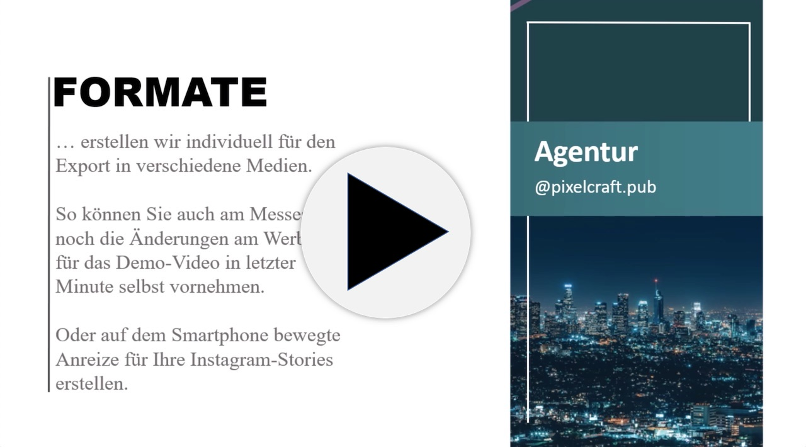

<nav class="nav--article"><!-- leave this alone -->

<!-- leave this alone -->
<h2><a href="#close" id="nav--close">Inhalts-Verzeichnis</a></h2><!-- leave this alone -->

- [Werkzeug-Sammlung][]
- &nbsp;
    - [Datei-Verwaltung][] (Cloud-Speicher & Synchronisation)
    - [Aufgaben-Verwaltung][] (Projekt-Management)
    - [Wissens-Verwaltung][] (Dokumentation & Notizen)
    - [Zeit-Verwaltung][] (Zeit messen & gemeinsam anzeigen)
    - [Finanz-Verwaltung][] (Buchhaltung mit dem Steuerbüro teilen)
    - [Infrastruktur-Verwaltung][] (Internet-Probleme beheben)
    - [Daten-Souveränität][] (Verschlüsselung & Passwörter)
- &nbsp;
    - [Versions-Kontrolle][] (Änderungen transparent nachvollziehen)
    - [Parallel-Arbeit an Text][] (live editieren, kommentieren)
    - [Parallel-Arbeit mit Visualisierungen][] (Whiteboards & Post-Its)
- &nbsp;
    - [Austausch in Text-Nachrichten][] (Chat & Messenger-Dienste)
    - [Austausch in Video-Konferenzen][] (Video-Telefonate & Webinare)
    - [Fern-Zugriff][] (Fernsteuerung von Computern)
- &nbsp;
    - [Publikums-Interaktion][] (Umfragen & Information für Konferenzen)
    - [Video-Produktions-Hilfen][] (für Aufzeichnungen & live-Webinare)
- &nbsp;
    - [Prokrastinations-Bekämpfung][] (Ablenkung beschränken)
- &nbsp;
    - [Virtuelle Realität][] (Simulierte Begegnungs-Räume)

- [◀ zurück zum Leitfaden](/)

<!-- leave this alone -->
<h2><a href="#open">Inhalts-Verzeichnis</a></h2><!-- leave this alone -->
</nav><!-- leave this alone -->

# Werkzeug-Sammlung

*Eine Auswahl der populärsten Dienste für vernetztes Arbeiten.*  
*★ markiert Dienste, die wir aktuell selbst nutzen.*

## Datei-Verwaltung

*Irgendwie müssen Sie Ergebnisse und Zwischen-Ergebnisse Ihrer Arbeit teilen: Die digitalen Artefakte liegen alle als Dateien vor. Eine eigene Plattform zum Austausch ist in jedem Fall komfortabler als hin-und-her-schicken.*

##### [Box](https://www.box.com/de-de/for-enterprise) [Box]
bietet  per App oder Browser Cloud-Content-Management und Schnittstellen der Zusammenarbeit mit anderen Plattformen und Diensten für Ihre Dateien. Kein Gratisangebot.

##### [Basecamp](https://basecamp.com) [basecamp--datei-verwaltung]
ist eine integrierte Lösung zu Projekt-Management, Dateiverwaltung und interner Kommunikation. Lohnt sich anzuschauen. [Siehe Eintrag unter *Aufgaben-Verwaltung*][Basecamp--aufgaben-verwaltung]{>>jakob: hier ein Beispiel für einen Querverweis<<}

##### [CryptPad](https://cryptpad.fr) [CryptPad]
ist eine Open-Source-Lösung für voll-verschlüsselte Zusammenarbeit an Dateiaustausch, Office-Anwendungen und Aufgabenverwaltung. Gratis mit 50MB Speicherplatz.

##### [Circuit](https://www.circuit.com/) [Circuit]
ist ein virtuelles Büro, wo um Gespräche herum über eine zentral geteilte Oberfläche Informationen (Chats, Video-Konferenz und Dateien) ausgetauscht werden. Keine kostenlose Variante. Browser-zentriert, mit Apps für mobile Geräte.

##### [Dropbox](https://www.dropbox.com/de/basic) [Dropbox]
ist der Platzhirsch der Cloud-Speicher und hat immer noch 2GB Speicherplatz gratis zum Einstieg. Dazu gehört mit [Dropbox Paper](https://www.dropbox.com/de/paper) eine übersichtliche Oberfläche zur gemeinsamen Arbeit an Text-Dokumenten. Entwickelt sich mit Lösungen zum Austausch und Arbeiten an Dateien zur Schnittstelle zwischen verschiedenen Ökosystemen. Die Business-Variante erlaubt Verwaltung von Zugriffsrechten.

##### [Google G-Suite](https://cloud.google.com/blog/products/g-suite/helping-businesses-and-schools-stay-connected-in-response-to-coronavirus) [Google G-Suite]
bietet Datei-Austausch und Zusammenarbeit an den Dateien in der Cloud. Premium-Features sind in der Gratisversion bis Juli 2020 verfügbar: Meetings mit bis zu 250 Personen abhalten und in Google Drive abspeichern, Videos live streamen.

##### [Microsoft Teams](https://products.office.com/de-de/microsoft-teams/free) (★) [Microsoft Teams]
ist als Integrations-Plattform für Office-Anwendungen mit Kommunikation für ein halbes Jahr kostenlos. OneDrive, SharePoint und die daran gekoppelte Dateiverwaltung von Office-Paketen bekommen hier eine neue Oberfläche.

## Aufgaben-Verwaltung

*Wer soll eigentlich was genau noch mal erledigen? Es gibt Werkzeuge, die sich darauf spezialisieren, eine hilfreiche Struktur in Aufgaben und die Absprache darum zu bringen. Welche __Ihre__ Struktur ist, müssen Sie selbst heraus finden.*

##### [Airtable](https://airtable.com) [Airtable]
Wer von Tabellen-Kalkulation zur Planung und Verwaltung einfach nicht genug bekommen kann und gleich eine ganze Datenbank darauf aufsetzen will: die Basisfunktion ist gratis. Erweiterte Möglichkeiten zur Zusammenarbeit nur in der bezahlten Version.

##### [Asana](https://asana.com/de) [Asana]
ist eine „Arbeitsmanagement-Plattform“. Allein das Wort schon. Für kleinere Teams gratis, vermutlich aber auch zu viel.

##### [Basecamp](https://basecamp.com) [Basecamp--Aufgaben-Verwaltung]
ist eine integrierte Lösung zu Projektmanagement, Dateiverwaltung und interner Kommunikation. Für kleinere Teams eine Möglichkeit, die Bedürfnisse der Fernarbeit auf einen Schlag zu verwirklichen mit vielen Anleitungen zur Umstellung - leider nur auf Englisch. Kostenlos in sehr reduzierter Funktion.

##### [ClickUp](https://clickup.com) [ClickUp]
vereint in einer App Aufgabenverwaltung und Kommunikation in Teams mit Fokus auf Planung und Integration mit verschiedenen anderen Apps. Die Integrationen sind erst in der bezahlten Version verfügbar.

##### [Jira](https://www.atlassian.com/de/software/jira) [Jira]
ist Projektmanagement mit Fokus auf Agilität. Mit großem A, da bleibt agiles Arbeiten manchmal auf der Strecke. Bei der Mutterfirma Atlassian sind seit März 2020 die Werkzeuge für kleine Teams bis 10 Personen gratis.

##### [TeamSuccess](https://teamsuccess.io/) [TeamSuccess]
ist eine kostenlose und simple Plattform, auf der Mitglieder eines Teams die Ziele ihrer Woche hinterlegen können und  ihren Fortschritt für alle sichtbar machen.

##### [Todoist Business](https://todoist.com/business) [Todoist Business]
GTD für Teams. Wenn Sie wissen, was GTD ist, kennen Sie Todoist wahrscheinlich längst. Getting Things Done ist ein Prinzip der Aufgabenverwaltung in Themen-Ordnern und Kontexten. Probemonat kostenlos.

##### [Trello](https://trello.com/de) (★) [Trello]
lässt Ihnen alle Freiheiten, Listen in Listen anzulegen. Basiert auf dem Kanban-Prinzip zur Strukturierung von Arbeit. Sehr schlank zum Start. Gratis in der Grundfunktion, Schnittstellen kosten extra.

##### [Smartsheet](https://www.smartsheet.com) [Smartsheet]
wenn Zusammenarbeit eigentlich immer Tabellenkalkulation ist.

## Wissens-Verwaltung

*Absprachen, Regeln, Anleitungen für Ihre Werkzeuge, Notizen: all das Wissen Ihres Unternehmens sollte nicht bloß in den Köpfen der Belegschaft versteckt sein.*

##### [Confluence](https://www.atlassian.com/de/software/confluence) [Confluence]
Zusammenarbeit an Dokumenten und Wissen in einer zentralen Datenbank. Bei der Mutterfirma Atlassian sind seit März 2020 die Werkzeuge für kleine Teams bis 10 Personen gratis.

##### [GetGuru](https://www.getguru.com) [GetGuru]
saugt über Schnittstellen  Informationsbausteine aus diversen Werkzeugen ab und bündelt sie in einer Oberfläche als Wissensdatenbank. Gratis für weniger als 10 Nutzende, wird teurer bei größeren Teams.

##### [Office365 OneNote](https://products.office.com/de-de/home) (★) [Office365 OneNote]
hat mit **OneNote** ein geteiltes Notizbuch an Bord. Kostet Geld, ist weit verbreitet. Leider hakt die Synchronisation aktuell (nach unserer Erfahrung), weil die Server unter der Last der vielen neuen Heim-Arbeitenden ächzen. Für gemeinsame gleichzeitige Arbeit weichen wir derzeit auf andere Werkzeuge aus.

##### [Notion](https://www.notion.so) [Notion]
ist ein Text-zentriertes Schweizer Taschenmesser unter den Kollaborations-Werkzeugen. Dokumentation, Notizen, Wiki, Aufgabenverwaltung, Kalender: Für Leute, die wissen was *Markdown* ist und sich eine minimalistische Oberfläche für diverse Online-Werkzeuge in nur einer App wünschen.

### Zeit-Verwaltung

*Wenn Sie Ihren Arbeits-Rhythmus mit anderen synchronisieren wollen, können gemeinsame Zeit-Anzeigen und Zeit-Erfassung helfen. Manchmal ist Zeit-Erfassung auch für die Abrechnung notwendig.*

##### [Clockify](https://clockify.me/) [Clockify]
ist ein simples Zeiterfassungs-Werkzeug, das komplett kostenlos ist. Es ist zeitlich unbegrenzt für Teams jeder Größe einsetzbar.

##### [cuckoo.team](https://cuckoo.team/) (★) [cuckoo.team]
ist ein kostenloser, browser-basierter Timer, der mit anderen über die URL teilbar die Zeit-Intervalle synchron steuert und zeigt. Pomodoro-Methode.

##### [Harvest](https://www.getharvest.com/)
ist ein Zeiterfassungs-Werkzeug, das die Arbeitszeit von Selbständigen oder Teams erfasst. Neben einer Analyse der Arbeitszeit lässt sich die Erfassung auch mit Rechnungen verknüpfen und so eine genaue Kostenaufstellung bewerkstelligen. Die ersten 30 Tage steht Harvest kostenlos zur Verfügung.

##### [Slice](https://slice.wbrain.me) [Slice]
minimalistische Web-App für einen Timer und geteilte Notizen in Online-Meetings. Die Notizen können anhand von Canvas-Vorlagen gruppiert und zugeordnet werden.

##### [Toggl](https://toggl.com/) [Toggl]
ist ein Zeiterfassungs-Werkzeug, das plattform-übergreifend per App oder Browser einsetzbar ist. Dabei bietet es verschiedene Formen der Zeiterfassung, die den Nutzenden hilft, den Arbeitsalltag zu strukturieren und dem Team einen Austausch über die Produktivität des Arbeitstages bietet. Der Einstiegs-Plan mit einfacher Zeiterfassung für Teams von bis zu 5 Mitgliedern ist kostenlos. Für 30 Tage besteht zudem eine kostenfreie Nutzung des Bezahl-Plans. 

## Finanz-Verwaltung

*Buchhaltung und Verwaltung von Belegen für Reisekosten und Rechnungen lassen sich auch per App dezentral verwalten. Damit mehrere Menschen Belege einpflegen können oder das Steuerbüro bei der Verwaltung direkt eingebunden ist.*

##### [LexOffice](https://lexoffice.de) (★) [LexOffice]
Buchhaltung und Lohnrechnung online erledigen, Steuerbüro und Bankkonto anschließen. Nutzen wir, hassen den Datei-Upload.
<label for="aside--github-notiz" class="aside-toggle" role="button" aria-pressed="false" aria-label="Randbemerkung anzeigen" onkeypress="toggleButtonKeyPress()" onclick="toggleButtonClick()" tabindex="0">⨭ …</label>

<input type="checkbox" id="aside--github-notiz" class="aside-toggle"/>

**Notiz:** *Im Ausland hatten wir mit einigen anderen Apps zur Finanz-Verwaltung gearbeitet, können aber gerade nicht prüfen, welche davon in Deutschland unter welchen Bedingungen verfügbar sind. Wir kümmern uns später darum.*

## Infrastruktur-Verwaltung

*Bei den ganzen Online-Werkzeugen ist der eigene Netz-Zugang ein kritischer Punkt. Diese Werkzeuge helfen bei der Suche nach Fehlerquellen.*

##### [Fast.com](https://fast.com/de/) [Fast.com]
Netflix bietet online eine schnelle und simple Möglichkeit, die zur Verfügung stehende Bandbreite zu prüfen. Mit einem Klick und übersichtlicher Ansicht kommt in Sekunden  die Information über die lokale Download-Geschwindigkeit.

##### [Wieistmeineip.de](https://www.wieistmeineip.de/)
ein Klassiker für deutsche Netz-Nutzende: bietet einen detaillierten Überblick über die lokale Download-, Upload- und Ping-Geschwindigkeit und natürlich die Information über die eigene IP-Adresse. Ist der lokale Internetanschluss für eine Video-Konferenz ausreichend, hängt die Synchronisation von Daten durch mangelnde Netz-Geschwindigkeit hinterher? Hier finden sich Antworten.

##### [downforerveryoneorjustme](https://downforeveryoneorjustme.com) [downforerveryoneorjustme]
hier lässt sich eine Anfrage starten, ob die Webseite nur lokal bei Ihnen nicht erreichbar ist, oder ob ein generelles Problem besteht und sie aktuell gar nicht erreichbar ist.

## Daten-Souveränität

*Spätestens bei sensiblen Daten ist Verschlüsselung angeraten. Besonders, wenn die Dateien dazu in der Cloud geteilt werden. Dazu brauchen Sie noch eine Zugriffs-Verwaltung für die ganzen Zugangs-Daten gemeinsam genutzter Web-Apps.*

##### [1Password](https://blog.1password.com/covid-19-response/) [1Password]
ist ein MacOS und iOS Passwort-Manager für Gruppen und derzeit für Unternehmen ein halbes Jahr kostenlos.

##### [7zip](https://www.7-zip.de/) (★) [7zip]
ist ein freies Datei-Komprimierungs-Programm, mit dem Dateiarchive verschiedener Formate gepackt, entpackt und verschlüsselt werden können.

##### [boxcryptor](https://www.boxcryptor.com/de/) [boxcryptor]
Ende-zu-Ende Verschlüsselung von Dateien in Cloud-Speichern wie Dropbox, OneDrive und Co. Gratis für private Nutzung (ein Cloud-Dienst). Eine nutzungsfreundliche Lösung aus Deutschland mit Apps auch für mobile Verwaltung und Zugriff.

##### [Dashlane](https://www.dashlane.com/de) [Dashlane]
ist ein plattformübergreifender Passwortmanager. In der Freien Version lassen sich bis zu 50 Passwörter sicher verwalten. Darüber hinaus sind mehr Admin-Optionen für Unternehmen, Zugriffsrechte und Regeln feinkörnig vorzugeben.

##### [GPG](https://www.openpgp.org) (★)  [GPG]
E-Mail-Verschlüsselung und digitale Fingerabdruck-Signatur, auch für einzelne Textdateien nutzbar. Open-Source-Standard prinzipiell kostenlos - nutzungsfreundliche Oberflächen z.B. für MacOS kosten allerdings Geld.

##### [KeePassXC](https://keepass.info/index.html)(★) [KeePassXC]
ist freie, quelloffene Software basierend auf [KeePass](https://keepass.info/index.html) für alle Betriebssysteme, auch ohne Installation nutzbar (auf USB-Stick selbstgenügsam).

## Versions-Kontrolle

*Versionskontrolle (in Git) ist eine Wunderwaffe zur gemeinsamen Verwaltung von Information. Leider bringt das Prinzip eine Umgewöhnung vom Prinzip "automatischer Synchronisation" und ist außerhalb von Code-Produktion wenig verbreitet. Einige Werkzeuge senken mit schicken Oberflächen die Hemmschwelle und machen Versions-Kontrolle über eine zentrale Plattform noch mächtiger und zugänglicher für gemeinsame Arbeit.*
<label for="aside--versions-kontrolle" class="aside-toggle" role="button" aria-pressed="false" aria-label="Randbemerkung anzeigen" onkeypress="toggleButtonKeyPress()" onclick="toggleButtonClick()" tabindex="0">⨭ …</label>

<input type="checkbox" id="aside--versionskontrolle" class="aside-toggle"/>

**Erläuterung**: Ein *Repository* ist ein verwaltetes Verzeichnis zur Speicherung und Beschreibung von digitalen Objekten. Das System *Git* legt für ein damit verwaltetes Verzeichnis eine Protokoll-Instanz an, die Veränderungen beobachtet und automatisch zum Vergleich mit anderen Versionen diese Änderungen dokumentiert.

##### [GitHub](https://github.com/) (★) [github--versions-kontrolle]
ist ein web-basierter Dienst zur Versions-Verwaltung; im Prozess der kollaborativen Software-Entwicklung aber auch in gemeinsam bearbeiteten Dokumenten einsetzbar. In der Web-Oberfläche können Sie Zugriffsrechte verwalten, Aufgaben mit den Inhalten verknüpfen und erweiterte Funktionen für Automatisierung einstellen.
<label for="aside--github-notiz" class="aside-toggle" role="button" aria-pressed="false" aria-label="Randbemerkung anzeigen" onkeypress="toggleButtonKeyPress()" onclick="toggleButtonClick()" tabindex="0">⨭ …</label>

<input type="checkbox" id="aside--github-notiz" class="aside-toggle"/>

**Notiz**: *Wir bilden (unter anderem) unsere Wissensdatenbank in verlinkten Text-Dokumenten ab und können über die Historie des* Repositories *unseren Lernprozess nachvollziehen. Daran knüpft sich hilfreicher Austausch, zum Beispiel eine Konferenz, wo wir feiern, was wir in dieser Woche gelernt haben. Auch dieser Leitfaden ist dort öffentlich einsehbar: <https://github.com/pxi-gmbh/fernarbeit>*

##### [Bitbucket](https://bitbucket.org/product/) [Bitbucket]
ist ein Git Code-Managementsystem zur gemeinsamen Bearbeitung von Code mit integrierter Funktion für Inline-Kommentare.

##### [GitLab](https://about.gitlab.com/) [GitLab]
ist eine Webanwendung zur Versionsverwaltung von kollaborativen Softwareprojekten auf Basis von Git.

##### [SourceTree](https://www.sourcetreeapp.com/) [SourceTree]
ist ein kostenloser Git Client für Windows und MacOS, der *Repositories* zur vereinfachten Interaktion optisch darstellt.

## Parallel-Arbeit an Text

*Manchmal möchten Sie mit anderen gleichzeitig an einem Dokument arbeiten, um schneller zu einem gemeinsamen Verständnis zu kommen oder einfach schneller Inhalt zu produzieren. Einige Werkzeuge synchronisieren live. Für asynchrone Arbeit, wenn es nicht gleichzeitig sein muss, empfiehlt sich die Arbeit mit [Versions-Kontrolle][]*

##### [Etherpad](https://etherpad.org) [Etherpad]
ist ein Werkzeug zur ad-hoc Text-Kollaboration. Einfach eine der angebotenen Instanzen im Browser starten. Autorschaft wird farblich markiert, mit einer Zeitleiste können Änderungen vor- und zurück-gespult werden. Datensparsames Open-Source-Projekt mit vielen Erweiterungen und Geschmacksrichtungen. Eventuell kurzfristig die [Corona-Edition](https://video.etherpad.com) mit integriertem Video-Chat nutzen.

##### [Google Docs](https://www.google.com/docs/about/) [Google Docs]
ist vermutlich das bekannteste Werkzeug, mit mehreren Leuten online gleichzeitig zu schreiben. Ist Teil der [Google G Suite][] und es gibt verschiedene Oberflächen zur Arbeit an Dokumenten, Folien und Tabellenkalkulation. Das Format ist außerdem weitgehend kompatibel mit [Office365][].

##### [Office365](https://products.office.com/de-de/home) (★) [Office365]
mit **Word**, **PowerPoint** und **Excel** lassen sich geteilte Dokumente live gemeinsam bearbeiten. Kostet Geld, ist weit verbreitet. Leider hakt die Synchronisation aktuell (nach unserer Erfahrung), vermutlich weil die Server unter der Last der vielen neuen Heim-Arbeitenden ächzen. Für gemeinsame *gleichzeitige* Arbeit weichen wir derzeit auf andere Werkzeuge aus.
<label for="aside--office365-word" class="aside-toggle" role="button" aria-pressed="false" aria-label="Randbemerkung anzeigen" onkeypress="toggleButtonKeyPress()" onclick="toggleButtonClick()" tabindex="0">⨭ …</label>

<input type="checkbox" id="aside--office365-word" class="aside-toggle"/>

**Notiz**: *Office ist prima geeignet, um* Artefakte *zu produzieren: Wir basteln damit zum Beispiel PowerPoint, das nicht aussieht, wie PowerPoint. Das lässt sich dann hervorragend in virtuellen Seminaren und Workshops verwenden.*
Video laden (2Min, 50MB)<video id="video-001" style="display:none;" autoplay loop muted class="drop-shadow" alt="Animationssequenzen in PowerPoint"><source src="" type="video/mp4">Entschuldigung, Ihr Browser unterstützt das Video-Format nicht.</video><noscript><a href="ppt-demo.mp4">zum Video (ohne JavaScript)</a></noscript>

## Parallel-Arbeit mit Visualisierungen

*Gerade bei verteilter Arbeit ist es besonders wichtig, allen schnell das gemeinsam Gemeinte zu vermitteln. Design-Teams arbeiten deswegen schon lange mit Whiteboards, wo Klebezettel und Skizzen die Verständigung vereinfachen. Visualisierungen sind Denk-Werkzeuge für gemeinsames Arbeiten. Auch dafür gibt es eine große Auswahl an Apps und Online-Werkzeugen, die live synchronisieren und die gemeinsame Denk-Arbeit abbilden.*

##### [AWW](https://awwapp.com/) [AWW]
ist ein touch-freundliches browser-basiertes Whiteboard mit kostenloser Basisversion. Von der Anmutung eher für Schulen konzipiert.

##### [Boldaretro Sprint Retrospective Tool](https://www.boldare.com/sprint-retrospective-tool/) [Boldaretro Sprint Retrospective Tool]
ist eine kostenlose online App, mit der gemeinsam *Scrums*, *Brainstorming* und Entscheidungen gelingen. Die Funktionalität umfasst geheime Abstimmungen über Ideen, Ordnung der auf Karten hinterlegten Ideen und Teilen der Ergebnisse im Team.
<label for="aside--scrum-sprint" class="aside-toggle" role="button" aria-pressed="false" aria-label="Randbemerkung anzeigen" onkeypress="toggleButtonKeyPress()" onclick="toggleButtonClick()" tabindex="0">⨭ …</label>

<input type="checkbox" id="aside--scrum-sprint" class="aside-toggle"/>

**Erläuterung**: *Die Schlagwort-Schlacht ist einen eigenen Artikel wert. Wir kümmern uns darum.* Es gibt standardisierte Prozesse oder Methoden für gemeinsames Arbeiten. Ein populäres Methoden-System ist *Agile*, was voll von englischen Fachbegriffen ist. Die Prinzipien dahinter sind weitgehend wirklich hilfreich für vernetztes Arbeiten, dementsprechend greifen einige Werkzeuge die Bezeichnungen und Methoden auf.

##### [Cardsmith](https://cardsmith.co/) [Cardsmith]
ist inspiriert von der Arbeit mit Klebezetteln auf Whiteboards. Es bietet online auf diese Weise gemeinsames Brainstorming oder Erarbeiten von Themen in Echtzeit und die optische Weiterverabeitung und Ordnung der einzelnen Zettel. Das ganze gelingt im Team oder mit Kunden und ist in der Basisform kostenlos. Weitere kostenpflichtige Feature, wie der Datei-Export der erarbeiteten Boards, ist 30 Tage lang kostenlos zu testen.

##### [Concept Board](https://conceptboard.com) (★) [Concept Board]
ist ein Multimedia-Whiteboard mit Schemata und Vorlagen zur Strukturierung der Inhalte. Server und Programmierung aus Deutschland, gut strukturierte Oberfläche für eigene Anpassungen. Die Gratisversion erlaubt nur Lesezugriff für Gäste, nur 50 Objekte pro Board.
<label for="aside--concept-board" class="aside-toggle" role="button" aria-pressed="false" aria-label="Randbemerkung anzeigen" onkeypress="toggleButtonKeyPress()" onclick="toggleButtonClick()" tabindex="0">⨭ …</label>

<input type="checkbox" id="aside--concept-board" class="aside-toggle"/>

**Notiz**: *Die gute Struktur der Oberfläche erstreckt sich bis auf den HTML-Code der Oberfläche. Das macht die App zu einem für uns idealen Werkzeug, live Skizzen und Video-Konferenz für virtuelle Seminare miteinander zu verknüpfen. [Siehe Eintrag zu Video-Produktions-Hilfen]*

##### [excalidraw](https://excalidraw.com/) (★) [excalidraw]
ist ein minimalistisches Whiteboard im Browser. Handgemalte Anmutung (wie Balsamiq) und Formen-Bibliothek für Wireframing oder Skizzen, für Maus-Steuerung optimiert. Open-Source, nutzbar ohne Anmeldung, WebRTC, Ende-zu-Ende verschlüsselt.

##### [Freehand von Invision](https://freehand.invisionapp.com/freehand/) [Freehand von Invision]
bietet einen endlose Leinwand auf der Teams gemeinsam in Echtzeit Designs und Ideen visualisieren können. Browser-Basiert lassen sich die Ergebnisse einfach mit Sketch oder Photoshop synchronisieren.

##### [Hoylu](https://www.hoylu.com/) [Hoylu]
dient als digitaler Raum für standort-übergreifende, interaktive Zusammenarbeit für strukturiertere Online-Meetings. Geboten werden vier Boards gratis in der Einstiegs-Version. Als App lässt es sich mittlerweile in die Dienste von [Microsoft Teams][] integrieren.

##### [Metro Retro](https://metroretro.io/) [Metro Retro]
ist ein kostenloses, auf Notiz-Zettel und Klebchen optimiertes Whiteboard, strukturiert anhand von Kolumnen oder Canvas-Vorlagen (können auch selbst erstellt werden), spezialisiert auf Retrospektiven. Klebezettel können geheim und sichtbar geschaltet werden, für den Wechsel von paralleler zu gemeinsamer Denkarbeit. Es ist browser-basiert und optimiert für Desktop-Browser. Auf mobilen Geräten können nur existierende Whiteboards bespielt werden.

##### [Miro](https://miro.com) [Miro]
ist ein Online-Whiteboard (und App) mit Schnittstellen zu diversen anderen Apps für Projektmanagement und Kommunikation. Gratis für drei Boards und eingeschränkter Funktion.  Virtuelle Klebezettel und Vorlagen bis zum Abwinken. Intuitive Menüführung. Anonyme Abstimmung. Mit Video-Integration von der Anmutung her wie ein virtueller Raum für Workshops. Zur produktiven Zusammenarbeit erst in der Bezahlversion zu gebrauchen.

##### [Mural](https://mural.co) [Mural]
bietet digitale Whiteboards und Canvas-Vorlagen zur Kollaboration für agile Sprints und Co-Design. Anmutung eher wie zentral gesteuerte, abstrakte Planung und Facilitation parallel zu anderer Kommunikation. Kontrolle über Position der Teilnehmenden auf dem Whiteboard möglich. 30 Tage Testen gratis.

##### [Microsoft Whiteboard](https://whiteboard.microsoft.com) (★) [Microsoft Whiteboard]
gibt es als App aus dem Microsoft-[Office356][]-Universum. Klebezettel, Bilder, Skizzen, Zoomen; die Leinwand ist allerdings nicht unendlich groß. Funktioniert im Browser mit leicht eingeschränkter Funktion, dort lassen sich auch Boards mit Personen ohne Microsoft-Account teilen. Alledings nicht in allen Browsern(!). Zum gemeinsamen Zeichnen auf dem Tablet für Office-Kundschaft guter Einstieg.

##### [padlet](https://padlet.com) [padlet]
bietet die Möglichkeit, in Teams besonders intuitiv Boards, Dokumente und Websites zu erstellen. Dies gelingt mit allen Endgeräten, unterstützt viele Dateitypen und ist in 29 Sprachen verfügbar.

##### [WhiteboardFox](https://whiteboardfox.com) [WhiteboardFox]
ist ein simples Whiteboard im Browser, gestattet auch Bild-Upload und Gestensteuerung und Stift-Unterstützung auf Tablets. (Noch?) Kostenlos.

##### [Witeboard](https://witeboard.com/)
Whiteboard im Browser, ohne Anmeldung nutzbar, für schnelle Skizzen URL teilbar. Interessant vielleicht als Erweiterung (Plug-In) für [Slack][].

## Austausch in Text-Nachrichten

*Chats waren als Alternative zur E-Mail ein Hoffnungsträger für den flexiblen Austausch von Information in vernetzten Teams. Text-Nachrichten lassen sich noch flexibler und präziser anhand von Themen oder Gruppen sortieren und durchsuchbar machen. Allerdings werden Chats auch schnell zu Datensilos, wo Information vergraben liegt. Außerdem ist der permanente Strom von Text-Nachrichten ein möglicher Störfaktor für konzentriertes Arbeiten.*

##### [Discord](https://discordapp.com) [Discord]
bietet kostenfrei eine Plattform für Chats und Voice-Chat und funktioniert auch ohne App-Installation im Browser. Strukturiert in thematischen Servern richtet sich das Angebot ursprünglich an die Gemeinde für Online-Computerspiele, wo sich auch künftige Bezahlmodelle für Premium-Funktionen anknüpfen. Die Kernfunktion ist gratis und mittlerweile auch außerhalb der Spiele-Szene verbreitet.

##### [rocket.chat](https://rocket.chat) [rocket-chat]
ist eine Open-Source-Lösung für Chats mit Archivierung der enthaltenen Information: Selbst hosten ist gratis, fertig eingerichtete Installationen als Service kosten Geld.

##### [Lark](https://www.larksuite.com) [Lark]
Wer Text-Nachrichten, Video-Konferenz, Arbeit an Texten und Terminplanung in eine App bündeln will, kann sich das ansehen. Vergleichbar mit [Basecamp][] und [Microsoft Teams][]. Derzeit Gratis. Vielleicht mal fragen, was denn genau Geld kosten soll.

##### [Slack](https://slack.com/intl/de-de/) [Slack]
hat Chats als zentrale Kommunikations-Plattform für Zusammenarbeit etabliert. Drängt Nutzende in Richtung permanenter synchroner Kommunikation. Mit Themenstruktur und Suchfunktionen, Information aus Unterhaltungen zu strukturieren und zu finden. Kostenlos mit eingeschränkten Funktionen, so lange die Information nicht langfristig verfügbar bleiben muss.

##### [Microsoft Teams](https://products.office.com/de-de/microsoft-teams/free) (★) [microsoft-teams--chat]
ist als Integrations-Plattform für Office-Anwendungen mit Kommunikation für ein halbes Jahr kostenlos. Grundprinzip der Kommunikations-Funktion ist die Verknüpfung von Gesprächen mit geteilten Dateien. [Siehe Eintrag unter *Datei-Verwaltung*][Microsoft Teams].

##### [Twist](https://twist.com/?lang=de) [Twist]
ist auch ein Chat, aber für nicht-synchrone Kommunikation optimiert. Geld kostet es, sobald die gesendeten Nachrichten und Texte länger als einen Monat verfügbar bleiben sollen.

## Austausch in Video-Konferenzen

*Für gleichzeitige, synchrone Kommunikation ist die Video-Konferenz der Standard für vernetzt verteilte Arbeit. Über Bild und Ton zusammen werden mehr Informationen vermittelt, als nur am Telefon. Außerdem lassen sich in das Video-Bild auch externe Werkzeuge einbinden. Häufig über die Apps selbst, für mehr Kontrolle empfehlen wir einen Blick in die [Video-Produktions-Hilfen][]*

##### [Adobe Connect](https://www.adobe.com/products/adobeconnect.html) [Adobe Connect]
bietet neben Video-Konferenzen auch Funktionalität für Webinare und E-Learning. Verbreitet im universitären Bildungs-Bereich. Für 90 Tage steht ein freier Zugang der Angebote zur Verfügung.

##### [BigBlueButton](https://bigbluebutton.org/) [BigBlueButton]
ist ein Open-Source-System zur Umsetzung von Webinaren mit Fokus auf Online-Learning und Bildungsinstitutionen. Bietet viele Schnittstellen zu Lern-Plattormen. Quelloffene Software: Selbst einrichten, konfigurieren, mit Modulen den eigenen Bedürfnissen anpassen. Oder machen lassen.

##### [BlueJeans](https://www.bluejeans.com/) [BlueJeans]
bietet browser-basierte Video-Konferenzen über WebRTC aber auch App-Nutzung. Ein schneller, unkomplizierter Zugang zu Video-Konferenzen liegt hier im Fokus. Je nach Abonnement lässt es sich in weitere Konferenzsysteme wie Teams oder Slack einbetten. Der Einstiegsplan richtet sich an Einzelpersonen und kleinere Teams mit einer Funktionalität für bis zu 50 Personen.
<label for="aside--WebRTC-notiz" class="aside-toggle" role="button" aria-pressed="false" aria-label="Randbemerkung anzeigen" onkeypress="toggleButtonKeyPress()" onclick="toggleButtonClick()" tabindex="0">⨭ …</label>

<input type="checkbox" id="aside--WebRTC-notiz" class="aside-toggle"/>

**Erläuterung**: Über das Protokoll *WebRTC* können direkte Verbindungen von Browser zu Browser erstellt werden. Die ausgetauschten Daten berühren also keinen Server. Gut für Daten-Souveränität. Leider problematisch für größere Datenmengen: Alle Teilnehmenden müssen alle Signale gleichzeitig verarbeiten. Das zwingt schwache Verbindungen und Prozessoren bei mehr als 5 Video-Streams schnell in die Knie.

##### [ClickMeeting](https://clickmeeting.com/) [ClickMeeting]
ist eine browser-basierte Webinar-Lösung mit Buchungs-Verwaltung. Nur 7 Tage Gratis-Test.

##### [Google Hangouts Meet](https://gsuite.google.com/products/meet/) [Google Hangouts Meet]
bietet als Teil von Googles Office-Produkt G-Suite Viedeo-Konferenzen und Instant-Messaging am Computer und Mobilgeräten an. So lässt sich mit bis zu 250 Personen gleichzeitig kommunizieren und dank einer Einwahlnummer für jede Konferenz können auch Personen ohne Internet-Verbindung direkt an den Besprechungen teilnehmen. Auch sonst lassen sich Gäste ohne G-Suite in die Besprechungen einladen. Als Reaktion auf Covid-19 stehen bis zum 1. Juli 2020 Funktionen aus G-Suite Enterprise auch Nutzenden von G Suite und G Suite Education kostenlos zur Verfügung.

##### [GoToMeeting](https://www.gotomeeting.com/de-de/work-remote) [GoToMeeting]
war früher als Quasi-Standard der Video-Konferenz in großen Unternehmen recht verbreitet. Zusammen mit der Fern-Wartungs-Software LogMeIn als Paket derzeit für drei Monate kostenlos.

##### [jitsi](https://meet.jit.si) [jitsi]
ist permanent kostenlos. Eine Open-Source-Lösung zu Video-Konferenzen, wo Sie sich selbst um Einrichtung und Hosting kümmern müssen. Dafür dankbar für Datenschutz-Bedenken. Wenn Sie sich auch darum kümmern.

##### [Rainbow](https://www.al-enterprise.com/de-de/geschaeftskontinuitaet) [Rainbow]
verbindet Anruf-Weiterleitung und Fernzugriff mit Video-Konferenz, 3 Monate kostenlos testen

##### [Skype](https://www.skype.com/de/) (★) [Skype]
bietet kostenlose Videotelefonie für bis zu 5 Personen und ist Geheimtipp für Geschäftsanrufe ins Ausland: Stabilere Verbindung als manche VoIP-Telefonate. Nutzt andere Server als Skype for Business (und die Nachfolge MS Teams). Daumen drücken, dass es noch lange hält.

##### [talque](https://talque.com/) [talque]
integriert [jitsi][] mit aufgeräumter Oberfläche in eine Konferenz-Management-App (Web und Mobile) und kann dadurch sowohl Präsenzveranstaltungen als auch virtuelle Konferenzen abbilden. Die Einladung gelingt allerdings nur per E-Mail, dann kann ein Share-Link aus der laufenden Instanz auch anonym weiter gegeben werden.

##### [videofacilitator](https://www.videofacilitator.com/) [videofacilitator]
ermöglicht Video-Konferenzen mit Fokus auf deren Steuerbarkeit und guter Mobilität innerhalb verschiedener Braekoutrooms, also unterteilten Arbeitsräumen. Mit 30 Tagen freier Testnutzung.

##### [WebEx](https://gblogs.cisco.com/de/coronavirus-cisco-erweitert-kostenloses-webex-angebot/) [WebEx]
integriert Video-Konferenzen zu Meetings und Austausch. Kostenlos für Unternehmen mit Ciscos angeschlossenen Lösungen (die sind nicht kostenlos).

##### [Whereby](whereby.com) (★) [Whereby]
bietet Video-Konferenz ohne Anmeldung oder Konto, Fokus auf den Browser, mit individuell wählbaren URLs. Freundlich zur Datensparsamkeit. App gibt es auch. Gratisversion ist mit bis zu 4 Personen in einem virtuellen Konferenzraum nutzbar.

##### [Zoom](https://zoom.us) [Zoom]
macht nur Video-Konferenzen, die macht es aber ziemlich robust. Gute Funktionalität für größere Veranstaltungen durch Verwaltung von Bild und Ton der Teilnehmenden und integrierten Umfragen. Ist allerdings wegen Problemen mit Sicherheit und Datenschutz in seinen Apps bisweilen auffällig. Als Teilnehmende am besten im Browser verwenden, dann erledigen sich die meisten dieser Probleme.

## Fern-Zugriff

*Vielleicht müssen Sie von zu Hause auf einen leistungsfähigeren Rechner im Büro zugreifen, mit spezieller Software. Oder Sie wollen jemand anderem beim Einrichten von Software auf deren Rechner helfen.*

##### [AnyDesk](https://anydesk.com/de) [AnyDesk]
ist Fernzugriff aus Deutschland, gratis zu Testen in der privaten Nutzung. Bietet Bildschirmfreigabe und Fernsteuerung des Computers.

##### [Screens](https://edovia.com/en/screens-mac/) (★) [Screens]
Fernzugriff für MacOS und iOS - die ferngesteuerten Computer können auch Windows als Betriebssystem nutzen.

##### [TeamViewer](https://www.pcwelt.de/news/Teamviewer-jetzt-fuer-alle-gratis-wegen-Coronavirus-10771656.html) [TeamViewer]
ist Fernsteuerung für Rechner und erlaubt anscheinend momentan die Ausweitung des kostenlosen Ausprobierens für Privatanwendung auf berufliche Nutzung

## Publikums-Interaktion

*In virtuellen Seminaren und Konferenzen mit vielen Teilnehmenden können Sie trotzdem Ihr Publikum live einbeziehen. Mit Umfragen oder Werkzeugen zur Verwaltung von geteilter Information in Konferenzen.*

##### [crowdsignal](https://crowdsignal.com/) [crowdsignal]
bietet mittels Drag-And-Drop die Möglichkeit, Umfragen innerhalb von Minuten einzurichten und eigenen optischen Vorstellungen anzupassen.

##### [Erhebung](https://erhebung.de) [Erhebung]
ist ein kostenloses Tool für Online-Umfragen. Es funktioniert ohne Anmeldung, eine Umfrage wird online erstellt, per Link geteilt und ausgewertet.

##### [Lamapoll](https://www.lamapoll.de/) [Lamapoll]
ist BSI geprüft und damit 100% DSGVO-konform. Der Datenschutz liegt bei diesem Umfrage-Tool im Fokus. Eine kostenlose Version steht für bis zu 50 Teilnehmer bereit.

##### [limesurvey](https://www.limesurvey.org/de/) [limesurvey]
ist eine freie Open-Source-Software, mit welcher Online-Umfragen ohne Programmierkenntnisse gelingen, veröffentlicht und in einer Datenbank erfasst werden können. Eigene Hostmöglichkeiten und Datenschutztechnische Anpassungsmöglichkeiten machen dieses Werkzeug besonders interessant.

##### [LiveSlides](https://www.liveslides.com/) [LiveSlides]
ist ein Plugin für **PowerPoint** und **Keynote**, mit dem Webseiten als Browser-Ansicht in einer Präsentation angezeigt werden können - darüber können also z.B. Ergebnisse von parallel statt findenden Online-Umfragen zu einer Veranstaltung in der Präsentation live angezeigt werden. Aber auch YouTube-Videos oder Kalenderansichten sind darstellbar.

##### [Mentimeter](https://www.mentimeter.com/) [Mentimeter]
bietet Online-Live-Umfragen und Präsentationen für den Einsatz in verteilten Teams und Online-Schulungen.

##### [oncoo](https://oncoo.de/) [oncoo]
bietet eine kleine Auswahl von kollaborativen Schulübungen mit Lehr-Ansicht und Lern-Ansicht auf eine ad-hoc-generierte URL. Es ist browserbasiert, kostenlos und die anonyme Nutzung ist möglich. Die Bewertungsumfrage (visualisiert als Punkte auf Zielscheibe) ist eventuell nützlich, die Lehr-Ansicht kann über CSS eigenen Anpassungen unterworfen werden.

##### [poll everywhere](https://polleverywhere.com/) [poll everywhere]
ermöglicht in Meetings oder Online-Kursen interaktive Echtzeitumfragen. Kostenlos für eine Gruppengröße von bis zu 25 Teilnehmenden.

##### [strawpoll.me](https://www.strawpoll.me) [strawpoll.me]
ermöglich browser-basiert und kostenlos in kürzester Zeit über einen geteilten Link in Echtzeit Umfragen und Abstimmungen durchzuführen. Einfache Bedienung, funktioniert ohne Anmeldung.

##### [VOXR](https://voxr.org/de/) (★) [VOXR]
leistet Umfragen im Browser. Gute Frage-Prinzipien mit einem Vereinfachungs-Algorithmus, der die Eingaben in Interaktionen und Fragen zusammenfasst. Minimalistisches bis sperriges Design mit sehr beschränkten Anpassungs-Möglichkeiten, was die Nutzenden angezeigt bekommen. Gratis für bis zu 20 Teilnehmende.

##### [yourls](https://yourls.org/) (★) [yourls]
ist eine freie Open-Source-Lösung, um lange Links und URLs einzukürzen. Links aus diversen Web-Apps auf Untermenüs oder für Live-Sessions lassen sich unter einer Haupt-Domain sammeln und als leicht zu merkende, kurze URLs darstellen. Praktisch für den Verweis und die Einladung zu Web-Apps für gemeinsame Arbeit in Konferenzen.

## Video-Produktions-Hilfen

*Videos können Informationen kompakt vermitteln, wenn Zusammenhänge visuell leichter zugänglich sind. Sowohl für asynchrone Kommunikation (für späteres Anschauen) als auch für den live-Einsatz gibt es Werkzeuge, die dabei helfen, noch schneller noch mehr Information zusammen zu fassen.*

##### [Loom](https://www.loom.com/blog/coronavirus-response)
ist ein Werkzeug zum Teilen und Erläutern von Bildschirminhalten, einen Monat gratis und für ein paar Monate kostenreduziert

##### [OBS](https://obsproject.com) (★) [OBS]
ist freie, Open-Source-Software, um Webcam- und Bildschirminhalte eines PCs aufzuzeichnen oder für Live-Übertragungen im Internet zu gestalten. Mit virtuellem Kamera-Plugin oder geteiltem Vorschau-Fenster können Sie beim [Austausch in Video-Konferenzen][] externe Inhalte in das Video-Bild integrieren. Damit werden Workshops und Konferenzen gleich viel interaktiver, wenn parallele Informations-Kanäle in das Video eingebettet werden.

##### [XSplit VCam](https://xsplit.com) [XSplit VCam]
ist eine Software zur Entfernung und Bearbeitung des Hintergrundes einer Webcam-Aufzeichnung. Das ganze funktioniert ohne zusätzlichen grünen Hintergrund (Green-Screen) und aufwändige Licht-Installation und unterstützt viele Anwedungen und Programme wie Zoom, Microsoft Teams oder Hangouts. In der kostenlosen Nutzungs-Lizenz erscheint ein Wasserzeichen auf dem Kamerafeed.

##### [Spot on the Mouse](http://www.markuswelz.de/software/features_de.html) [Spot on the Mouse]
hebt den Maus-Zeiger beim Teilen von Bildschirm-Inhalten hervor und macht Aktionen wie Klicken und Mausrad-Drehungen aber auch Tastatureingaben sichtbar. Die kostenpflichtige Software eignet sich in geteilten Bildschirmpräsentationen und Software-Schulungen um die Aufmerksamkeit auf die Maus und deren Umgebung zu lenken und Aktionen von Maus und Tastatur nachvollziehbar zu machen. Für Mac und Windows verfügbar.

##### [Mouseposé](https://boinx.com/mousepose/) [Mouspose]
visualisiert Mauszeiger-Aktionen und Tastatureingaben auf macOS. Bei Aktivierung wird der Bildschirm abgedunkelt und ein Spotlight rund um den Mauszeiger kreiert, um die Aufmerksamkeit der Zuschauer in den beleuchteten Bereich des Bildschirms zu lenken. Als freie Testversion verfügbar.

## Prokrastinations-Bekämpfung

*Es gibt verschiedene Wege, Prokrastination zu begegnen. Manchen helfen Werkzeuge, sich selbst zu disziplinieren und wenigstens digitale Ablenkung zu minimieren.*

##### [SelfControl](https://selfcontrolapp.com) [SelfControl]
ist eine kostenlose open-source-App für macOS, die Ablenkung im Homeoffice minimieren soll. Sie sperrt die Nutzung von Websites, Mail-Servern und allem Ablenkenden aus dem Internet. Dabei lassen sich die Zeit und genauen Orte bestimmen, für welche eine Sperrung vorgesehen ist. Erst mit dem Ablaufen eines Timers wird erneuter Zugang zu den Orten der Ablenkung gewährt.

##### [Cold Turkey](https://getcoldturkey.com) [Cold Turkey]
ist eine App für Windows und macOS, die jegliche Ablenkung durch Apps oder Websites minimiert. Über Timer lässt sich bestimmen, welche Apps oder Websites für diesen Zeitraum nicht nutzbar und erreichbar sind. Eine zu bezahlende Pro-Variante bietet weitere Anwendungsmöglichkeiten wie den zeitlich begrenzten Zugriff auf einen Computer.

##### [FocusMate](https://www.focusmate.com) [FocusMate]
ist ein virtueller Coworking-Space, der Prokrastination den Kampf ansagt. Über den Browser finden sich andere Personen, die sich in Einheiten von 50 Minuten gemeinsam konzentrierter Arbeit widmen wollen. Dabei kommunizieren die Teilnehmenden nur zur Begrüßung per Chat und sind im Verlauf der Einheit per Webcam verbunden, mit dem Ziel gegenseitiger sozialer Kontrolle und Motivation. Pro Woche gibt es 3 Einheiten kostenfrei.

##### [Zero Willpower](https://apps.apple.com/us/app/zero-willpower-block-distracting-websites/id1045944416) [Zero Willpower]
blockt auf Apple-Geräten ab iOS 9 den Zugriff auf ablenkende, selbstgewählte Websites, die über den Browser erreichbar wären.

##### [Forest](https://play.google.com/store/apps/details?id=cc.forestapp&hl=de) [Forest]
ist eine Android-App, die spielerisch hilft, das Handy vorübergehend wegzulegen, um sich besser auf die aktuelle Arbeit konzentrieren zu können. Konzentriertes Arbeiten ohne den Griff zum Handy wird in dieser App belohnt - die App dient so gleichzeitig als Motivationshilfe. Auch in der kostenlosen Version ansprechend.

## Virtuelle Realität

*Die nächste Evolutions-Stufe für die Online-Simulation von gemeinsamer Präsenz im Raum sind Virtual-Reality-Anwendungen. Die ersten Dienste können schon echten Nutzen in begrenzten Aufgabenbereichen schaffen. Wir sammeln nach und nach die überzeugendsten Erfahrungen.*

##### [MozillaHubs](https://hubs.mozilla.com/) [MozillaHubs]
ist eine soziale VR-Begegnungs-Umgebung. Es ist Kostenlos und erweiterbar. Vermutlich zu verspielt für offene Einladungen, aber eventuell eine gute virtuelle Kaminfeuer-Umgebung (insbesondere, wenn der Raum eingerichtet wird und Interaktions-Möglichkeiten beschränken werden können). Distanz, die sich in Lautstärke abbildet, bildet fluide Grüppchen-Bildung um Gespräche ab.

##### [OnlineTown](https://theonline.town) [OnlineTown]
ist eine Verknüpfung von virtueller Realität mit Video-Konferenzen. In einem zwei-dimensionalen Raum können Nutzende sich aufeinander zu bewegen. Die Anmutung ist wie eine Drauf-Sicht von oben auf ein Spielbrett, angelehnt an Rollenspiele der 90er Jahre. Wenn andere Avatare in der Nähe sind, wird neben der Spielfläche ein Video-Fenster eingeblendet. Je näher der Avatar, desto klarer wird das Bild. So können sich Grüppchen im Raum spontan bilden und Gespräche verlassen oder betreten werden, ähnlich wie bei einer Cocktail-Party. Zur Zeit kostenlose Prototypen-Phase. Eine bezahlte Version für größere Gruppen und maßgeschneiderte Räume wird bei [Gather](https://gather.town) entwickelt.
