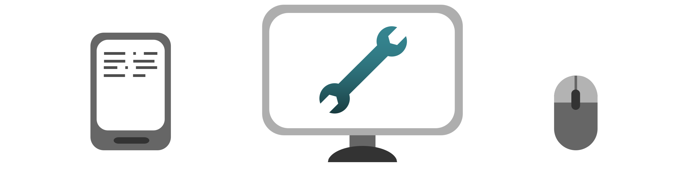

## Arbeitsplatz: Ausstattung [arbeitsplatz-ausstattung-20200710]

Basis aller vernetzter Arbeit ist der Computer und eine passende Internet-Anbindung. Mobile Geräte, die älter sind als vier Jahre, kommen beim parallelen Arbeiten mit mehreren Apps langsam an ihre Grenzen. Die allgegenwärtigen Video-Konferenzen stellen Anforderungen an Prozessor und Grafik - Geräte mit Grafikkarte oder wenigstens einem entsprechenden mobilen Chip sind jetzt sinnvoll.

Spätestens für Video-Konferenzen, bei denen Sie parallel inhaltlich arbeiten, lohnt sich ein zweiter Bildschirm zum Laptop. Dazu sollten Sie sich ein Mikrofon gönnen, das ihre Stimme von Hintergrundgeräuschen isoliert. Dafür reicht ein solides Lavalier-Mikrofon für unter 50€. Lassen Sie sich nicht von der Material-Schlacht um professionelles Podcasting-Equipment anstecken. Als Kopfhörer nehmen sie das erstbeste, was sie da haben.

Eine Kamera ist in den meisten Laptops schon eingebaut, für etwa 100€ können Sie licht-empfindlichere Webcams und Kontrolle über das Bild bekommen bekommen. Auch hier lohnen sich große Investitionen erst für besondere Ansprüche: Die Auflösung wird von der Video-Chat-Software ohnehin begrenzt, aber zu wenig Licht führt schnell zu Bildrauschen. Ein Spotlight ist meist die bessere Investition als eine teure Kamera.

Die beste Kamera in den meisten Haushalten ist die Ihres Mobil-Telefons. Sie können sich für Konferenzen einfach zwei mal einwählen und das Handy für ihr Video-Bild nutzen, während Sie den Computer fürs Bildschirm-Teilen einsetzen.

Die Technologie für den Kontakt zu Kolleginnen und Kollegen sollte vor allem robust sein. Ein extra WLAN-Router kann (am besten mit einem Kabel) als Access Point an Ihre private Internet-Box angeschlossen werden und ein eigenes, stabiles WLAN nur für die Arbeit senden. Für die Internet-Anbindung selbst schauen Sie, ob eine Hybrid-Leitung DSL und LTE-Signal kombiniert verfügbar macht. Ansonsten lohnt sich eventuell auch ein mobiler Router als Rückversicherung, wenn die Festnetz-Leitung mal streikt.

Mehrere Endgeräte helfen, parallele Arbeit zu koordinieren. Pro Bildschirm eine Aufgabe oder ein Kommunikationskanal. <label for="aside--die-technologie-fuer" class="aside-toggle" role="button" aria-pressed="false" aria-label="Randbemerkung anzeigen" onkeypress="toggleButtonKeyPress()" onclick="toggleButtonClick()" tabindex="0">⨭ …</label>

<input id="aside--die-technologie-fuer" type="checkbox" class="aside-toggle"/>

**Notiz**: Mehrere Geräte und Bildschirme stellen virtuelle Räumlichkeit für verschiedene Aufgabenbereiche und Kommunikation her. Hier kann ein Unternehmen viel Unterstützung leisten und Arbeitsgeräte stellen, damit die Arbeit zu Hause angenehmer und produktiver wird. Bei uns haben alle Angestellten ein Tablet mit Stift neben dem Computer, mit dem wir auf virtuellen Whiteboards zeichnen.

Verzichten Sie für Video-Konferenzen auf drahtlose Übertragung, so weit wie möglich. WLAN ist fehler-anfälliger, als Sie denken und häufig bremst es bei schwachem Empfang mehr als die dahinter liegende Internet-Leitung. Bluetooth macht immer im falschen Moment Kopplungs-Probleme.

Mit stabiler Verbindung, einem halbwegs aktuellen Laptop und dem Zubehör für parallele Arbeit und Video-Konferenzen sind sie schon gerüstet, von zu Hause aus professionell zu arbeiten. Weitere Fortschritte an Produktivität kommen über die Anwendung der richtigen Software und eingeübten Gewohnheiten.

[nächstes Kapitel: Gesundheit &&nbsp;Motivation](#motivation-20200710)
