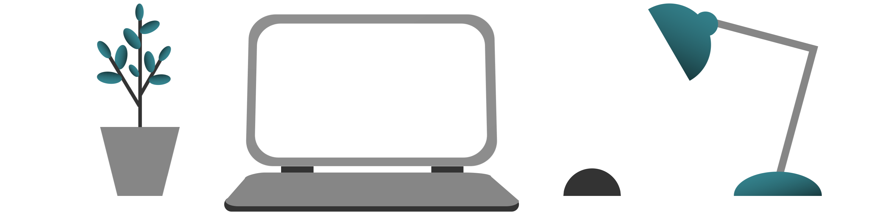

## Arbeitsplatz: Umfeld &&nbsp;Umgebung [arbeitsplatz-umgebung-20200710]

Ihre Arbeitsumgebung hat einen großen Einfluss darauf, wie wohl Sie sich fühlen und wie produktiv Sie sein können. Schaffen Sie möglichst Raum für sich alleine, wenigstens einen Platz, den Sie ganz gezielt als Arbeitsbereich einrichten. Dort finden Sie Fokus und etablieren eine Grenze zwischen Ihrem Privatleben und der Arbeit.

Spezielle Sitzgelegenheiten sind gar nicht so wichtig, so lange kein medizinischer Bedarf besteht. Der teure Bürostuhl kann warten. Für den Anfang viel hilfreicher und kostengünstiger sind ständige Veränderung der Sitzposition und regelmäßige, aktive Bewegung. Positionieren Sie den Bildschirm auf Augenhöhe, so dass Sie den Hals nicht verrenken. Wenn Sie die Tastatur bedienen, sollten sich Ihre Handgelenke entspannen können. <label for="aside--spezielle-sitzgelegenheiten" class="aside-toggle" role="button" aria-pressed="false" aria-label="Randbemerkung anzeigen" onkeypress="toggleButtonKeyPress()" onclick="toggleButtonClick()" tabindex="0">⨭ …</label>

<input id="aside--spezielle-sitzgelegenheiten" type="checkbox" class="aside-toggle"/>

**Jakob**: *Spazierengehen lockert die Wirbel und macht Kopf und Atemwege frei. Pausen mit Bewegung oder einem kurzen Gespräch verbinden. Ich wechsle mit dem Laptop ständig die Sitzgelegenheit, vom Stuhl zur Couch. Dazu habe ich mir mit einem Teleskop-Arm als Monitor-Halterung einen Arbeitsplatz am Regal montiert, an dem ich ab und zu stehen kann.*

Ein wenig Grün wirkt Wunder. Am schönsten ist natürlich ein Blick nach draußen, aber eine strategisch platzierte Pflanze oder Schnittblumen sind auch ein schönes Geschenk an Sie selbst.

Ein Fensterplatz ist hilfreich für gute Beleuchtung. Natürliches Licht ist besonders angenehm. Lichtquellen sollten für Video-Konferenzen möglichst hinter der Kamera  sein, der Raum im Video-Bild möglichst ruhig. Eventuell stellen Sie einen Schirm auf, der gleichzeitig als Schall-Schlucker dient und Spiegelungen verringert. Eine dicke Wolldecke, in Ihrem Arbeitsbereich aufgehängt, ist schon ein guter Anfang, um die Akustik aufzuwerten.

Zur Abgrenzung des Arbeitsbereiches sind sichtbare Signale und Schranken hilfreich, die Störungen aus dem Alltag begrenzen. Klären Sie vorab mit anderen Mitgliedern eines Haushalts, wie Sie die Arbeit abgrenzen wollen und dass Konzentration wichtig ist. Trennen Sie das private Telefon von der Arbeitskommunikation.

Besonders in Wohnblöcken und Hochhäusern sollten Sie sich Ruhezonen einrichten und zu gewissen Zeiten die Klingel abstellen und vielleicht ein Schild an die Tür hängen, dass Sie für ein paar Stunden nicht erreichbar sind. Es wird wahrscheinlich Übung kosten, die Konzentration in der neugewonnenen Flexibilität zu verteidigen, bis Heimarbeit auch für Ihr Umfeld Normalität geworden ist.

[weiter lesen: Abgrenzung](#arbeitsplatz-abgrenzung-20200710)
