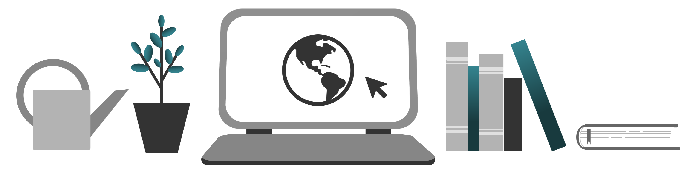

## Motivation & Gesundheit: Aufmerksamkeit [motivation-aufmerksamkeit-20200710]

Sie haben jetzt die Gelegenheit, Ablenkung besser und aus eigener Kraft zu kontrollieren. Nutzen Sie das, in dem Sie Ihre Arbeit selbst in Phasen der ungestörten Konzentration bündeln.

Multitasking sollten Sie ab sofort vermeiden. Das ist eine schädliche Angewohnheit und eine Selbstlüge obendrein. Echte Gleichzeitigkeit von Aufmerksamkeit gibt es nicht. Wenn Sie mehrere Aufgaben jonglieren, verlieren Sie bei jedem Wechsel von Fokus wertvolle Zeit, in der Sie den passenden Kontext erst wieder herstellen müssen.

Auch Ruhe hat Aufmerksamkeit verdient. Konzentration lässt sich nicht ständig aufrechterhalten. Planen Sie deswegen Momente der Ruhe und Inspiration, wo Sie sich neue Energie für die nächste Aufgabe holen.

Vergeuden Sie diese Ruhe nicht auf die unersättlichen Aufmerksamkeits-Abgründe der sozialen Medien. Verbannen Sie solche Apps am besten von Arbeitsgeräten, die Sie für fokussierte Arbeit nutze. Schauen Sie nur mit Stoppuhr bewaffnet in einen Feed.

Nehmen Sie sich lieber gezielt Zeit für einen Kaffee oder Ihr Lieblingsgetränk und gehen Sie ein paar Schritte. <label for="aside--finden-sie-ihren-eigenen" class="aside-toggle" role="button" aria-pressed="false" aria-label="Randbemerkung anzeigen" onkeypress="toggleButtonKeyPress()" onclick="toggleButtonClick()" tabindex="0">⨭ …</label>

<input id="aside--finden-sie-ihren-eigenen" type="checkbox" class="aside-toggle"/>

**Jule**: *Zu viele kleine Pausen, die ohne vorher festgesetzte Struktur mit privater Hausarbeit gefüllt werden, können dazu führen, dass Sie sich in Ablenkung verlieren: Beim Geschirrspülen gesehen, dass die Topfpflanze trocken ist, und eigentlich müssten Sie die alle mal wieder gießen, huch da ist eine Spinnwebe, schnell noch den Besen aus der Kammer holen, die Sie sowieso mal aufräumen wollten und schon haben Sie ungewollt eine Stunde weg prokrastiniert.*

Finden Sie Ihren eigenen Rhythmus. Für manche ist es hilfreich, Hausarbeit in den Arbeitstakt zu integrieren: Waschmaschine laden, arbeiten, Wäsche in den Trockner packen, arbeiten, Wäsche falten.

Vielleicht hilft Ihnen aber auch ein strikter Fokus auf die Arbeit. Schaffen Sie sich ein Zeitfenster, in dem keine Hausarbeit oder Privatleben Platz haben, um nicht den Bezug zur Arbeit zu verlieren.

Finden Sie auf jeden Fall einen Takt, in dem Zeit für Essen und Pausen bleibt, um Energie zu tanken. Auch Sie selbst brauchen Aufmerksamkeit.

[weiter: Gemeinschaft](#motivation-gemeinschaft-20200710)
