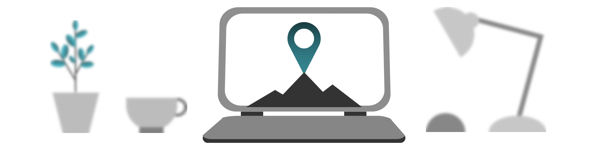

## Motivation & Gesundheit: Dranbleiben [motivation-dranbleiben-20200710]

Der Albtraum vieler selbstverantwortlich Arbeitenden heißt Prokrastination. Sie stehlen sich mit Aufschieben selbst Zeit für produktives Arbeiten, obwohl Sie es besser wissen. Dabei gibt es Gründe, warum Prokrastination so einen psychologischen Reiz entwickelt. Manchmal kann sie sogar hilfreich sein.

Aufgaben mit hoher Eigenkreativität sind besonders anfällig für Prokrastination. Generell hilft: Erstmal irgendwie anfangen, egal wie - keine Ansprüche an die Qualität der Arbeit haben, denn die entwickelt sich von alleine, wenn Sie erstmal reingekommen sind.

Dementsprechend macht es auch Sinn, sich Aufgaben, die einfach nur abgearbeitet werden müssen bewusst auf den Anfang der Bürozeit zu legen. Rechnungen einpflegen zum Beispiel. Das stuft die Hürde herunter, sich an den Schreibtisch zu setzen. <label for="aside--aufgaben-mit-hoher" class="aside-toggle" role="button" aria-pressed="false" aria-label="Randbemerkung anzeigen" onkeypress="toggleButtonKeyPress()" onclick="toggleButtonClick()" tabindex="0">⨭ …</label>

<input id="aside--aufgaben-mit-hoher" type="checkbox" class="aside-toggle"/>

**Jakob**: *Andererseits hilft es mir manchmal, den größten Brocken oder unangenehmsten Teil gleich zu Beginn des Tages zu erledigen, wo ich noch Energie für anstrengende Entscheidungen habe. Vielleicht setzen Sie sich ein Zeitfenster für Arbeit ohne viel Nachdenken zum Start und dann nehmen Sie sich die größte Aufgabe vor.*

Hier kann auch die Gemeinschaft per Fernarbeit sich gegenseitig unterstützen. Helfen Sie einander, dran zu bleiben mit gemeinsamer Parallel-Arbeit.

Haben Sie Respekt vor dem Konzentrations-Bedürfnis der anderen Person, aber seien Sie ansprechbar, wenn jemand Hilfe braucht, sich neu zu fokussieren. Oder vereinbaren Sie, wann es Zeit ist, Ablage zu machen und dabei nebenher einen Schwatz zu halten.<label for="aside--hier-kann-auch" class="aside-toggle" role="button" aria-pressed="false" aria-label="Randbemerkung anzeigen" onkeypress="toggleButtonKeyPress()" onclick="toggleButtonClick()" tabindex="0">⨭ …</label>

<input id="aside--hier-kann-auch" type="checkbox" class="aside-toggle"/>

**Notiz**: Wir nutzen regelmäßig unsere Video-Konferenz, um schweigend nebeneinander zu arbeiten. Gerade, wenn dabei unterschiedliche Rollen zusammenkommen, simulieren wir dabei auch so etwas wie die Politik der offenen Tür oder personalisierte Sprechstundenzeit.

Haben Sie aber nicht minder Respekt vor Ihren eigenen Bedürfnissen. Planen Sie Pausen und Momente, in denen Sie Zeit für sich reservieren. Wenn Sie ausgeruht und bei sich sind, können Sie Ihr Bestes geben.

Unterschätzen Sie neben ausreichend nahrhafter Ernährung nicht, wie viel positiven Einfluss Bewegung auf ihr Wohlbefinden hat. Ein Ausgleich zur starren Sitzposition vor dem Bildschirm ist besonders wichtig. Gönnen Sie sich vielleicht einen regelmäßigen Spaziergang, wenn Sport nichts für Sie ist.

Gönnen Sie sich überhaupt einfach mal etwas. Wirklich. Sie haben es verdient.

---

[zurück zur Übersicht](/)
