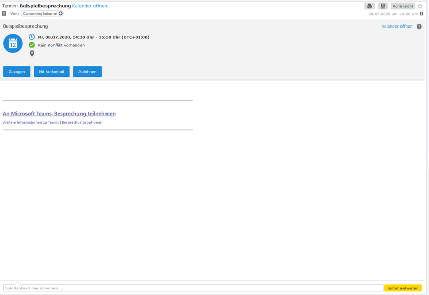
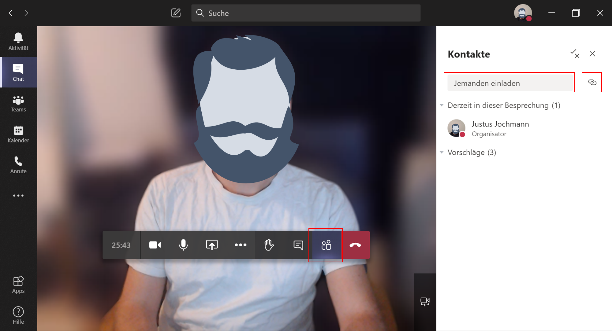

## Gäste in eine Besprechung einladen [gastzugang-besprechungen-20200907]

MS Teams bietet Ihnen die Möglichkeit, Externe an einzelnen Besprechungen teilnehmen zu lassen. Eine Teilnahme ist dabei ganz ohne Anmeldung möglich.

Hierzu müssen Sie der externen Person einen Link bereitstellen, der direkt in die gewünschte Besprechung führt. Wie Sie den Link teilen, etwa per E-Mail oder Messenger, bleibt Ihnen überlassen. Die Teilnahme über einen Link ist allen Personen mittels der Teams-App möglich, welche auch auf mobilen Geräten mit Mac- oder Android-OS verfügbar ist. Aber auch über einen Browser lässt sich die Besprechung öffnen. Unter Mac-OS eignet sich hierfür der Chrome-Browser, unter Windows Microsoft Edge oder Chrome. Die eingeladene Person erhält über den Link die Wahl, wie sie an der Besprechung teilnehmen will.

Den Link für die Einladung generieren Sie auf zwei Arten:
In der Planung einer Besprechung über den Teams-Kalender, oder in einer laufenden Besprechung.

Planen Sie eine [+ Neue Besprechung] über den [Kalender], können Sie Personen über deren E-Mail-Adresse im Bereich [Erforderliche Teilnehmer hinzufügen]. Wenn Sie die Planung inklusive der Angabe aller Beteiligten abgeschlossen haben, können Sie über [Kalender] erneut auf die geplante Besprechung zugreifen. Nun wird im Bereich für [Details zu dieser Besprechung] der Hyperlink dargestellt, der weitere Personen zu dieser Besprechung führen kann. Kopieren Sie diesen und teilen Sie ihn mit weiteren Personen, die Sie nicht direkt eingeladen haben.

Personen, die Sie direkt über die Besprechungs-Planung durch Angabe der E-Mail-Adressen eingeladen haben, erhalten eine E-Mail mit einem Teilnahme-Link und der Möglichkeit, der geplanten Besprechung zuzusagen, diese abzulehnen und eine Synchronisation des Termins mit persönlichen Kalendern vorzunehmen.

In einer laufenden Besprechung können Sie über die Schaltfläche [Teilnehmer anzeigen] im Eingabefeld [Jemanden einladen] Personen direkt einen Beitritts-Link per E-Mail zukommen lassen, indem Sie dort deren E-Mail-Adresse eintragen. Außerdem können Sie den Teilnahme-Link generieren, indem Sie auf [Teilnahmeinfos kopieren] klicken.

Der Teilnahme-Link verbirgt sich in beiden Fällen als Hyperlink hinter dem Text [Join Microsoft Teams Meeting]. Sie können den Hyperlink nutzen oder den Link aus dem Hyperlink kopieren und so für die direkte Verwendung in der Adresszeile des Browsers nutzbar machen. Diese Link-URL ist jedoch sehr lang.

Wird dem Link gefolgt, muss sich die Person vor dem Betreten der Besprechung einen Namen geben, ihre Ton- und Video-Optionen wählen und dies mit [Jetzt teilnehmen] bestätigen.

Daraufhin befindet sie sich im Wartebereich, was der Person angezeigt wird, die die Besprechung geplant hat. Dies geschieht über eine Pop-Up-Benachrichtigung und ein Symbol in der Steuerleiste Ihrer aktiven Besprechung, welches über [Teilnehmer anzeigen] erscheint. Hier finden Sie auch den Wartebereich, in dem Sie Eingeladene über das Häkchen-Symbol aktiv teilnehmen lassen können.

---

[zurück zur Übersicht](/)
