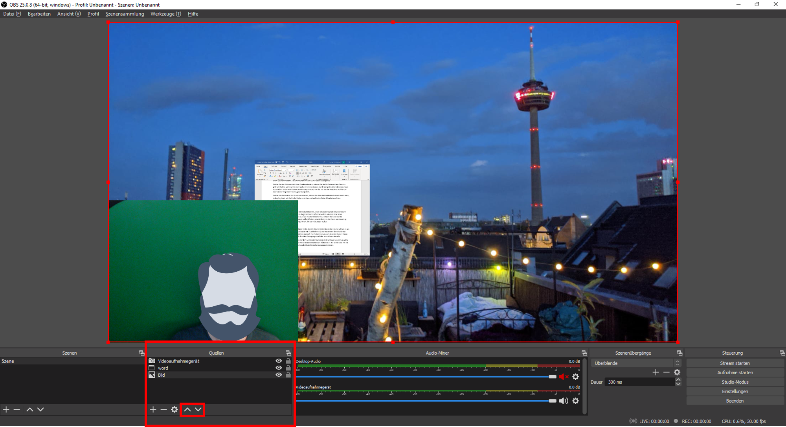

## Anordnung der Quellen im Vorschaufenster [obs-anordnung-20200909]

Wenn Sie mehrere Quellen in OBS eingefügt haben, können Sie diese anordnen, wie Sie wollen. Die Größe und Position jeder einzelnen Quelle können Sie mit der Maus bestimmen.

Im Quellen-Menü werden alle eingefügten Quellen aufgelistet. Die Reihenfolge bestimmt die Ebenen, auf der sich die Quellen befinden. Wollen Sie etwa ein eingefügtes Bild im Hintergrund haben, so muss sich diese Quelle ganz unten in der Auflistung befinden; Ihre Kamera im Vordergrund entsprechend ganz oben. Mit den Pfeiltasten können Sie jede angewählte Quelle eine Ebene nach oben oder unten verschieben.

Über das Zahnrad können Sie die [Eigenschaften] der einzelnen Quellen erneut bearbeiten. Mit dem [-] können Sie eine nicht mehr benötigte Quelle entfernen. Über die Augensymbole neben den einzelnen Quelle blenden Sie diese ein und aus.

Mit einem Rechtsklick der Maus auf eine Quelle gelangen Sie in ein erweitertes Kontextmenü. Hier können Sie die Quelle unter anderem umbenennen.

[weiter lesen: OBS als virtuelle Webcam](#obs-live-20200909)
