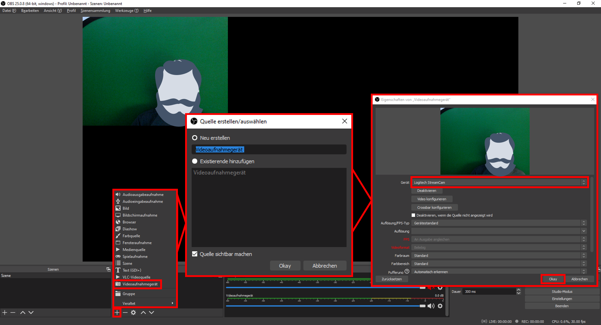

## Eine Kamera einbinden [obs-kamera-20200909]

Um eine Webcam als Quelle einzubinden, klicken Sie in OBS auf das [+] im Quellen-Menü. Wählen Sie [Videoaufnahmegerät] und geben Sie eine sinnvolle Bezeichnung ein.

Unter [Gerät] wählen Sie dann Ihre Gewünschte Kamera aus und bestätigen dies mit [Okay].

Ihr Kamerabild wird Ihnen nun auf dem Vorschaufenster angezeigt. Jetzt können Sie es wie alle Quellen nach Ihren Vorstellungen platzieren und beschneiden.

[weiter lesen: Vorschaufenster](#obs-anordnung-20200909)
