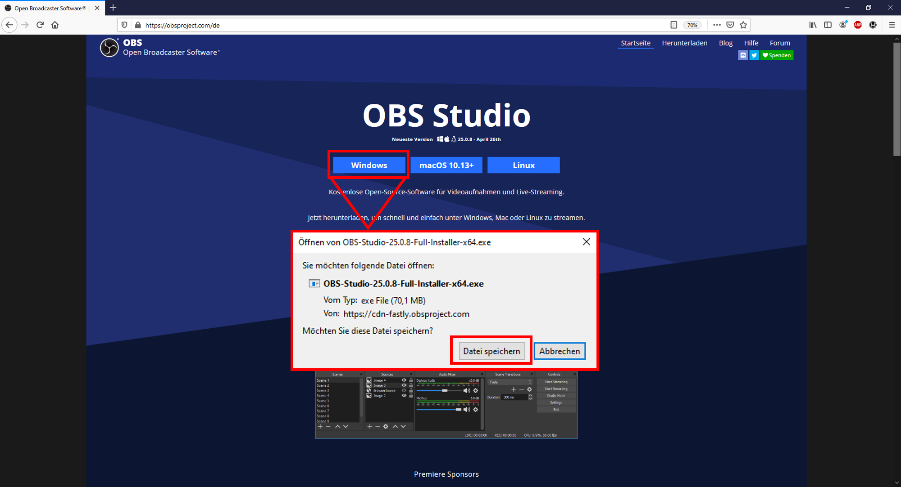
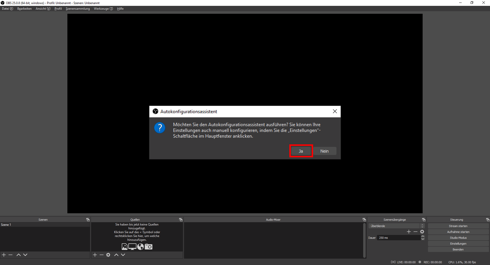
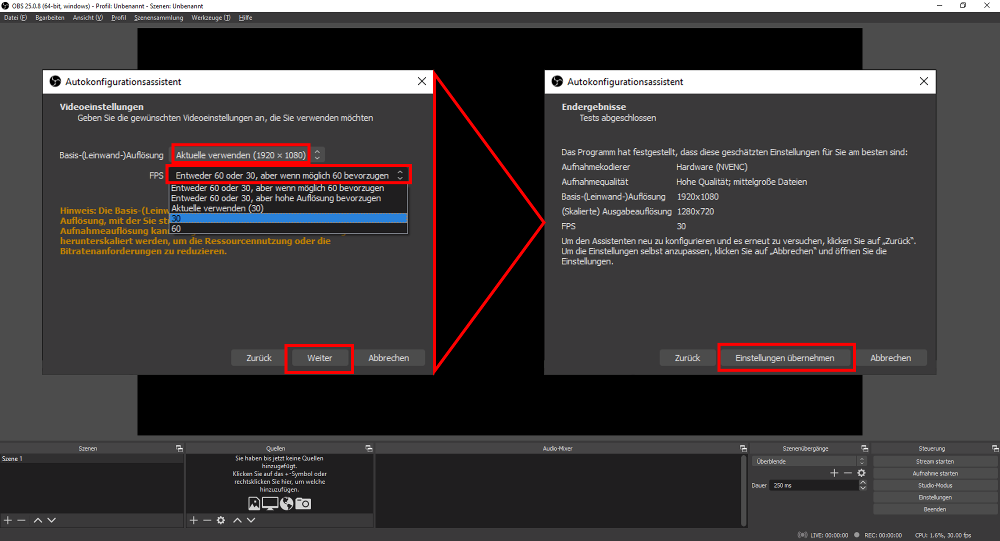

## OBS installieren und einrichten [obs-los-20200909]

Das frei erhältliche Programm können Sie ohne Anmeldung auf der Seite [obsproject.com](https://obsproject.com/de) herunterladen. Hier müssen Sie zunächst auswählen, für welches Betriebssystem Sie OBS verwenden wollen.

Nachdem Sie die Installations-Datei heruntergeladen haben, starten Sie den Installations-Prozess nach Anweisung.

Nach erfolgreicher Installation öffnen Sie das Programm OBS. Bei einem ersten Start wird Ihnen angeboten, den Autokonfigurations-Assistenten zu nutzen. Klicken Sie hier auf [Ja].

Geben Sie nun zur Verwendung an, OBS [Für das Aufnehmen optimieren, Streamen ist zweitrangig].

Der Konfigurations-Assistent wird Ihre Video-Einstellungen analysieren und die für Ihr System optimalen Einstellungen treffen. Sie können bei den Video-Einstellungen also einfach auf [Weiter] klicken und im Folgenden die [Einstellungen anwenden]. Sollten Sie diese Auswahl dennoch manuell treffen wollen, ist als [Basis-(Leinwand-)Auflösung] [Aktuelle verwenden] und als [FPS] die niedrigste Auswahl [30] ausreichend.

Sofern gewünscht, können Sie den Autokonfigurations-Assistenten über den Reiter [Werkzeuge] auch später erneut nutzen und Einstellungen anpassen, oder für Streaming anstelle von Aufnahmen optimieren.

[weiter lesen: OBS anpassen](#obs-aufbau-20200909)
