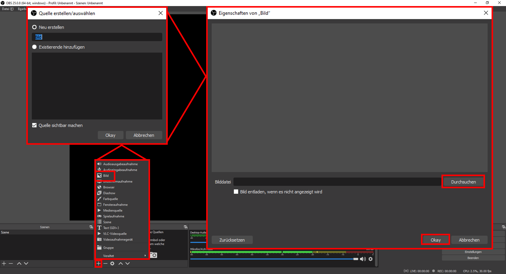
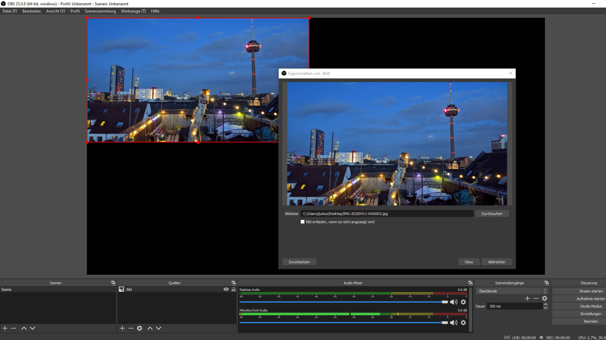
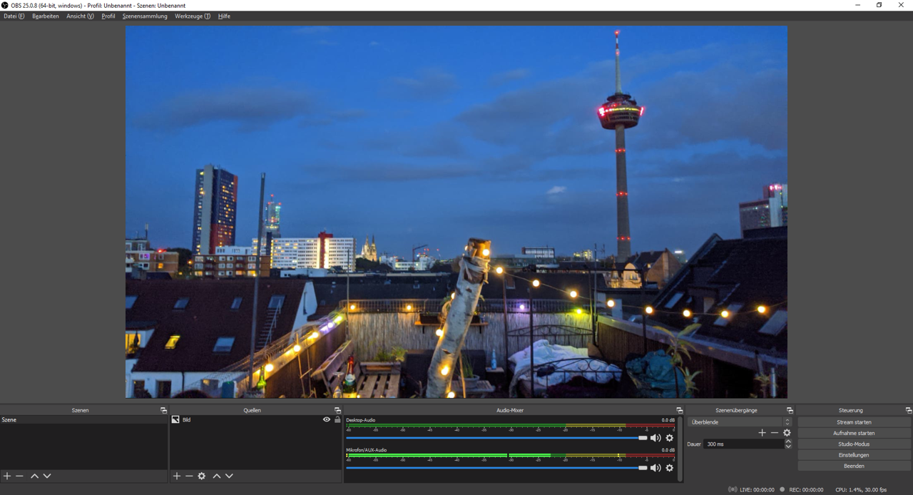
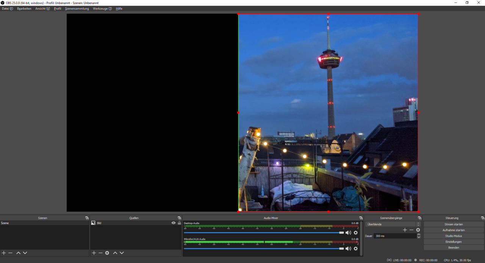

## Quellen einfügen und anpassen [obs-quellen-20200909]

Quellen für Ihre Video-Komposition fügen Sie über den Bereich Quellen ein, indem Sie auf das kleine [+] klicken. Dann öffnet sich ein Auswahl-Menü für alle wählbaren Quellen-Arten.

Wählen Sie Ihre gewünschte Quellen-Art, etwa ein Bild, müssen Sie Ihrer Quelle zunächst einen Namen geben. Lassen Sie dabei die Auswahl auf [Neu erstellen]. Einmal so eingerichtet, wird diese Quelle entsprechend im Bereich Quellen angezeigt und kann später über [Existierende hinzufügen] immer wieder genutzt werden. Benennen Sie Ihre Quellen also möglichst eindeutig.

Über [Durchsuchen] können Sie ein Bild von Ihrem Computer auswählen. Bestätigen Sie dann die Auswahl mit [Okay], derweil die ausgesuchte Quelle bereits in Ihrer Vorschau dargestellt wird.

Wenn Sie Ihre Quelle im Vorschaufenster mit der Maus anwählen, wird diese mit einem roten Rand und kleinen quadratischen Anfassern markiert. Einmal markiert, können Sie Ihre Quelle mit der Maus auf eine gewünschte Größe bringen, indem Sie die an den Anfassern bei gedrückter linker Maustaste ziehen. Das Seitenverhältnis der Quelle bleibt dabei gleich.

Wollen Sie den Bildausschnitt Ihrer Quelle verändern, müssen Sie [Alt] auf Ihrer Tastatur gedrückt halten, während Sie einen Anfasser mit gedrückter linker Maustaste verschieben. Dabei wird die rote Markierung der Seite, von der aus Sie den Ausschnitt verändern, grün dargestellt.

Um die Position der Quelle zu verschieben, können Sie direkt auf die Quelle klicken und diese mit gedrückter linker Maustaste auf dem Vorschaufenster bewegen.

[weiter lesen: Desktop als Quelle](#obs-desktop-20200909)
