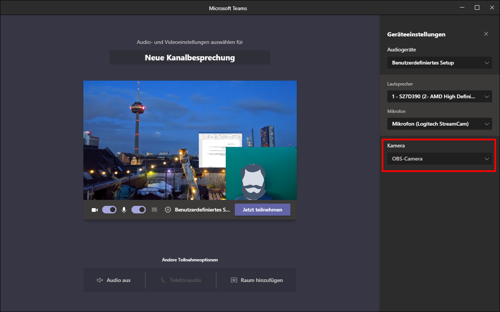

## Eine Live-Aufnahme aus OBS als Webcam in Videokonferenzen nutzen [obs-live-20200909]

Mit der Installation einer Erweiterung können Sie Ihre OBS-Aufnahme anstelle Ihrer normalen Webcam-Aufnahme live in andere Programme einbinden. Beispielsweise in Video-Konferenzen über Teams, Zoom oder Skype.

Das sogenannte Plugin „OBS VirtualCam“ erhalten Sie ebenfalls zum freien Download: [OBS Resources](https://obsproject.com/forum/resources/obs-virtualcam.949/)

Klicken Sie dort auf [Go to Download], speichern Sie den darauf erscheinenden Downloader und starten die Installation von VirtualCam.

Nach erfolgreicher Installation und einem Neustart von OBS finden Sie in OBS unter [Werkzeuge] Ihre [VirtualCam]. Klicken sie auf [Start] und die VirtualCam zeichnet auf. Das Kontrollkästchen der VirtualCam bleibt dabei stets offen und kann nicht minimiert werden. Bei laufender Cam wird der [Start]-Knopf ausgegraut dargestellt.

Ab diesem Moment haben Sie in vielen Programmen die Möglichkeit, [OBS-Camera] als Kamera auszuwählen. Meist finden Sie diese Option in den [Geräteeinstellungen] der jeweiligen Programme wie MS Teams oder Zoom. Statt Ihrer normalen Webcam bildet die ausgewählte [OBS-Camera] dann alles ab, was Sie in OBS in Ihr Vorschaufenster integriert haben.

---

[zurück zur Übersicht](/)
