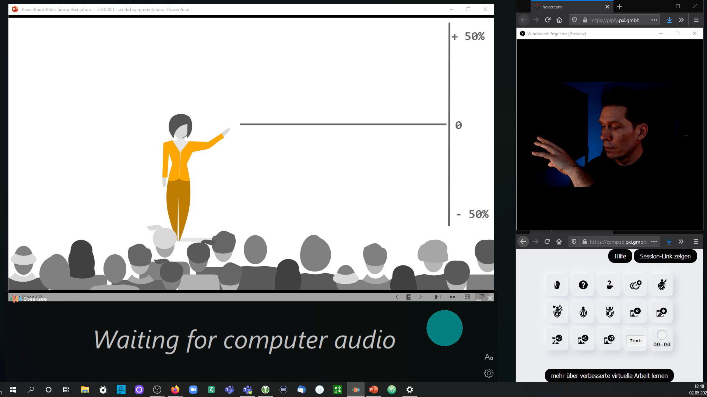

## eine Einführung [teilhabe-20210505]

*Dies ist ein erster Entwurf. Wir laden herzlich dazu ein, hier mit zu schreiben teilhabe [at] leitfaden-fernarbeit.de. Insbesondere Menschen mit Behinderung, für die wir gerne mehr Barrieren in Online-Veranstaltungen abbauen wollen.*

Online-Konferenzen und Seminare können Teilhabe für mehr Menschen möglich machen. Sie können Barrieren abbauen, die in Präsenz-Veranstaltungen entstehen. Dafür müssen wir allerdings dafür sorgen, dass wir in den neu geschaffenen Räumen online, nicht neue Barrieren aufbauen, die Menschen von Teilhabe ausschließen.

Erschwerend für die Gestaltung der Online-Erlebnisse kommt hinzu, dass wir uns in fremdem Räumen bewegen. Wir sind gebunden an die technischen Rahmen-Bedingungen, die Microsoft Teams, Zoom, Jitsi und andere Software uns vorgeben.

Dies ist eine Kurz-Übersicht, wie Sie helfen können, Ihre Online-Angebote in diesen Räumen einladender und interaktiver zu gestalten.

### Das Minimalismus-Setup

Konferenz-Software beschränkt die Auflösung für Videos und macht Text unleserlich. Außer beim Bildschirm teilen. Das nutzen wir aus und machen den geteilten Bildschirm zur Leinwand, auf der wir unser Video, interaktive Elemente und Hilfe-Stellungen für Barriere-Freiheit anordnen. <label for="aside--es-gibt-zoom" class="aside-toggle" role="button" aria-pressed="false" aria-label="Randbemerkung anzeigen" onkeypress="toggleButtonKeyPress()" onclick="toggleButtonClick()" tabindex="0">⨭ …</label>

<input id="aside--es-gibt-zoom" type="checkbox" class="aside-toggle"/>

**Tipp:** es gibt bei Zoom einen Trick für echtes HD im Video-Bild: Im Menü für Bildschirm-Teilen unter fortgeschrittenen Optionen eine [zweite Kamera] auswählen - dort dann einfach die eigene Webcam wählen.

Wir empfehlen vier Grund-Elemente nach einfacher Hierarchie für Aufmerksamkeit zu arrangieren:

1. Was es zu zeigen gibt. Präsentation im Fenstermodus, Browser-Fenster, Whiteboard. Die visuelle Hilfe-Stellung, worüber geredet wird, sollte den größten Raum einnehmen und gemäß der Lese-Richtung links oben platziert werden.
2. Wer etwas sagt. Das Video-Bild der sprechenden Person sollte möglichst mit dem gezeigten interagieren können. Rechts oben platziert wird ein Blick nach links (womöglich auf den Bildschirm) als Blick auf das Vorzeige-Element gelesen und lenkt die Aufmerksamkeit. Tipp: [pipfy - Webcam im Browser-Fenster](https://pipfy.pxi.gmbh)
3. Meta-Information. Zeit-Anzeige, Sprecher*Innen-Name oder Kontext-Info, vielleicht aber auch visuelle Signale oder ein Chat-Fenster worüber das Publikum mit den Inhalten interagieren kann. Tipp: [compad - Rück-Kanal im Browser-Fenster](https://compad.pxi.gmbh)
4. Unterstützung für Barriere-Freiheit. Automatische Untertitel, eventuell auch Gebärden-Sprachen-Übersetzung in einem zusätzlichen Video-Bild mit einer zweiten Webcam im Browser-Fenster. Tipp: [caption.ninja - automatische Untertitel mit Google Chrome Browser](https://caption.ninja) dort im automatisch erzeugten Link "&lang=en-US" durch "&lang=de" ersetzen.

Web-Apps im Browser sind das Werkzeug, mit dem ganz ohne Installation von Software Interaktion möglich wird. Viele Apps synchronisieren Interaktion zwischen den Teilnehmenden. So können Sie Medien-Brüche vermeiden. <label for="aside--ms-office" class="aside-toggle" role="button" aria-pressed="false" aria-label="Randbemerkung anzeigen" onkeypress="toggleButtonKeyPress()" onclick="toggleButtonClick()" tabindex="0">⨭ …</label>

<input id="aside--ms-office" type="checkbox" class="aside-toggle"/>

Dahin gehen, wo das Publikum ist, bedeutet, dessen Software-Beschränkungen anzunehmen. Zoom ist nun einmal Standard, genau wie das Microsoft-Universum an vielen Orten Bedingung ist. Microsoft immerhin ist vorbildhaft beim Thema Barriere-Freiheit. Untertitel gibt es in PowerPoint integriert. Mit der Translator-App auch als eigene App mit noch mehr Funktionalität.

Für Barriere-Freiheit gibt es weit mehr zu bedenken als nur Untertitel anzubieten. Auch finanzielle Hürden oder erzwungener Lern-Aufwand und Beschränkung auf geschlossene Software-Ökosysteme erschwert Teilhabe.

Wir werden an dieser Stelle noch konkretere Hilfs-Angebote vorstellen. Vielleicht wird auch ein Manifest daraus. <label for="aside--ein-paar-prinzipien" class="aside-toggle" role="button" aria-pressed="false" aria-label="Randbemerkung anzeigen" onkeypress="toggleButtonKeyPress()" onclick="toggleButtonClick()" tabindex="0">⨭ …</label>

<input id="aside--ein-paar-prinzipien" type="checkbox" class="aside-toggle"/>

- agnostische Formate wählen: Entwickeln wir Lösungen, die auf jeder Plattform funktionieren, damit wir zu unserem Publikum gehen können, wo immer es sich aufhält.
- Lernkurven und Installations-Zwang vermeiden: Bürden wir dem Publikum so wenig Technik wie möglich auf.
- Profis professionalisieren: Geben wir den Veranstaltenden Anleitungen und Werkzeug an die Hand, wie sie mit etwas Mehr-Aufwand Aufwand und Barrieren für ihr Publikum abbauen.
- Medien-Brüche vermeiden: Führen wir interaktive Elemente zurück in den zentralen Begegnungs-Raum.

Grundsätzlich ist es ein Vorteil für alle Teilnehmenden, Barrieren abzubauen. Das Stichwort hierzu: [Curb-Stone-Effect (englisch)](https://en.wikipedia.org/wiki/Curb_cut_effect). Oder auch Bordstein-Kanten-Absenkungs-Effekt?

Wir richten unsere Arbeit zu Barriere-Freiheit anhand der Prinzipien funktioneller Beschränkung aus. Behinderung als soziale Kategorie hat einen anderen Fokus. Funktional behindert können nämlich auch nicht-behinderte Menschen sein: Beim Blick in die tief stehende Sonne sind alle Menschen seh-behindert.

Um so wertvoller ist die Expertise und Erfahrung behinderter Menschen, funktionale Barrieren zu erkennen und zu beheben.

---

Für professionelle Produktion empfehlen wir, eine Regie einzurichten und darüber noch mehr Interaktion, aber auch die Videos und andere Beiträge der Teilnehmenden in einem einladenden Erlebnis zu vereinigen. Tipp: [Open Broadcaster Software](https://obsproject.com)

Hintergründe, wie Sie Zoom-Fatigue mit interaktiven Formaten begegnen, wie Sie konkrete Hilfe-Stellungen zur Barriere-Freiheit entwickeln und detailliertere Anleitungen reichen wir nach.
