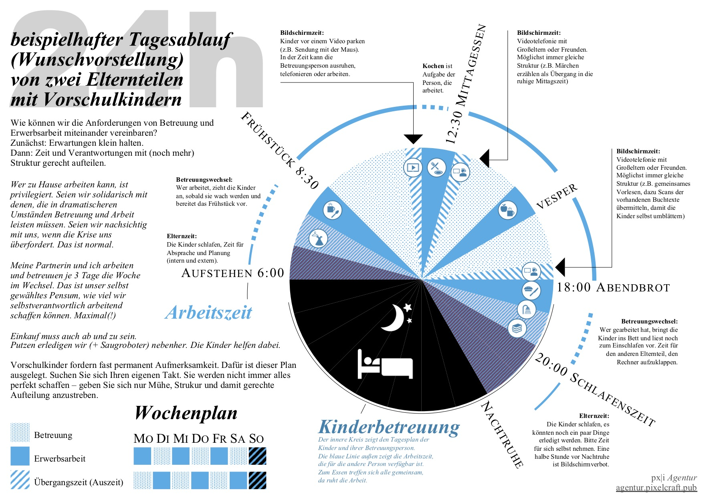

## Ein Wochenplan für Arbeit und Familie [balance-familie-wochenplan-20200729]

Verteilen Sie Arbeit um die Bedürfnisse Ihrer Kinder und Ihrer Gesundheit herum. Wir haben einen Beispielplan entworfen, wie im besten Fall die Arbeitszeit und Betreuungszeit von zwei Elternteilen zu Hause gerecht verteilt werden kann.

<a href="tagesplan-familie-wegweiser.pdf"> <small>eine Anleitung als PDF zum Download</small></a>

<label for="6" class="margin-toggle">⨭ …</label>
<input type="checkbox" id="6" class="margin-toggle"/>**Jakob:** *Das ist die Absprache, die ich mit meiner Partnerin mit zwei Wochen ausprobieren und nachbessern gefunden habe. Wir wollten Fürsorgearbeit gleich verteilen und trotzdem noch unseren jeweiligen Führungsaufgaben im Betrieb nachkommen können. Oder es zumindest versuchen. Wir erwarten nicht, dass unsere Angestellten nun ebenso am Wochenende oder Abends arbeiten. Das ist unglücklich, wenn wir das vorleben, aber perfekte Lösungen finden wir im Moment nicht.* Dieser Plan ist eine sehr privilegierte Idealvorstellung. Nur wenige Menschen können so  selbstbestimmt über ihre Zeit und ihre Aufgaben verfügen. Wer es kann, darf sich gerne am Beispiel orientieren. So können wir besser füreinander da sein.

Der Plan ist außerdem Grundlage für die Visualisierung des Rhythmus, den wir in unserer Agentur gefunden haben, die verschiedenen Tagesabläufe zu koordinieren.

[weiter lesen: Der Rhythmus verschiedener Arbeit](#balance-familie-rhythmus-20200729)
