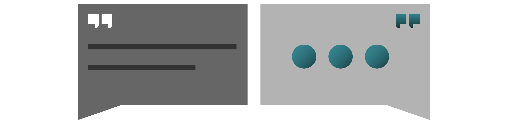

## Praxis: Chat [praxis-chat-20200710]

Wenn Sie schon einen Chat nutzen, dann halten Sie daran fest. Sie werden schon wissen, was Sie daran haben. Wenn Sie noch keinen Chat nutzen, lassen Sie sich nicht dazu verleiten, darin die einzige Lösung für verteiltes Arbeiten zu sehen.

Wichtiger als das Konzept „Text-Nachrichten in Boxen” ist die Frage, wie Information in der Kommunikation verwaltet wird. Konzeptionell ist es ein großer Unterschied, ob sich Gespräche um gemeinsam bearbeitete Dateien gruppieren oder ob Dateien einzeln an Gespräche geknüpft werden. <label for="aside--wenn-sie-schon" class="aside-toggle" role="button" aria-pressed="false" aria-label="Randbemerkung anzeigen" onkeypress="toggleButtonKeyPress()" onclick="toggleButtonClick()" tabindex="0">⨭ …</label>

<input id="aside--wenn-sie-schon" type="checkbox" class="aside-toggle"/>

**Werkzeugempfehlung**: Microsoft Teams und Google G-Suite beinhalten Chat-artige Kommunikation. Teams wird bei Microsoft mittelfristig Skype ablösen. Bis dahin können Sie Skype aber immer noch für Video und Chat nutzen. Slack hat Chats populär gemacht, ist aber in der kostenlosen Version nicht zum längerfristigen Speichern von Information geeignet. Vorsicht!
  
**Weiterführendes**: *Eine Sammlung und Einordnung von Werkzeugen stellen wir hier zusammen: <a href="/werkzeug-sammlung/" title="mehr über Werkzeuge für Fernarbeit erfahren">→ zur Werkzeug-Sammlung</a>*

Wenn Ihre Belegschaft private Messenger-Dienste nutzt, um sich beruflich auszutauschen, können Sie für die Übergangsphase erstmal daran festhalten. Vielleicht stellen Sie Regeln auf, wie Sie im Sinne des Datenschutzes dabei wenigstens verschlüsselt kommunizieren oder welche Inhalte Sie über andere Kanäle teilen könnten.

Im Sinne der Transparenz können Sie später eine Plattform zur Koordination und Absprache auswählen, die Elemente von Messengern und Chats mit Informations-Verwaltung verknüpft.

Je nachdem, wie groß ein Team ist, bieten offene Gruppenchats sich an, in denen alle während ihrer Arbeitszeit online sein können. Das hilft gegen die ungewohnte Einsamkeit, indem es übergangsweise die Möglichkeit ersetzt, sich spontan und informell mit der Belegschaft auszutauschen.

[weiter lesen: Briefpost](#praxis-post-20200710)
