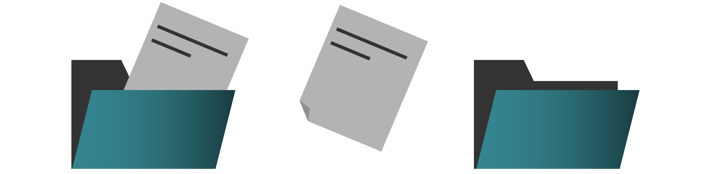

## Praxis: Datei-Verwaltung [praxis-dateien-20200710]

Sie brauchen für dezentrale Organisationen eine zentrale Quelle der Wahrheit, auf die alle gleichermaßen Zugriff haben. Das Zusammenfügen von getrennt gespeicherten Dateiversionen zu gemeinsamer Arbeit ist eine tickende Zeitbombe.

Falls Sie keinen eigenen Server extra für geteilten Zugriff einrichten können, gibt es bei vielen Diensten die Möglichkeit, Ordner über die Cloud zu teilen.
<label for="aside--sie-brauchen-so-bald" class="aside-toggle" role="button" aria-pressed="false" aria-label="Randbemerkung anzeigen" onkeypress="toggleButtonKeyPress()" onclick="toggleButtonClick()" tabindex="0">⨭ …</label>

<input id="aside--sie-brauchen-so-bald" type="checkbox" class="aside-toggle"/>

**Werkzeugempfehlung**: Wenn Sie sich eine zentrale Dateiablage neu schaffen müssen, probieren Sie es mal mit Dropbox. Dort sind die ersten zwei GB Speicher gratis. Wenn Sie ohnehin schon eine Office-Lösung nutzen, richten Sie einfach einen geteilten Ordner in OneDrive für alle Beteiligten ein.   
**Weiterführendes**: *Eine Sammlung und Einordnung von Werkzeugen stellen wir hier zusammen: <a href="/werkzeugsammlung/" title="mehr über Werkzeuge für Fernarbeit erfahren">→ zur Werkzeug-Sammlung</a>*

Machen Sie dazu regelmäßig Sicherungskopien in Form von Schnappschüssen des Ordners, in dem sich die Dateien befinden, und sichern Sie diese Momentaufnahmen mit Datumsbezeichnung auf zusätzlichen Datenträgern. So können Sie auch gröbere Fehler oder versehentliche Löschungen rückgängig machen. Mindestens eine dieser Sicherungen sollten Sie für Notfälle außerhalb deponieren.

Professionelle Dienste zur Datei-Verwaltung nehmen Ihnen viel Arbeit zur Versions-Kontrolle und Koordination ab. Dafür müssen Sie sich in die Handhabung der Datei-Verwaltung einarbeiten. <label for="aside--professionelle-dienste-zur" class="aside-toggle" role="button" aria-pressed="false" aria-label="Randbemerkung anzeigen" onkeypress="toggleButtonKeyPress()" onclick="toggleButtonClick()" tabindex="0">⨭ …</label>

<input id="aside--professionelle-dienste-zur" type="checkbox" class="aside-toggle"/>

**Justus**: *Eine klare Regelung für Dateinamen hilft, Missverständnisse zu vermeiden. Versionieren Sie mit einer fortlaufenden Nummer, wenn Sie eine Kopie anlegen müssen. Markieren Sie Exporte oder zeitweilige (!) Duplikate, die Sie im Anschluss aufräumen. Es gibt keine Kundenprojekt-Dringend-Final-Korrektur-FinalFinal.doc mehr.*

Aber denken Sie daran: Die Cloud ist nicht Ihr Backup. Die Cloud ist nur der Keller, wo jemand anderes den Computer stehen hat, auf dem Sie Ihre Daten speichern.

[weiter lesen: Aufgaben-Verwaltung](#praxis-aufgaben-20200710)
